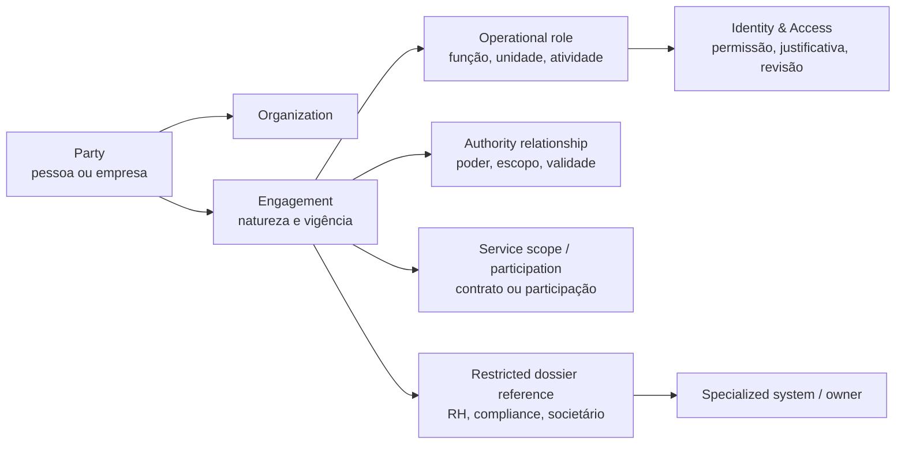

# Análise crítica — sócios, parceiros e colaboradores

## O estudo amplia a estratégia do CRM para o lado interno da organização

O material fornecido acerta ao separar a natureza de relações societárias, civis, trabalhistas e de associação/autonomia. Para o futuro produto, a consequência mais importante é outra: **o CRM não deve se tornar folha de pagamento, prontuário ocupacional, contabilidade societária ou repositório jurídico**, mas precisa ser o ponto de ligação entre identidade, vínculos, poderes, escopos, acessos, tarefas e evidências mínimas que afetam a operação imobiliária.

> A empresa precisa de uma base única de partes e organizações. Os dados de RH, saúde, remuneração, societário detalhado e compliance restrito devem ficar em domínios separados, integrados por referências e estados — não expostos no perfil comercial ou administrativo comum.

## Requisitos que entram no modelo de produto

| Área | Contribuição do estudo | Decisão de CRM |
| --- | --- | --- |
| Natureza de vínculo | A realidade da relação importa mais que o rótulo contratual | `Engagement` com classificação, fonte, vigência, revisor e estado; sem “concluir vínculo” automaticamente. |
| Sócio multiempresa | Uma pessoa/holding pode participar de várias empresas e SPEs | `EquityParticipation` ligado a `Organization`, com percentual, classe, vigência, instrumento e governança. |
| Administração e poderes | Cargo, contato e poder de assinatura não são sinônimos | `AuthorityRelationship` com escopo, instrumento, validade, evidência e revogação. |
| Parceiro profissional | Contabilidade, jurídico, TI e outros têm escopo e acesso delimitados | `ServiceProviderEngagement`, `ServiceScope`, `DataAccessAgreement` e `PowerOfAttorney` separados. |
| Colaborador | Função e setor definem permissões operacionais | `WorkEngagement` mantém função, unidade, responsável e estado; detalhes de RH ficam no domínio restrito. |
| Corretor associado | Associação não é emprego e tem documentação/contexto próprio | Papel `AssociatedBroker` com registro, contrato, vigência e acesso comercial próprio; nunca reaproveitar fluxo de empregado. |
| Terceirização | O contratante precisa de relação com empresa prestadora e obrigações de operação | `VendorOrganization`, contrato, escopo, local, aprovador e estado de evidência; dados individuais só quando necessários. |
| Encerramento | Saída precisa revogar acesso e procurações, e preservar histórico | Evento de desligamento/encerramento com plano de revogação, responsáveis e evidência de conclusão. |

## Limites que o CRM deve respeitar

| Domínio | O CRM pode coordenar | O CRM não deve substituir |
| --- | --- | --- |
| RH/folha | Referência de vínculo ativo, função operacional, unidade e estado de acesso | eSocial, folha, cálculo de encargos, prontuário, ASO, dados de dependentes e gestão médica. |
| SST | Sinalizar que um requisito de acesso/atividade está pendente para o gestor autorizado | PCMSO/PGR, laudos, histórico clínico, detalhes de saúde e decisão ocupacional. |
| Societário | Vínculo de participação, alçada, poder e documento de referência | Livro societário, cálculo tributário, contabilidade de pró-labore/lucros ou parecer jurídico. |
| Prestadores | Escopo, contrato, acesso, procuração e revogação | Controle profissional de OAB/CRC, faturamento fiscal ou avaliação jurídica do vínculo. |
| Corretor associado | Registro declarado, contrato, vigência, território e comissionamento de negócio | Diagnóstico trabalhista da relação, folha ou controle de ponto. |
| Compliance | Caso restrito, dono, prazo e próxima ação | Decisão jurídica, comunicação regulatória ou classificação de pessoa baseada em inferência oculta. |

## Correções necessárias antes de transformar o estudo em regra fixa

| Afirmação do estudo | Risco de implementação literal | Ajuste de estratégia |
| --- | --- | --- |
| “Prestador estratégico é operador LGPD” | O papel de controlador, operador ou controlador conjunto depende das decisões efetivas e do contrato; não é determinado apenas pela profissão | Criar `DataProcessingRoleAssessment` por contratação, com finalidade, instruções, dados, acesso e revisor. |
| “Contrato de operador obrigatório” | Um instrumento é importante para governança, mas o enquadramento e a obrigação precisam de avaliação jurídica do caso | Tratar como requisito condicionado à avaliação de relacionamento de tratamento. |
| “Sócio sem beneficiário final não integra quadro” | Pode bloquear governança interna por uma exigência mal definida ou em contexto não aplicável | Exibir pendência de qualificação/beneficiário final conforme escopo e política; revisão humana decide o gate. |
| “ASO/eSocial trava ativação do empregado” | CRM não deve consultar nem expor dado médico; a regra de admissão deve ser cumprida no sistema/gestor autorizado | Consumir apenas estado mínimo de elegibilidade para acesso/atividade, sem armazenar laudo ou diagnóstico. |
| “Corretor associado não tem folha/eSocial/FGTS” | A relação e seus efeitos dependem de fatos e regras aplicáveis; regra superficial pode induzir gestão inadequada | Separar associação de emprego e exigir revisão de vigência/documento; não inferir consequência trabalhista/previdenciária pelo CRM. |
| “Cadastro único interno” | Misturar perfil comercial com dados de empregado e sócio amplia acesso indevido | Usar `Party` única e módulos com fronteiras de dados, referências pseudonimizadas e controle por atributo. |
| “Dados pessoais completos no ato admissional” | Alguns campos podem não ser necessários em toda situação e dados sensíveis exigem análise reforçada | Checklist condicional por tipo de vínculo, função, obrigação e política de retenção. |

## Arquitetura recomendada para o lado interno

## Princípios de dados internos

1. **Uma identidade, contextos separados.** A pessoa pode ser sócia, corretora associada e procuradora de uma SPE, mas esses contextos têm visibilidade e regras diferentes.
2. **Acesso é concedido por função e escopo, nunca pelo “nome” da pessoa.** Qualquer acesso tem justificativa, dono, prazo e recertificação.
3. **Evidência mínima para o CRM.** O CRM guarda o estado e a referência necessária à operação; o conteúdo médico, tributário, de folha ou jurídico fica no sistema e na equipe adequados.
4. **Natureza do vínculo é uma declaração avaliada.** O software não deve chamar uma relação de CLT, autônoma, societária ou de associação somente porque um campo foi selecionado.
5. **Encerramento revoga, não apaga história.** Acesso, procuração e escopo terminam; o histórico operacional e a retenção obedecem à finalidade e política aplicáveis.

## Ganhos para o CRM imobiliário

Esse módulo reduz um problema comum: uma operação imobiliária pode ter boa carteira e maus controles internos. Ao ligar pessoas internas, parceiros, poderes e acessos aos objetos já existentes — ativos, propostas, contratos, empreendimento, lote, recebível e evidências — torna-se possível responder com segurança: **quem pode aprovar uma tabela, quem pode assinar uma proposta, quem acessou um dossiê, qual parceiro atua em uma pendência e qual acesso precisa ser revogado**. Isso é governança operacional, não um sistema paralelo de RH.
