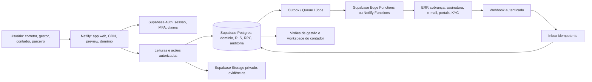
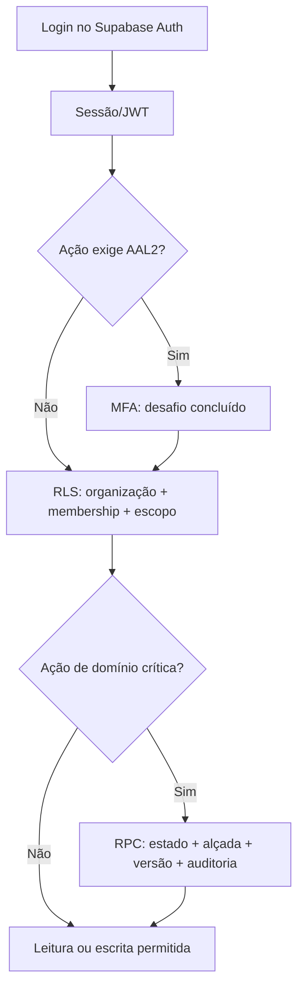

# Arquitetura de referência — CRM imobiliário sobre Netlify + Supabase

## Versão 0.1 — agosto de 2026

> **Decisão de base:** o CRM será uma aplicação web entregue pelo Netlify, com Supabase como plataforma de identidade, Postgres, políticas de acesso, arquivos privados, mudanças versionadas e eventos duráveis. Essa combinação organiza o produto; não transfere para o CRM a responsabilidade de banco, parceiro de pagamentos, ERP ou profissional contábil, jurídico e fiscal.

## 1. Mapa de responsabilidades

| Camada | Responsabilidade principal | Não é responsável por |
| --- | --- | --- |
| **Netlify** | Entrega do frontend, CDN, domínio, previews, build, configuração por ambiente e endpoints de borda quando necessários. | Fonte de verdade de contrato, saldo, documento, permissão ou evento econômico. |
| **Supabase Auth** | Sessão, usuário, MFA, claim e contexto de identidade. | Decidir sozinho a permissão de cada ação de domínio. |
| **Supabase Postgres + RLS** | Registro canônico de organização, parte, ativo, contrato, evento, direito, política, aprovação, log e escopo de acesso. | Substituir a escrituração do ERP ou a liquidação de parceiro financeiro. |
| **RPC/SQL transacional** | Aplicar regras atômicas de reserva, transição, aprovação, entitlement, fechamento e compensação. | Renderizar telas ou guardar segredos no navegador. |
| **Storage privado** | Conservar binários com policy e metadados de evidência. | Ser um link aberto de documento sensível. |
| **Functions e workers** | Verificar callback, chamar terceiro, preparar tarefa, processar tentativa e registrar resultado. | Fazer regra crítica sem transação, autorização ou trilha. |
| **Parceiro especializado** | Cobrança, liquidação, KYC, assinatura, ERP/fiscal ou bureau, conforme contrato. | Tornar o CRM instituição de pagamento, razão contábil ou parecer profissional. |

## 2. Separação entre leitura, comando e integração

O CRM não deve fazer toda interação do browser atravessar uma camada serverless só por hábito. A arquitetura separa o caminho por risco.

| Tipo de operação | Caminho preferencial | Proteção obrigatória | Exemplo imobiliário |
| --- | --- | --- | --- |
| Leitura de trabalho | App Netlify → Supabase via sessão do usuário | RLS, escopo da organização/SPE/carteira e índice em colunas de policy. | Corretor vê apenas a carteira e os imóveis autorizados. |
| Rascunho de baixo risco | App → tabela exposta com RLS ou RPC simples | Ownership, validação de payload, auditoria de alteração. | Nota pessoal de atendimento ou rascunho de classificação. |
| Comando crítico | App → RPC transacional ou endpoint seguro → Postgres | Estado esperado, alçada, idempotency key, registro de decisão, evento de auditoria. | Reservar lote, aprovar proposta, fechar cascata de direitos, gerar lote contábil. |
| Integração de saída | Comando cria `outbox_message`; worker chama terceiro | Chave idempotente, segredo no servidor, tentativas, timeout, resultado e reconciliação. | Criar cobrança, enviar lote ao ERP, pedir assinatura. |
| Callback de terceiro | Endpoint seguro → `inbox_event` → processador transacional | Assinatura, replay defense, deduplicação, correlação e exceção. | Pagamento, estorno, assinatura concluída ou rejeição de exportação. |
| Trabalho lento | Fila durável → worker curto/reexecutável | Job state, lease, backoff, limite de tentativa, alerta e reprocessamento operado. | Importar extrato, produzir relatório, atualizar índice de busca. |

## 3. O núcleo de dados no Supabase

### 3.1 Convenções obrigatórias

Cada tabela de domínio terá, conforme aplicável, `id` UUID/ULID, `organization_id`, `legal_entity_id` ou `spe_id`, `created_at`, `created_by`, `updated_at`, `version`, `source_system`, `external_reference` e estado explícito. O valor de `organization_id` não é apenas um filtro de interface: ele compõe as políticas RLS, índices e testes de isolamento.

| Grupo | Entidades canônicas | Regras de integridade |
| --- | --- | --- |
| Organização e acesso | `organizations`, `legal_entities`, `spe_entities`, `memberships`, `roles`, `permission_grants`, `access_reviews`, `platform_principals`, `administrative_grants`, `support_case_access`, `admin_audit_events` | Membership/grant expira e é revisado; papel não substitui escopo; AAL2 para comando privilegiado e auditoria append-only. |
| Relações | `parties`, `party_profiles`, `relationships`, `powers`, `beneficial_interests` | Uma parte pode exercer vários papéis; identidade e relação são separadas. |
| Ativo e comercial | `properties`, `developments`, `blocks`, `lots`, `inventory_units`, `listings`, `leads`, `deals`, `reservations`, `proposals` | Estoque é controlado por estado/versionamento; reserva não pode ser duplicada por concorrência. |
| Contrato e financeiro operacional | `contracts`, `installments`, `receivables`, `economic_plans`, `distribution_entitlements`, `settlements`, `reconciliation_cases` | Eventos compensatórios preservam origem; split não nasce sem elegibilidade/aprovação. |
| Evidência e decisão | `evidence_records`, `evidence_versions`, `policies`, `approvals`, `audit_events` | Toda decisão relevante aponta para contexto, regra vigente, autor, tempo e origem. |
| Integração e operação | `inbox_events`, `outbox_messages`, `integration_attempts`, `job_runs`, `error_cases`, `accounting_export_batches` | Chave externa única; reenvio é explícito; falha não apaga evento nem lote. |

### 3.2 Esquemas e exposição

| Schema ou superfície | Conteúdo | Regra |
| --- | --- | --- |
| `public` exposto com RLS | Tabelas/visões explicitamente permitidas ao produto. | Sem tabela sem RLS, grants mínimos e testes de permitir/negar. |
| `app_private` não exposto | Funções de apoio, staging, segredo operacional e cálculo interno. | Acesso apenas por função controlada. |
| `audit` não exposto | Eventos imutáveis, tentativas, snapshots e mudanças de policy. | Sem `UPDATE`/`DELETE` da aplicação; retenção definida. |
| `integration` não exposto | Inbox/outbox, locks, estado de processamento, payload protegido. | Funções seguras e operadores autorizados; payload sensível minimizado/criptografado conforme política. |

## 4. Segurança de identidade e autorização

1. **Identidade não contém todas as permissões.** JWT transporta identidade e sinal de MFA; membership, carteira, SPE, finalidade e vínculo de parte permanecem consultáveis no banco, evitando token grande ou desatualizado.
2. **RLS e grants nascem juntos.** Uma policy sem grant e um grant sem policy podem falhar de modos diferentes; ambos entram na mesma migration e no mesmo teste.
3. **MFA por risco.** AAL2 é exigido para mudança de acesso, exportação sensível, aprovação de distribuição, alteração de dados bancários/beneficiário, configuração de integração e ações de fechamento.
4. **Chaves são segregadas.** A chave publicável pode estar no app; `service_role`, credenciais de ERP/pagamento e segredos de webhook só existem em runtime seguro. Não há chave privilegiada em `VITE_*`, log, preview compartilhado ou browser.
5. **Admin não é superusuário cego.** Administrador continua sujeito a `organization_id`, escopo, auditoria e, em ações de risco, MFA/dupla aprovação.

### 4.1 Administração privilegiada e separação de infraestrutura

`platform_super_admin` responde por segurança e ciclo de vida da plataforma; ele não recebe leitura diária dos dados de uma locatária. `organization_admin`, `area_admin` e `operator` recebem somente o escopo delegado. Qualquer suporte a dado de cliente ocorre por `support_case_access` temporário, mascarado, finalístico e expirável. Break-glass usa incidente, MFA recente, duração curta, alerta, auditoria e revisão posterior; não cria uma permissão persistente.

O Netlify Team Owner/Developer pertence à infraestrutura de entrega e não mapeia automaticamente para papel administrativo do CRM. Equipes, projetos, deploys e segredos de produção/homologação/sandbox ficam separados; audit log da hospedagem complementa o evento administrativo do produto, mas não o substitui. [17]

## 5. Evidências e arquivos privados

Uma evidência possui metadado transacional e binário separado. A tabela `evidence_records` guarda tipo, parte/contrato/ativo relacionado, classificação, finalidade, status de revisão, retenção, origem e hash; `evidence_versions` preserva substituição e revisão; o objeto do bucket recebe chave não adivinhável e policy de Storage. O binário não é enumerado publicamente.

| Ação | Caminho | Controles |
| --- | --- | --- |
| Enviar documento | App solicita intenção/autorização → upload em bucket privado → confirma metadado | Tipo MIME/tamanho, escopo da organização, policy de `INSERT`, hash e antivírus se aplicável. |
| Visualizar | App solicita URL temporária após policy | RLS de metadado + `SELECT` de objeto, finalidade, prazo de URL e audit event. |
| Substituir | Cria nova `evidence_version` | Original preservado, motivo, revisor e cadeia de versões. |
| Reter/excluir | Job/ação aprovada | Legal hold, prazo, aprovação, prova de exclusão e impacto em backup avaliados. |

## 6. Integrações confiáveis: inbox, outbox e reconciliação

### 6.1 Saída para parceiro

1. A RPC aprovada grava a mudança de domínio, `audit_event` e `outbox_message` na **mesma transação**.
2. O worker obtém uma mensagem por lease, envia com `idempotency_key` e registra `integration_attempt`.
3. O retorno é associado à referência externa sem confirmar artificialmente o efeito econômico.
4. Falha temporária recebe backoff; falha de negócio abre `error_case`; reprocessamento é uma nova tentativa ligada à mesma intenção.

### 6.2 Entrada de parceiro

1. Endpoint Netlify ou Supabase Edge Function valida assinatura, origem, timestamp e schema do callback.
2. A mensagem é gravada em `inbox_event` com hash e unicidade `(provider, event_id)`; duplicata retorna resposta segura sem reaplicar fato.
3. Um processador transacional correlaciona contrato, parcela, settlement ou beneficiary; divergência vai para fila de exceções.
4. O evento de domínio/compensação e a auditoria preservam payload normalizado, referência externa e decisão tomada.

> **Regra de ouro:** callback é evidência externa recebida; não é autorização para ignorar elegibilidade, alçada, competência, estado de contrato ou política vigente.

## 7. Netlify: entrega, ambientes e borda

| Ambiente | Netlify | Supabase | Dados permitidos | Portão de liberação |
| --- | --- | --- | --- | --- |
| Local | App e emuladores/ferramentas locais | Projeto/local separado | Fixtures e dados sintéticos. | Testes de schema, RLS e unidade. |
| Preview | Deploy Preview protegido por acesso | Projeto de homologação/branch isolada, nunca produção | Massa anonimizável e cenários de teste. | Checklist de migração, fluxo e segurança. |
| Homologação | URL estável interna | Projeto Supabase de staging | Integrações de sandbox e dados de aceitação. | UAT, reconciliação simulada e teste de rollback. |
| Produção | Domínio público/privado do produto | Projeto Supabase de produção | Dados reais sob política LGPD. | Aprovação de mudança, monitoramento e plano de reversão. |

### 7.1 Funções: divisão pragmática

| Necessidade | Local prioritário | Justificativa |
| --- | --- | --- |
| App web, assets, previews e configuração de frontend | Netlify | Entrega e colaboração de produto. |
| Endpoint BFF same-origin, integração leve ligada à borda ou proteção de segredo específico do site | Netlify Function | Mantém o segredo no runtime e dá governança de deploy/contexto. |
| Callback com regra próxima do Postgres, validação de dados e mutação transacional | Supabase Edge Function + RPC | Reduz deslocamento entre receptor e dado autoritativo. |
| Job com fila, idempotência e resultado persistido | Worker disparado por fila/outbox | A função é executora; Postgres preserva estado. |
| Tarefa curta em agenda | Scheduled Function Netlify ou agendamento Supabase, após definição de owner | Só para disparo/checagem curta; job rastreável executa o trabalho. |
| ETL pesado, OCR em grande escala ou execução além de limites serverless | Serviço especializado avaliado posteriormente | Não contaminar o MVP com worker inexistente; definir custo, dados e operação. |

## 8. Operação, observabilidade e recuperação

| Sinal | Métrica ou evento | Dono inicial | Reação esperada |
| --- | --- | --- | --- |
| Comercial | conversão, SLA de primeiro atendimento, taxa de reserva/proposta | Operação comercial | corrigir funil, regra ou UX. |
| Financeiro | eventos sem conciliação, settlement não aplicado, distribuição bloqueada | Controladoria | abrir caso e não ajustar saldo manualmente. |
| Integração | backlog de outbox, tentativas, assinatura inválida, reprocessamento | Engenharia/integração | isolar, corrigir contrato, repetir com segurança. |
| Segurança | negação RLS, acesso fora de escopo, MFA ausente, URL de evidência | Segurança/owner da organização | bloquear, investigar e recertificar acesso. |
| Dados | migration falha, policy sem teste, backup/arquivo não verificado | Engenharia de dados | interromper release, corrigir e validar restore. |

O plano de recuperação tem quatro trilhas independentes: rollback de app no Netlify; correção/migration compensatória no banco; reprocessamento idempotente de integração; e restauração de banco/objetos conforme RPO e RTO aprovados. Restaurar banco não deve ser tratado como correção de uma cobrança ou contrato individual; para isso existem eventos compensatórios e lote corretivo.

## 9. Ondas de implementação

| Onda | Resultado técnico verificável | Prioridade |
| --- | --- | --- |
| **P0 — Fundação administrativa** | Repositório, ambientes separados, Auth/MFA, bootstrap controlado, `platform_principals`, `organizations`/`memberships`, grants, RLS testada, `AdminAuditEvent`, revogação e observabilidade mínima. | Bloqueadora. |
| **P1 — Núcleo comercial** | Parte/relação, inventário, lead, proposta e reserva com estados transacionais, leitura por escopo e evidências. | Alta. |
| **P2 — Loteadora e carteira** | Gleba/empreendimento/lote, condições, contrato, parcela, direito econômico e workflow de exceção. | Alta. |
| **P3 — Integrações financeiras** | Inbox/outbox, callbacks homologados, conciliação, split configurável, lote contábil/exportação e workspace controlado. | Condicionada a parceiro, contador e jurídico. |
| **P4 — Inteligência e escala** | Relatórios materializados, realtime para fila, IA com fonte/consentimento/revisão e testes de carga por domínio. | Após estabilidade operacional. |

## 10. Limitações e decisões que exigem validação antes de construção

1. Limites e preços de Netlify, Supabase, armazenamento, filas, backups e computação devem ser verificados na contratação, porque variam por plano e data.
2. O fornecedor financeiro precisa confirmar formalmente idempotência, assinatura, limites de split, estorno, disputa, KYC, liquidação, extratos e SLA antes de o CRM prometer cada fluxo.
3. Privacidade, retenção, base legal, acesso do contador, exportação, fiscalidade e escrituração requerem validação contextual com jurídico, DPO, contador/fiscal e parceiro habilitado.
4. Alta disponibilidade, residência de dados, SSO corporativo, backup de objetos, RPO/RTO e arquitetura de analytics exigem critérios comerciais e técnicos próprios antes de produção.

## 11. Prontidão operacional: a arquitetura só existe quando pode ser provada

A escolha por Netlify e Supabase não é uma garantia automática contra erro. A plataforma fica pronta por capacidade: ambiente separado, mudança reproduzível, acesso negado corretamente, documento privado, integração idempotente, telemetria suficiente, recuperação ensaiada e carga conhecida. Por isso, cada fluxo de CRM deverá obedecer a gates antes de ser promovido do preview ao ambiente produtivo.

| Capacidade | Decisão operacional | Prova que bloqueia promoção sem base |
| --- | --- | --- |
| Conexão e runtime | Browser usa Data API/RLS; processo efêmero usa pooler compatível; migration e backup usam conexão direta controlada. | URL/segredo de banco não aparece em cliente, e o teste confirma configuração de pooler/driver por ambiente. |
| Comando de domínio | Reserva, proposta, direito, distribuição, fechamento e compensação entram por RPC/serviço transacional. | Concorrência, repetição, versão defasada e alçada insuficiente falham sem alterar o fato. |
| Arquivo e dossiê | Upload vai direto ao Storage privado com intenção, versão, hash e metadado; Function não transporta binário pesado. | Upload interrompido, URL expirada, acesso revogado e caminho repetido foram simulados. |
| Evento e parceiro | Outbox/inbox, Queue, job e correlação separam intenção, transporte, callback e confirmação. | Callback duplicado/fora de ordem, timeout e falha do parceiro preservam histórico e abrem exceção rastreável. |
| Agenda e trabalho lento | Cron apenas cria trabalho elegível; worker/fila persistem lease, tentativa, resultado e replay. | Nenhum fechamento, conciliação ou lote depende de runtime em memória ou de agenda não observada. |
| Release e recuperação | Migration, RLS, segredo, Function e policy chegam juntos, com rollback de app, migration compensatória e restore ensaiado. | RPO/RTO, backup de banco e de objetos, owner e runbook estão aprovados antes de dado real. |

Os detalhes de escolha de runtime, envelope de integração, testes de permitir/negar, runbooks e baselines de capacidade ficam documentados nos artefatos de prontidão. Eles formam uma extensão vinculante desta arquitetura, e não um manual opcional a ser escrito depois da primeira falha.

## 12. Qualidade de mudança e tratamento de falha

Cada mudança de software é uma mudança de produto, dados e operação. Por isso, a arquitetura adota uma sequência de prova: **invariante → validação de fronteira → teste da decisão → observabilidade → contenção → recuperação → aprendizagem**. A ausência de qualquer elo não é detalhe de implementação; é risco conhecido que impede promoção conforme a severidade.

| Ponto de controle | Aplicação técnica | Erro que deve bloquear |
| --- | --- | --- |
| Contrato e tipo | Schema validado em formulário, webhook, importação e Function; tipos de estado sem fallback ambíguo. | Payload não confiável, `null`/lista vazia significando “todos”, valor ou tempo inferidos. |
| Teste de domínio | Unitários e transacionais para estado, versão, alçada, concorrência, cálculo e compensação. | Reserva, proposta, direito, split ou fechamento duplicado/incompatível. |
| Teste de policy | Casos permitir/negar em RLS, grant, RPC, URL temporal, exportação e Storage. | Acesso transversal por interface, URL ou API direta. |
| Contrato e caos controlado | Sandbox, fixture e simulação de duplicata, timeout, 429/5xx, atraso, ordem invertida e parceiro indisponível. | Callback/worker que confirma, liquida ou repassa sem reconciliação. |
| Erro e correlação | Código público seguro, `correlation_id`, trace/release/ambiente protegidos, log minimizado e audit event separado. | Stack trace, segredo, token ou PII em resposta/telemetria; falha sem investigação possível. |
| Release e dependência | Scan, dependency review, preview, flag/canário, migration compatível, rollback e compensação. | Change sem revisão, pacote vulnerável, schema/policy em drift ou rollback impossível. |
| Incidente | Runbook, severidade, owner, timeline, comunicação, postmortem e teste de regressão. | Recuperação improvisada, correção manual do passado ou ação corretiva sem responsável. |

O frontend usa error boundary como contenção de renderização por rota/painel e estado explícito para falha de comando; handlers e trabalho assíncrono continuam exigindo tratamento próprio. A telemetria agrupa sintomas por fingerprint/release, mas não substitui audit trail de domínio. Resposta de UI deve dizer o que ocorreu, qual ação é segura e como informar a correlação; ela não afirma sucesso enquanto a transação ou a reconciliação não confirmar o estado canônico.

### 12.1 Fronteira de retry e recuperação

| Camada | O que pode repetir | O que é proibido repetir cegamente | Mecanismo de recuperação |
| --- | --- | --- | --- |
| Browser/leitura | Leitura idempotente, com limite, backoff, cancelamento e estado visível. | Comando de reserva, alçada, documento, exportação ou dinheiro após rede instável. | Recarregar estado canônico e preservar rascunho somente quando não altera fato. |
| RPC/transação | Decisão interna curta e pura após conflito/serialização, reexecutando a transação inteira. | Qualquer chamada a parceiro, e-mail, assinatura, arquivo externo ou notificação que possa ter escapado da transação. | Versão/constraint, conflito explícito, nova tentativa transacional ou retificação por fato. |
| Outbox/worker | Mensagem elegível não concluída, sob lease, limite e chave estável. | Nova intenção econômica criada para “destravar” a tentativa anterior. | Tentativa ligada à intenção, backoff, suspensão, dead-letter/arquivamento e caso de exceção. |
| Inbox/callback | Processamento que a unicidade/hash prova ainda não ter produzido efeito. | Aplicação de settlement, distribuição ou cancelamento só porque o payload chegou outra vez. | Deduplicação, ordenação/versão, reconciliação por referência externa e compensação aprovada. |
| Restore | Recuperação de serviço/objeto ensaiada em escopo isolado. | Restore usado para corrigir contrato, parcela, direito ou decisão individual. | Evento compensatório, lote corretivo e reconciliação preservando o passado. |

O modelo detalhado, incluindo cenário de timeout ambíguo, conflito de transação, RLS por operação, callback tardio e carga de jornada, é vinculante à arquitetura. [Matriz aprofundada anti-erro](crm_engenharia_antierro_02_matriz_jornadas.md) · [Evidências](crm_engenharia_antierro_evidencias.md)

## Referências de plataforma

[1]–[12] [Caderno de evidências Netlify + Supabase](crm_netlify_supabase_evidencias.md)

[13] [Matriz operacional de prontidão](crm_netlify_supabase_prontidao_operacional.md)

[14] [Fluxos operacionais Netlify, Supabase e parceiros](crm_netlify_supabase_fluxos_operacionais.md)

[15] [Gates e runbooks operacionais](crm_netlify_supabase_gates_runbooks.md)

[16] [Disciplina anti-erro — metodologia, catálogo, controles e relatórios](crm_engenharia_antierro_metodologia.md)

[17] [Administração de plataforma — método, evidências, alçadas e implementação](crm_administracao_plataforma_metodologia.md) · [evidências](crm_administracao_plataforma_evidencias.md) · [modelo](crm_administracao_plataforma_modelo.md) · [blueprint](crm_administracao_plataforma_implementacao.md)

[18] [Aprofundamento anti-erro — matriz de jornadas, contramedidas e fontes](crm_engenharia_antierro_02_matriz_jornadas.md) · [evidências atualizadas](crm_engenharia_antierro_evidencias.md)
