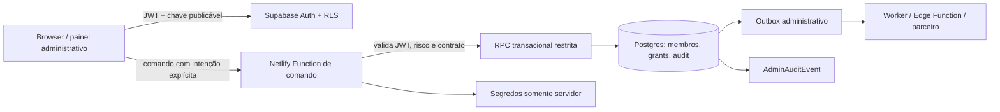

# Administração de plataforma — blueprint de implementação Netlify + Supabase

**Estado:** `blueprint_de_inicio`  
**Decisão:** o primeiro incremento de desenvolvimento implementa o núcleo de controle administrativo, não um dashboard genérico de configurações.

## 1. Fronteira de execução



O browser só recebe chave publicável, sessão do próprio usuário e dados liberados por RLS. Ele nunca recebe `service_role`, segredo de parceiro, chave de automação, lista de principals privilegiados ou decisão de autorização client-side como fonte de verdade. A interface é uma projeção; o banco e as funções transacionais são autoridades de decisão.

## 2. Schema inicial e separação de schemas

| Schema/tabela | Responsabilidade | Exposição |
| --- | --- | --- |
| `public.organizations` | Locatária, estado e metadados mínimos. | RLS por organização. |
| `public.organization_memberships` | Pessoa, organização/SPE/unidade, papel-base, vigência e estado. | RLS mínima; edição somente por função autorizada. |
| `public.administrative_grants` | Delegação ou suporte temporário com finalidade e expiração. | Leitura parcial ao sujeito; alteração por comando transacional. |
| `public.roles` / `public.permissions` | Catálogo estável de papéis e ações. | Leitura controlada; mutação por migration/release, não por tela inicial. |
| `public.admin_audit_events` | Evento administrativo append-only, redigido e correlacionado. | Leitura filtrada por scope; inserção exclusiva de função. |
| `public.support_case_access` | Caso, resource selector, redaction e expiração de suporte. | Sem API genérica de escrita. |
| `private.authorization` | Funções de decisão e auxiliares de policy. | Não exposto à API. |
| `private.admin_commands` | Operações transacionais de alto risco. | Invocado por wrappers mínimos, sem `SELECT *` exposto. |
| `private.outbox_events` | Evento durável para notificação e integração. | Não exposto ao browser. |

As migrations criam grants, RLS, índice, função e teste como a mesma unidade de mudança. Tabela em schema exposto começa em deny-by-default: RLS habilitada, grants revogados de `anon`/`authenticated`, permissões reabertas apenas para a operação necessária. Views recebem `security_invoker` ou permanecem em schema não exposto. [1]

## 3. Claims, dados vivos e sessão

| Sinal | Uso permitido | Não usar como única fonte |
| --- | --- | --- |
| `sub` do JWT | Identificar o principal autenticado. | Concluir escopo ou alçada sem membership ativo. |
| `aal` / `amr` | Exigir MFA e avaliar reautenticação recente em comando privilegiado. | Definir se a pessoa continua vinculada à organização. |
| Claim mínima de papel | Habilitar navegação e reduzir chamadas de apresentação. | Liberar comando de alto risco após revogação/mudança de escopo. |
| `raw_app_meta_data` | Metadado de aplicação controlado. | Substituir `OrganizationMembership` e `AdministrativeGrant` auditáveis. |
| `raw_user_meta_data` | Preferências de perfil. | Autorização — o usuário pode alterá-lo. [1] |

O token é uma fotografia de sessão. Grant, revogação, support case e risco devem ser avaliados no comando ou em policy baseada no dado vigente. Ao mudar papel ou remover acesso, a implementação invalida/renova sessão conforme a política e impede o comando mesmo que a UI ainda exiba uma tela anterior.

## 4. Funções transacionais de primeira entrega

| Comando | Entrada mínima | Pré-condições | Efeito atômico | Saída segura |
| --- | --- | --- | --- | --- |
| `bootstrap_platform_principal` | principal, procedimento, correlação | Apenas migração/procedimento controlado; nenhum bootstrap prévio. | Cria principal, política e audit event inicial. | ID e estado; sem dados sensíveis. |
| `provision_organization` | nome, domínio, owner, correlation ID | `platform_super_admin`, AAL2, idempotency key. | Cria organização `provisioning`, membership inicial, convite, audit/outbox. | IDs, estado, próxima ação. |
| `grant_membership` | pessoa, papel, scope, vigência, motivo | Autoridade superior, SoD, organização ativa. | Cria grant, invalida cache/sessão quando necessário, audit/outbox. | Grant redigido e expiração. |
| `revoke_membership` | grant, motivo, correlation ID | Autoridade de revogação, não remove último owner sem sucessor. | Fecha grant, sessões elegíveis, audit/outbox. | Estado revogado e itens de follow-up. |
| `open_support_case_access` | caso, selector, finalidade, duração | Caso ativo, escopo mínimo, dupla aprovação quando aplicável. | Cria grant temporário, audit/outbox e relógio de expiração. | Escopo redigido e prazo. |
| `break_glass` | incidente, motivo codificado, duração | AAL2, verificação de indisponibilidade/risco, elegibilidade. | Cria elevação curta, alerta, incidente e audit event. | Token/sessão contextual; nunca segredo persistente. |

Toda função deve usar `security definer` somente quando necessário, com `search_path` explícito e vazio, validação de `auth.uid()`, validação de escopo, lista fechada de campos e escrita de audit event na mesma transação. Wrapper exposto não pode aceitar nome de tabela, SQL, papel arbitrário, ID de outra locatária ou payload livre.

## 5. Padrão Netlify

| Camada | Responsabilidade | Restrições |
| --- | --- | --- |
| SPA estática | Mostra estado do usuário, exige confirmação e chama comando nomeado. | Não decide autorização; não recebe segredo; não faz write direto para objeto sensível. |
| Netlify Function | Valida token no servidor, valida schema do comando, cria correlation ID, aplica rate limit/telemetria e encaminha para RPC/serviço permitido. | Não usa service key como proxy genérico de banco; segredo é escopo mínimo por função e ambiente. |
| Deploy Preview | Testa painel contra projeto/branch isolado e dados sintéticos. | Não recebe dump de produção, segredo de produção ou acesso a parceiros reais. |
| Produção | Recebe migrations revisadas e variáveis de produção somente após gate. | Mudança de policy, segredo ou função crítica exige revisão, teste e rollback documentado. |
| Auditoria Netlify | Registra alteração de equipe, projeto e configuração. [2] | Complementa — não substitui — `admin_audit_events` de produto. |

O acesso de equipe ao Netlify é outra camada de privilégio. `Team Owner`, `Developer` e demais papéis de infraestrutura não são papéis do CRM e não devem mapear automaticamente para `platform_super_admin`. Produção, homologação e sandbox usam projetos e secrets separados, com acesso de projeto mínimo. [3]

## 6. Contrato de autorização

Antes de executar um comando, a função/relação deve avaliar:

```text
allow(command, actor, target, context) =
  authenticated(actor)
  ∧ session_assurance(actor, command.risk)
  ∧ active_membership(actor, target.organization)
  ∧ permission(actor.role, command)
  ∧ scope_contains(actor.scope, target)
  ∧ grant_is_active(actor, command, now)
  ∧ separation_of_duties(actor, command, target)
  ∧ purpose_is_valid(context.case_or_reason)
  ∧ policy_allows(command, actor, target, context)
```

Falha retorna um código de domínio seguro — por exemplo, `ADMIN_SCOPE_DENIED`, `ADMIN_MFA_REQUIRED`, `ADMIN_DUAL_APPROVAL_REQUIRED`, `ADMIN_GRANT_EXPIRED` — sem revelar existência ou conteúdo de outra organização. O cliente recebe instrução de correção, não detalhes de policy interna.

## 7. Suite de testes obrigatória

| Nível | Prova mínima | Exemplo de falha que deve ser barrada |
| --- | --- | --- |
| SQL/RLS (pgTAP) | `anon`, membro, não-membro, admin de outra organização, principal expirado e AAL inferior. | URL/payload de organização B não retorna linha para Admin da organização A. |
| RPC | Idempotência, transação, allow/deny, rollback e audit atômico. | Grant criado sem audit event, ou segundo reenvio criando duplicidade. |
| Function | JWT inválido, schema inválido, falta de correlation ID, rate limit e segredo ausente. | Browser tenta chamar comando livre com `action=delete_everything`. |
| Integração | Revogação → sessão/cache → RLS → UI; expiração de suporte; alerta de break-glass. | UI ainda mostra botão e servidor executa comando depois de grant revogado. |
| E2E | Bootstrap, convite, MFA, delegação, suspensão e retorno seguro de erro. | Admin de área eleva a própria alçada ou remove último owner. |
| Segurança | Mutação de metadata, view, Storage, exportação e segredo. | `raw_user_meta_data` forjado altera autorização ou arquivo de outra locatária abre. |

## 8. Ordem real de construção

| Ordem | Entrega | Gate para continuar |
| --- | --- | --- |
| **A0** | Projeto Supabase, migrations, ambientes, Auth/MFA e bootstrap controlado. | Nenhuma key privilegiada no cliente; primeiro principal rastreável. |
| **A1** | Organização, membership, papéis, RLS e `AdminAuditEvent`. | Suite permitir/negar por tabela e organização passa em CI. |
| **A2** | Painel de Super Admin mínimo: organizações, principals, convites, revogação e eventos. | Todo comando crítico é RPC/função validada, idempotente e auditável. |
| **A3** | Painel de Admin de organização: membros, escopos, área e delegação. | Escalonamento vertical/horizontal negado e testado. |
| **A4** | Suporte JIT, break-glass, recertificação, alertas e runbook. | Expiração e incidente se completam sem intervenção manual. |
| **A5** | Catálogos, analytics, automação administrativa e integração operacional. | Métricas/SLO, telemetria e rollback provam operação estável. |

## Referências

[1] [Supabase — Custom Claims & RBAC](https://supabase.com/docs/guides/api/custom-claims-and-role-based-access-control-rbac), [MFA](https://supabase.com/docs/guides/auth/auth-mfa) e [RLS](https://supabase.com/docs/guides/database/postgres/row-level-security)  
[2] [Netlify — Team audit log](https://docs.netlify.com/manage/accounts-and-billing/team-management/team-audit-log/)  
[3] [Netlify — Roles and permissions](https://docs.netlify.com/manage/accounts-and-billing/team-management/roles-and-permissions/) e [project access](https://docs.netlify.com/manage/accounts-and-billing/team-management/manage-project-access/)
