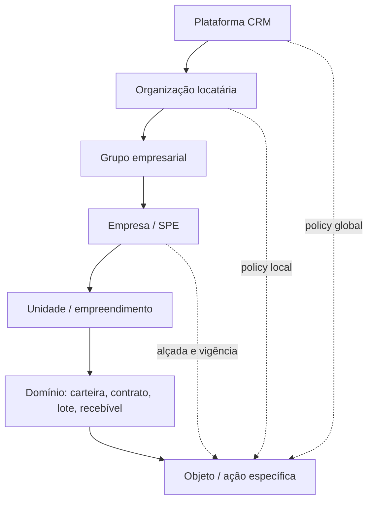

# Administração de plataforma — modelo de alçadas e jornadas

**Estado:** `proposto_para_piloto`  
**Dependências:** `crm_administracao_plataforma_metodologia.md`, `crm_administracao_plataforma_evidencias.md`, `crm_dominio_organizacional.md`, `crm_nucleo_cadastral_carteira.md`.

## 1. Regra de leitura

O painel de administração é o **primeiro módulo de desenvolvimento**, mas não o primeiro lugar para colocar todas as configurações. A primeira entrega é a fronteira de segurança que permite criar uma organização, atribuir escopo, revogar acesso, provar quem fez a alteração e negar o que não deve passar. Configurações amplas entram gradualmente depois de essa fronteira ser testada.

> **Nenhuma pessoa é “dona de todos os dados”.** Um Super Admin é responsável pela saúde da plataforma; cada locatária continua responsável por seu domínio, seus dados, suas alçadas e suas decisões de negócio.

## 2. Lattice de escopo

A autorização resulta de `identidade + papel-base + escopo + ação + objeto + finalidade + vigência + alçada + risco de sessão + policy`. Um papel declara a intenção de trabalho; ele não elimina os demais testes.

## 3. Catálogo inicial de papéis

| Papel | Escopo máximo | Propósito | Ações permitidas inicialmente | Ações vedadas por padrão |
| --- | --- | --- | --- | --- |
| `platform_super_admin` | Plataforma | Manter segurança, organizações, integrações homologadas, políticas globais, incidentes e suporte controlado. | Criar/suspender organização; gerir catálogo de capacidade; abrir caso de suporte; exigir MFA; revogar grant; consultar eventos administrativos. | Ler conteúdo de dossiê/carteira; agir como corretor; alterar valor de pagamento; instruir split; exportar dado de locatária sem caso. |
| `platform_security_admin` | Plataforma | Operar políticas de segurança, sessão, incidentes e recuperação. | Suspender principal; fechar sessão; aprovar elevação; acionar break-glass; revisar eventos. | Criar cobrança, operar carteira, assumir empresa cliente ou editar regra comercial. |
| `platform_support_operator` | Caso temporário | Diagnosticar falha sob escopo mínimo. | Consultar metadado mascarado, status de integração e correlação; solicitar suporte elevado. | Ler documento, payload completo, credencial, dados financeiros detalhados ou conceder a si próprio escopo. |
| `organization_admin` | Organização e escopos delegados | Administrar pessoas, unidades, SPEs, papéis e políticas locais permitidas. | Convidar membro; revogar membership; criar Admin de área; gerir catálogos locais. | Cruzar organização; editar guardrail global; alterar política de infraestrutura; aprovar alçada acima do próprio teto. |
| `area_admin` | Área/unidade/SPE delegada | Configurar filas, templates, delegações e operação local. | Organizar workspaces e delegar atividades permitidas. | Criar Super Admin; editar RLS; aprovar pagamento/split fora de alçada; alterar organização. |
| `operator` | Objeto atribuído | Executar jornada de negócio. | Criar/editar o que sua policy permitir e abrir exceção. | Mudar policy, grants, auditoria, integração, segredo ou configuração privilegiada. |

## 4. Matriz de comandos sensíveis

| Comando | Quem solicita | Quem aprova | Quem executa | Condições mínimas |
| --- | --- | --- | --- | --- |
| Criar organização | Platform Super Admin | Segundo Super Admin ou fluxo de bootstrap aprovado | Função transacional | MFA AAL2, domínio validado, evento e idempotência. |
| Conceder Admin de organização | Platform Super Admin / Organization Admin autorizado | Autoridade superior ao grant | Função transacional | Alçada, vigência, convite aceito e prova de MFA antes da primeira sessão privilegiada. |
| Elevar suporte a objeto de locatária | Suporte | Security Admin ou policy automática restritiva | Função de suporte | Caso, motivo, recurso mínimo, expiração curta, mascaramento e evento. |
| Alterar policy global | Security Admin | Dupla aprovação de plataforma | Deploy/migration revisada | AAL2, revisão de código, teste permitir/negar, rollback e correlação de release. |
| Reprocessar evento financeiro | Operação financeira autorizada | Segunda alçada definida por contrato/policy | Função de domínio | Idempotency key, evento original, motivo, simulação e trilho de compensação. |
| Break-glass | Principal elegível | Posterior, independente do solicitante | Função transacional restrita | Incidente, duração, notificação, captura de sessão e postmortem obrigatório. |

## 5. Jornadas de painel

### 5.1 Bootstrap seguro da plataforma

O primeiro principal privilegiado nasce fora do fluxo normal, por procedimento controlado de implantação e registro de bootstrap. Antes de qualquer administração, o produto exige enrollment MFA, confirmação de canal de recuperação, aceite de política, identidade de organização técnica e geração de evento inicial. A aplicação não deve possuir uma variável que converte qualquer login em Super Admin.

### 5.2 Criação de organização e primeiro Admin

O Super Admin inicia o cadastro de organização em estado `draft`. O sistema valida domínio, dados mínimos, owner inicial e limites de produto; cria a organização em estado `provisioning`; atribui um `organization_admin` com vigência; e somente libera ambiente depois do convite aceito, MFA exigida e teste mínimo de RLS. Falha ou abandono não deixa membership parcialmente ativa.

### 5.3 Delegação local

O Admin de organização só enxerga os escopos próprios. Ao delegar um Admin de área, a interface mostra explicitamente o limite herdado, a expiração, o que o delegado não pode fazer e a cadeia de aprovação. Delegar não transmite o poder de delegar acima da própria alçada.

### 5.4 Suporte just-in-time

O suporte começa por metadado: correlation ID, status, versão, erro e objeto mascarado. Acesso ampliado deve ser um novo `SupportCaseAccess`, ligado a caso, finalidade, principal, resource selector, hora de término e redaction policy. A tela mostra cronômetro, escopo e botão de encerramento; o encerramento revoga credencial de sessão e produz evento.

### 5.5 Break-glass

O painel de emergência não é um atalho visual. Ele pede incidente, motivo codificado, confirmação explícita do escopo, MFA recente e prazo curto. O sistema notifica responsáveis, registra a trilha completa, bloqueia extensão silenciosa e cria tarefa obrigatória de postmortem/revogação. Se o fluxo normal estiver disponível, break-glass deve ser negado.

## 6. Blueprint de painéis

| Painel | Público | Pergunta principal | Conteúdo inicial | Ação de maior risco |
| --- | --- | --- | --- | --- |
| **Central de Plataforma** | Super Admin | A plataforma está segura e organizada? | Organizações, principals privilegiados, grants expirando, incidentes, integrações, releases e eventos. | Suspender organização, revogar principal, abrir suporte ou iniciar break-glass. |
| **Segurança e sessões** | Security Admin | Quem tem privilégio agora e por quê? | MFA/AAL, sessões, grants temporários, recertificações, violações e trilha de auditoria. | Elevar privilégio, fechar sessão, aplicar hold ou policy. |
| **Organização e pessoas** | Organization Admin | Quem pode fazer o quê nesta empresa? | Memberships, escopos, SPEs, áreas, alçadas, vigências e pendências de convite. | Conceder/revogar papel ou delegar escopo. |
| **Administração de área** | Area Admin | A operação local está pronta para trabalhar? | Filas, templates, delegações, workspaces e exceções locais. | Alterar configuração que afeta a jornada local. |
| **Caso de suporte** | Support Operator | Qual diagnóstico mínimo resolve o caso? | Ticket, correlação, sinais técnicos, objeto redigido, escopo e relógio de expiração. | Solicitar/usar acesso temporário. |

## 7. Critérios de aceitação da primeira entrega

1. Um usuário autenticado sem membership não lê linha, arquivo, função ou view administrativa de nenhuma organização.
2. Um Admin de organização não enxerga nem cria recursos de outra organização, mesmo alterando URL, payload ou client state.
3. Um Admin de área não pode elevar o próprio grant, atribuir `platform_*` ou remover um guardrail superior.
4. Todo grant, revogação, convite, expiração, sessão reforçada, negação e comando de alto risco gera `AdminAuditEvent` correlacionado.
5. Uma sessão `aal1` vê orientação para MFA, mas não executa comando administrativo de alto risco; uma sessão `aal2` continua limitada por escopo e policy.
6. O uso de break-glass expira, alerta, abre incidente e não deixa permissão residual.

## 8. Decisões que dependem de piloto e validação

O tempo de expiração de suporte, a composição de dupla aprovação, a lista de comandos de alto risco, retenção de eventos, política de mascaramento, método de recuperação de MFA e regras de exportação precisam ser calibrados por segmento, contrato, LGPD, jurídico, segurança e equipe operacional. Não devem ser tratados como valor universal de interface.
