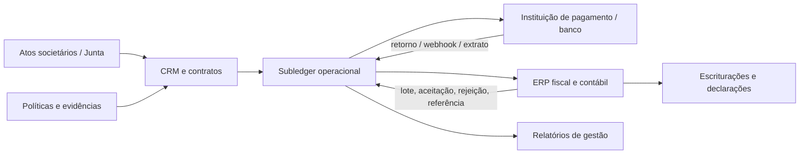

# Área da contabilidade, auditoria e integrações

## O contador deve enxergar o todo econômico, não controlar o comercial

A área contábil do CRM não é um superusuário irrestrito. É um workspace por empresa/SPE, competência e escopo de trabalho que permite visualizar **o que originou faturamento, cobrança, recebimento, repasse, distribuição, documento e divergência**. Ela não muda proposta, contrato ou retorno bancário; ela revisa classificações, mapeamentos, exportações e exceções, devolvendo pendências a quem originou o evento.

## Workspace do contador

| Área | Pergunta operacional | Ação permitida |
| --- | --- | --- |
| Visão de competência | Quais eventos econômicos pertencem ao período e a que empresa/SPE? | Filtrar, verificar completude e abrir pendência com referência de origem. |
| Faturamento e documentos | O que foi faturado, emitido, cancelado, reembolsado ou ainda aguarda classificação? | Conferir, devolver exceção, exportar lote e registrar referência fiscal. |
| Carteira | Qual é o saldo contratual, a entrada conciliada, a inadimplência e o distrato por projeto? | Conciliar visão, apontar divergência e aprovar mapeamento dentro do papel. |
| Repasses/distribuições | Quais direitos foram calculados, bloqueados, instruídos ou liquidados? | Conferir base, versão de regra, beneficiário, estado e evidência. |
| Fechamento | O que ainda impede exportação, conciliação ou fechamento do período? | Abrir/atribuir caso, bloquear lote, aprovar retorno e arquivar snapshot. |
| Auditoria | Quem alterou regra, valor, acesso ou status e em qual versão? | Consultar trilha e exportar evidência, sem apagar eventos. |
| Política fiscal | Qual regra, leiaute e configuração estava vigente para cada evento? | Propor/validar versão e vigência de configuração com responsável autorizado. |

## Painéis essenciais

| Painel | Segmentações obrigatórias | Sinal de risco |
| --- | --- | --- |
| Faturamento originado | Empresa, SPE, competência, produto, contrato, documento e estado | Evento sem documento/regra ou documento sem evento de origem. |
| Cobrança e liquidação | Meio, provedor, vencimento, banco, projeto, contrato e diferença | Pagamento não conciliado, pagamento parcial, retorno duplicado ou estorno. |
| Carteira de loteadora | Empreendimento, fase, lote, safra, vencimento, status de contrato e condição | Saldo sem parcela, lote em carteira sem contrato ou retorno de estoque pendente. |
| Distribuições | Regra/versão, beneficiário, natureza, gatilho, alçada e estado de pagamento | Direito bloqueado, percentuais incompatíveis, base negativa ou pagamento sem evidência. |
| Fechamento fiscal-contábil | Empresa, competência, obrigação, lote de exportação e retorno | Leiaute desatualizado, exportação rejeitada ou divergência aberta na competência. |
| Acessos sensíveis | Papel, empresa, projeto, dossiê, data de expiração e última recertificação | Acesso amplo, expirado, sem dono ou sem política vinculada. |

## Matriz de acesso

| Perfil | Escopo padrão | Pode aprovar | Não pode fazer |
| --- | --- | --- | --- |
| Contador externo | Empresas/SPEs designadas, períodos e relatórios financeiros | Mapeamento/exportação dentro do escopo e segundo alçada | Modificar contrato, saldo conciliado, instrução de pagamento ou acesso de terceiros. |
| Fiscal interno/terceiro | Documento, natureza, retenção configurável, competência e lote fiscal | Devolver classificação, validar configuração e liberar lote sob política | Definir regime tributário sem responsável, movimentar caixa ou apagar evidência. |
| Tesouraria | Banco/provedor, settlement, conciliação e instruções aprovadas | Conciliar e instruir pagamento dentro da alçada | Alterar a regra econômica que originou a distribuição. |
| Controladoria | Visão consolidada de empresa/projeto, orçamento, carteira e fechamento | Aprovar exceção financeira configurada | Reescrever retorno bancário ou documento fiscal emitido. |
| Auditoria | Leitura de evidências, logs, snapshots e casos | Nenhuma alteração econômica | Conceder acesso ou resolver exceção sem trilha e responsável. |
| Comercial | Proposta, condição comercial e próxima ação necessárias à própria carteira | Solicitar ajuste/exceção | Consultar carteira completa, dados bancários, dossiês fiscais ou liberar pagamento. |

## Integrações e fontes de verdade

| Integração | Direção | Dados mínimos | Controle técnico e operacional |
| --- | --- | --- | --- |
| Pagamento/banco → subledger | Entrada | Id externo, valor, data/hora, meio, status, tarifa e referência | Idempotência, assinatura/verificação do retorno, reconciliação e caso de divergência. |
| Subledger → pagamento/banco | Saída | Instrução aprovada, recebedor elegível, valor, motivo, referência e política | Dupla aprovação quando aplicável, expiração, limite, callback e proibição de reenvio cego. |
| Subledger → ERP | Saída | Evento, competência, empresa, dimensão, mapeamento, documento, parte e lote | Esquema versionado, validação prévia, imutabilidade do lote e retorno de aceitação/rejeição. |
| ERP → subledger | Entrada | Número/referência do lançamento, estado do lote, divergência e correção | CRM não substitui o razão; retorno é anexado à origem e à competência. |
| Fiscal/NFS-e → subledger | Bidirecional controlada | Documento, chave/referência, situação, competência e cancelamento | Município/leiaute configurados, não hardcoded; emissão exige fluxo autorizado. |
| Junta/atos → dossiê | Entrada assistida ou documental | Ato, certidão, data, participantes, poderes e estado | Fonte e versão da evidência; revisão jurídica de poderes. |

## Fechamento por competência

1. **Cortar a operação.** Definir empresa/SPE, competência e horário de corte; o sistema gera snapshot de eventos, contratos e regras elegíveis.
2. **Conciliar caixa.** Todo settlement recebido deve estar aplicado, em diferença justificada ou classificado como pendente; não existe saldo “ajustado manualmente” sem evento.
3. **Revisar documentos e regra.** Itens com documento faltante, município/regra indefinido, recebedor bloqueado ou distribuição sem alçada entram na fila de exceções.
4. **Fechar lote de exportação.** O contador aprova um `AccountingExportBatch` imutável, que preserva esquema, mapeamento, parâmetros e itens exportados.
5. **Receber retorno.** Aceitação, rejeição e referência externa retornam ao lote; rejeição não apaga a origem, abre correção e gera novo lote.
6. **Arquivar evidência.** Snapshot, relatório de diferenças, política vigente e logs de aprovação ficam disponíveis para auditoria e revisão futura.

## Regras de integridade

| Regra | Implementação |
| --- | --- |
| Não duplicar caixa | Chaves externas de liquidação são únicas por provedor/conta/evento; repetição entra como possível duplicidade. |
| Não editar passado | Ajuste posterior gera evento compensatório, aditivo ou novo lote, mantendo o original. |
| Não exportar sem contexto | Todo item tem empresa, competência, origem, categoria, política e estado de revisão. |
| Não atribuir imposto por palpite | Alíquota, regime, natureza, município e retenção são parâmetros versionados e revisados pelo fiscal. |
| Não pagar sem base | Instrução de pagamento referencia entitlement/obrigação, regra e aprovação. |
| Não liberar acesso por cargo | Acesso exige escopo, dono, expiração e recertificação, mesmo para sócios/contadores. |

## Conexão com obrigações e livros

A ECD compreende livros como Diário, Razão, balancetes, balanços e fichas de lançamento; a ECF reúne operações relevantes para IRPJ e CSLL; a EFD-Reinf e a EFD-Contribuições recebem conjuntos fiscais próprios, estruturados por evento/documento e regras aplicáveis. [1] [2] [3] [4] A arquitetura proposta não tenta reproduzir esses sistemas no CRM. Ela produz origem confiável e rastreável para que a contabilidade e o fiscal tenham menos retrabalho, mais visibilidade e uma trilha de retorno por competência.

## Referências

[1] [Portal SPED / Receita Federal — Escrituração Contábil Digital (ECD)](https://www.gov.br/sped/pt-br/assuntos/escrituracoes-digitais/ecd)

[2] [Gov.br / Receita Federal — Entregar Escrituração Contábil Fiscal](https://www.gov.br/pt-br/servicos/entregar-escrituracao-contabil-fiscal)

[3] [Portal SPED / Receita Federal — EFD-Reinf](https://www.gov.br/sped/pt-br/assuntos/escrituracoes-digitais/efd-reinf)

[4] [Portal SPED / Receita Federal — EFD-Contribuições](https://www.gov.br/sped/pt-br/assuntos/escrituracoes-digitais/efd-contribuicoes)
