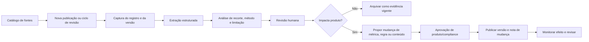

# Governança de atualização contínua de estudos

## Objetivo

O CRM futuro deve tratar estudos de mercado, regras, indicadores e aprendizados de operação como um **produto de conhecimento versionado**. A atualização não deve alterar silenciosamente uma tela, regra ou recomendação: precisa gerar uma nova versão de evidência, indicar o impacto potencial e passar por revisão proporcional ao risco.

> A automação deve acelerar a descoberta e a preparação de uma atualização; a decisão de publicar uma nova regra, métrica ou orientação continua sendo humana e auditável.

## Fluxo canônico de atualização

## Objetos de governança

| Objeto | Finalidade | Campos essenciais |
| --- | --- | --- |
| Catálogo de fontes | Registrar cada fonte monitorada e sua confiabilidade | Emissor, URL, tema, tipo, escopo, cadência esperada, método de acesso e responsável. |
| Snapshot de fonte | Guardar a versão exata analisada | URL/arquivo, data de publicação, data de captura, hash, licença/uso e status. |
| Evidência | Converter o conteúdo em afirmação verificável | Resumo, valor/unidade, período, território, método, limitação, confiança e estado. |
| Proposta de impacto | Ligar evidência a uma possível mudança de produto | Módulo afetado, hipótese, risco, dono, teste e versão de regra. |
| Nota de mudança | Explicar o que mudou para usuários internos | Antes/depois, evidência de suporte, data efetiva e reversão. |
| Revisão | Registrar a decisão humana | Revisor, parecer, data, exceção, aprovar/rejeitar e motivo. |

## Estados da atualização

| Estado | Significado | Quem pode avançar |
| --- | --- | --- |
| Descoberta | A fonte ou publicação foi identificada, ainda sem avaliação | Curadoria de pesquisa. |
| Capturada | A versão foi preservada e possui metadados mínimos | Curadoria de pesquisa. |
| Estruturada | Fatos, recortes e limites foram extraídos | Analista de pesquisa. |
| Em revisão | Há leitura metodológica e proposta de uso | Pesquisa, produto ou compliance, conforme tema. |
| Vigente | Pode contextualizar painel, relatório ou decisão definida | Dono do domínio. |
| Substituída | Nova versão assume a vigência, preservando histórico | Dono do domínio. |
| Rejeitada | Não atende qualidade, licença, escopo ou relevância | Revisor responsável. |

## Alternativas para receber novas atualizações

As três alternativas abaixo são viáveis e podem coexistir. A escolha deve considerar frequência, estabilidade das fontes, necessidade de análise e orçamento; não deve ser feita apenas pela atratividade de automação.

| Abordagem | Como funciona para a equipe | Trade-offs | Custo | Complexidade de implantação |
| --- | --- | --- | --- |
| Curadoria guiada por formulário | Uma pessoa registra nova fonte/estudo, anexa ou referencia a versão, preenche o recorte e envia para revisão | Maior controle editorial e ótimo para começar; depende de disciplina operacional | Baixo; não exige rotina de servidor | Baixa. |
| Atualização periódica assistida | Em cadência definida, o sistema verifica um catálogo de fontes públicas, aponta novas versões e prepara uma ficha para revisão | Reduz trabalho repetitivo; requer manutenção quando uma fonte muda formato ou página | Moderado; exige serviço de execução e observabilidade | Média. |
| Integração por evento de fonte | Quando um provedor disponibiliza um mecanismo oficial de aviso, a publicação nova inicia o fluxo de captura e revisão | Menor latência e maior precisão; só é possível quando a fonte oferece esse recurso e ele precisa ser validado antes da adoção | Variável; depende do fornecedor e do canal | Média a alta. |

## Como decidir entre as alternativas

| Critério | Curadoria guiada | Atualização periódica assistida | Integração por evento |
| --- | --- | --- | --- |
| Menos de 20 fontes e análise qualitativa | Excelente | Possível, mas antecipada | Raramente necessária. |
| Fonte publica relatórios mensais estáveis | Boa | Excelente | Depende de recurso oficial. |
| Dados precisam aparecer poucas horas após publicação | Insuficiente sem disciplina dedicada | Pode ser adequada com frequência planejada | Melhor opção se o emissor oferecer aviso confiável. |
| Necessidade de interpretar metodologia e limite | Excelente | Boa, desde que mantenha revisão humana | Boa, desde que mantenha revisão humana. |
| Equipe inicial sem operação de dados | Melhor início | Implantar após estabilizar catálogo | Avaliar somente para fontes estratégicas. |

## Regras de segurança para automação futura

| Regra | Aplicação |
| --- | --- |
| Não alterar dado comercial por evidência externa | Indicador de mercado pode contextualizar e sugerir revisão, mas não editar preço de anúncio ou proposta. |
| Não alterar decisão de pessoa | Nova regra não deve aprovar crédito, excluir lead ou alterar elegibilidade automaticamente. |
| Preservar versão de origem | Todo número, texto ou regra publicada precisa apontar para uma captura e uma fonte específicas. |
| Separar descoberta de publicação | Encontrar um artigo não torna seu conteúdo automaticamente vigente no produto. |
| Declarar escopo | Cidade, período, amostra e metodologia devem acompanhar todo indicador exibido. |
| Monitorar falhas | Se uma fonte não publicar, mudar formato ou ficar indisponível, registrar alerta e manter a última versão como histórica, não como atual sem aviso. |
| Rever licenças e uso | Fonte pública não significa licença ilimitada para republicar dados ou documentos. |

## Governança de papéis

| Papel | Responsabilidade | Não deve fazer sozinho |
| --- | --- | --- |
| Curador de pesquisa | Cadastrar fontes, capturar versões e estruturar evidências | Publicar regra de alto impacto sem revisão. |
| Analista de mercado | Avaliar recorte, método, comparabilidade e implicação de produto | Validar interpretação jurídica. |
| Produto | Traduzir evidência em hipótese, requisito, painel ou experimento | Transformar indicador em decisão automática de preço/crédito. |
| Compliance/jurídico | Revisar assuntos legais, privacidade, contrato e retenção | Gerir sozinho prioridades comerciais e UX. |
| Operações | Relatar efeito real, exceções e divergências de campo | Alterar regra canônica sem controle de versão. |
| Gestor | Aprovar mudanças de política, alçada ou investimento | Tornar uma hipótese de pesquisa um fato sem evidência. |

## Interface mínima para o futuro “Centro de Pesquisa”

| Área | Conteúdo | Ação principal |
| --- | --- | --- |
| Caixa de entrada | Novas fontes, snapshots e atualizações pendentes | Triar, atribuir e descartar. |
| Biblioteca de evidências | Achados por tema, território, fonte e estado | Comparar versões e ver limitações. |
| Mapa de impacto | Regra, painel, formulário ou roteiro afetado | Abrir proposta de mudança e teste. |
| Calendário de fontes | Próxima publicação esperada e fontes atrasadas | Planejar revisão ou investigar ausência. |
| Notas de mudança | Alterações vigentes e motivo | Comunicar operação e manter reversibilidade. |

## Primeiro ciclo recomendado

O primeiro ciclo não deve automatizar a internet inteira. Deve criar o catálogo com as fontes já usadas, fazer uma atualização manual assistida de um relatório de locação e um de venda, registrar as diferenças, discutir o impacto em uma reunião de produto e publicar uma nota de mudança. Só depois de três ciclos bem executados será possível avaliar, com dados reais, se a atualização periódica assistida ou uma integração por evento vale o investimento.
