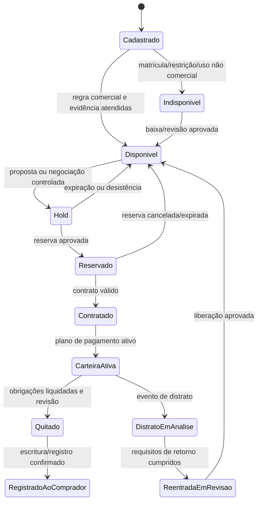

# Domínio de loteadoras no CRM imobiliário

## Decisão de arquitetura

Loteadora não deve ser implementada como uma variação de `Listing + Buyer + Proposal`. Ela é um domínio de desenvolvimento urbano que combina projeto territorial, aprovação pública, infraestrutura, inventário, venda, carteira própria e relacionamento de longo prazo. O CRM deve compartilhar o núcleo de `Party`, `Asset`, `Proposal`, `Evidence`, `Activity` e `Task`, mas operar um **contexto especializado de desenvolvimento de loteamentos**.

> **Princípio arquitetural:** o CRM não substitui engenharia, jurídico, contabilidade, cobrança bancária ou estruturação de mercado de capitais. Ele conserva a relação entre evidência, responsabilidade, estado operacional e próxima decisão em cada uma dessas interfaces.

## Limites de domínio

| Contexto | Pergunta que responde | Entidades específicas | Saída operacional |
| --- | --- | --- | --- |
| Terra e viabilidade | A gleba é potencialmente desenvolvível e em que condição? | Gleba, interesse de aquisição, due diligence, estudo de viabilidade, participação/permutante e restrição | Decisão de avançar, pausar ou encerrar. |
| Projeto e aprovação | O empreendimento pode ser projetado, aprovado e registrado? | Empreendimento, diretriz, conjunto de regra municipal, projeto, aprovação, licença e registro | Estado registral e autorização documentada para comercialização. |
| Infraestrutura | O que foi planejado, executado, aceito e garantido? | Cronograma físico, marco de obra, obrigação de infraestrutura, garantia e termo de recebimento | Entrega de obra e liberação/alteração de restrições. |
| Inventário e comercialização | Qual lote pode ser ofertado, reservado ou contratado? | Quadra, lote, status de disponibilidade, tabela, reserva, canal, proposta e alçada | Lote corretamente alocado, sem venda duplicada. |
| Carteira e recebíveis | Qual contrato gera qual obrigação, evidência e risco? | Contrato de lote, plano de pagamento, evento financeiro, parcela, indexação, cobrança, renegociação e distrato | Carteira operacional confiável e trilha de cobrança. |
| Parceiros e permuta | O que pertence a cada participante e em qual base? | Participação, política de distribuição, alocação, repasse e comprovante | Rateio demonstrável de lote, VGV ou fluxo. |
| Pós-entrega | O que continua ativo após a venda? | Associação/condomínio, entrega, pendência, escritura, registro e relacionamento | Encerramento gradual, sem apagar histórico. |

## Modelo de dados ampliado

| Entidade | Finalidade | Campos/relacionamentos indispensáveis |
| --- | --- | --- |
| `LandParcel` | Representa a gleba e seu contexto de aquisição | Geometria/referência, matrícula, município, proprietários declarados, origem, restrições e evidências. |
| `AcquisitionCase` | Organiza compra, permuta ou parceria da gleba | Tipo, partes, cronograma, condições, estado, responsáveis e documentos. |
| `FeasibilityStudy` | Registra hipóteses antes de comprometer capital | Versão, cenário, área, produto, VGV estimado, custo, premissas, autor e parecer. |
| `MunicipalityRuleSet` | Preserva regra local como configuração versionada | Município, fonte, vigência, parâmetro, responsável e alerta de revisão. |
| `Development` | Raiz do empreendimento | Nome, cidade, modalidade declarada, gleba(s), fase, responsável, estado por trilha e evidências. |
| `ApprovalCase` | Reúne diretriz, projeto, licença e protocolo | Órgão, protocolo, prazo, estado, dependência, documento e parecer. |
| `RegistrationRecord` | Demonstra situação registral do parcelamento | Cartório, número, data, matrícula, arquivo, validador e estado de revisão. |
| `InfrastructurePlan` | Lista obrigações e marcos de obra | Item, prazo, responsável, evidência, progresso e aceite. |
| `MunicipalGuarantee` | Controla garantia de infraestrutura e restrições | Tipo, instrumento, valor/referência, lotes vinculados, vigência, estado e baixa. |
| `Block` / `Lot` | Representa estoque físico e jurídico | Desenvolvimento, fase, quadra, lote, área, atributos, matrícula, alocação e estados ortogonais. |
| `PriceTable` | Versiona preço e condição de comercialização | Vigência, lote/faixa, preço, desconto permitido, canal, alçada e aprovação. |
| `InventoryHold` / `Reservation` | Impede conflito temporário de estoque | Lote, titular, canal, prazo, status, motivo e auditoria. |
| `LotContract` | Contrato de compra, cessão ou promessa | Comprador/grupo, lote, versão do quadro-resumo, condições, assinatura, estado e evidências. |
| `PaymentPlanVersion` | Registra a versão contratual de obrigação | Entrada, parcelas, reforços, indexação, juros, eventos, vigência e motivo da versão. |
| `ReceivableInstallment` | Unidade de cobrança/recebimento | Vencimento, valor-base, correção, juros, estado, comprovante e conciliação. |
| `CollectionsCase` | Organiza atraso, comunicação e negociação | Gatilho, etapas, notificações, proposta, responsável e resultado. |
| `RescissionCase` | Controla distrato e retorno de estoque | Base contratual, posse, cálculo revisado, aprovações, restituição, documentos e condições de reentrada. |
| `PartnerParticipation` | Torna o permutante/parceiro uma parte de primeira classe | Tipo de participação, base de apuração, alocação, regra de distribuição e evidências. |
| `ReceivableAssignment` | Registra cessão ou preparação de carteira sem emitir valores mobiliários | Carteira de origem, contratos, status, identificadores externos, termo e responsáveis. |

## Estados ortogonais: não comprimir o empreendimento em um único funil

Um loteamento pode estar em obras e em vendas ao mesmo tempo. Um lote pode estar matriculado, caucionado e ainda não comercialmente disponível. Por isso, o CRM deve usar estados paralelos, não uma lista única de status que mistura assuntos diferentes.

| Objeto | Dimensão | Estados exemplificativos |
| --- | --- | --- |
| Desenvolvimento | Viabilidade | Prospeção, diligência, estudo, aprovado para avançar, pausado, descartado. |
| Desenvolvimento | Regulação/registro | Diretriz pendente, projeto submetido, aprovado, registro em preparação, registrado, divergência. |
| Desenvolvimento | Infraestrutura | Não iniciada, em execução, em aceite, recebida, pendência de entrega. |
| Desenvolvimento | Comercial | Planejado, pré-lançamento interno, vendas ativas, vendas limitadas, esgotado, encerrado. |
| Lote | Alocação | Comercial, permutante/parceiro, garantia municipal, área não comercial, bloqueado. |
| Lote | Disponibilidade | Indisponível, disponível, hold, reservado, contratado, reentrada em análise. |
| Lote | Registro | Previsto, matrícula pendente, matriculado, contrato registrado, escritura/registro concluído. |
| Contrato | Carteira | Rascunho, ativo, adimplente, atraso, renegociação, distrato em análise, encerrado. |
| Parcela | Financeiro | Prevista, emitida por sistema externo, comprovante recebido, conciliada, em atraso, renegociada, cancelada. |

## Gates de integridade

| Gate | Condição de bloqueio | Liberação exigida | Dono da decisão |
| --- | --- | --- | --- |
| Viabilidade | Espólio, ônus, risco ambiental/geotécnico ou urbano sem solução registrada | Parecer e evidência com decisão explícita | Jurídico/técnico responsável. |
| Registro | Empreendimento sem registro documental revisado | Registro, matrícula/cartório, documento e revisão | Jurídico/registro. |
| Estoque | Lote com reserva ativa incompatível, vínculo de permutante ou garantia municipal | Cancelamento/expiração, alocação ou baixa aprovada | Comercial + gestor do empreendimento. |
| Tabela | Condição comercial sem versão vigente ou alçada suficiente | Tabela aprovada e aprovação de exceção | Gestão comercial. |
| Contrato | Quadro-resumo/condições incompletos para o tipo de contrato | Template e campos versionados, documentação e revisão | Jurídico/comercial. |
| Pagamento | Registro financeiro sem prova ou conciliação | Evidência e confirmação no sistema financeiro integrado/operador | Financeiro/cobrança. |
| Distrato | Lote retornado ao estoque sem conclusão/controle de restituição aplicável | Caso, contrato, pagamentos, revisão e liberação | Jurídico/financeiro. |
| Cessão de carteira | Contrato selecionado sem trilha, elegibilidade definida e termo | Checagem de escopo, termo e integração autorizada | Financeiro/jurídico especializado. |

## Máquina de estados do inventário de lote

> O estado de alocação (`permutante`, `garantia municipal`, `comercial` ou outro) corre em paralelo ao fluxo acima. Um lote só chega a `Disponível` se sua alocação permitir comercialização.

## Carteira própria: modelo de controle, não de banco

| Camada | O CRM faz | O CRM não faz |
| --- | --- | --- |
| Originação | Liga contrato, lote, comprador, tabela, alçada e plano de pagamento | Oferece crédito ou define aprovação automática. |
| Plano de pagamento | Versiona eventos, vencimentos, índice, juros declarados e regra contratual | Assume índice, juros, fruição ou penalidade universal. |
| Cobrança | Organiza status, parcela, comprovante, comunicação, acordo e responsável | Emite boleto ou executa cobrança sem integração/autoridade adequada. |
| Conciliação | Registra evidência recebida e estado informado pelo financeiro | Declara pagamento somente por marcação comercial. |
| Inadimplência | Abre caso, tarefas, notificações e negociação | Aciona execução, negativação ou retomada sem processo aplicável. |
| Cessão | Preserva origem, composição, status e identificadores da carteira | Estrutura CRI/FIDC, custódia ou emissão de valor mobiliário. |

## Permutantes e parceiros

| Pergunta do negócio | Como modelar |
| --- | --- |
| Quem é o parceiro e qual sua relação com a gleba/empreendimento? | `PartnerParticipation` com parte, instrumento, vigência, papel e evidência. |
| A remuneração ocorre por lotes, percentual de VGV ou percentual de recebimento? | `AllocationPolicy` e `DistributionRule` versionadas, com base de cálculo explícita. |
| Quais lotes pertencem ao permutante? | `LotAllocation` com lote, fração, estado comercial e restrições. |
| O que foi efetivamente distribuído? | `DistributionEvent` com referência a contrato/recebimento, aprovação e comprovante. |
| Como impedir conflito com estoque? | Alocação de parceiro bloqueia disponibilidade comercial geral até regra permitir. |

## Papéis e permissões

| Papel | Pode decidir | Não pode decidir sozinho |
| --- | --- | --- |
| Aquisição/novos negócios | Criar caso de gleba, organizar diligência e premissas | Aprovar risco jurídico, ambiental ou investimento. |
| Urbanismo/engenharia | Atualizar projeto, obra e marcos técnicos | Tornar lote comercialmente disponível sem gate registral/comercial. |
| Jurídico/registro | Revisar evidências, registro, contrato e distrato | Alterar tabela, receber pagamento ou aprovar crédito. |
| Comercial | Qualificar demanda, reservar, negociar e propor condições dentro de alçada | Liberar lote caucionado/permutante ou remover bloqueio registral. |
| Financeiro/cobrança | Registrar conciliação, acordo, atraso e distribuição | Alterar contrato/índice sem versão, jurídico e alçada. |
| Gestão | Aprovar exceções, alçada, regra de distribuição e indicador | Apagar histórico ou revisar sua própria decisão sem trilha. |

## Métricas operacionais da loteadora

| Pergunta | Métrica consultável | Recorte obrigatório |
| --- | --- | --- |
| Como evolui o estoque? | Lotes por alocação, disponibilidade e fase | Empreendimento, quadra, lote, tipo/modalidade, período. |
| Como performa a comercialização? | Reservas, conversão para contrato, VSO, desconto e tempo em etapa | Canal, corretor, tabela, praça e faixa de ticket. |
| Como evolui a carteira? | Saldo, atraso por faixa, acordos, distratos, pagamento comprovado | Safra contratual, fase, canal e status do contrato. |
| Qual risco está concentrado? | Lotes caucionados, pendências de registro, marcos de obra e concentração de recebíveis | Desenvolvimento, órgão, garantia e responsável. |
| O parceiro está sendo remunerado conforme a regra? | Alocado, contratado, recebido e distribuído versus política | Permutante, regra e período. |

## Ordem de construção para loteadoras

1. Começar por inventário confiável de empreendimento, fase, quadra, lote, alocação e disponibilidade.
2. Adicionar reserva, proposta, tabela versionada e alçada, com bloqueio de concorrência de estoque.
3. Criar contrato de lote, plano de pagamento, parcelas e comprovantes — ainda sem tentar substituir o sistema financeiro.
4. Integrar distrato, reentrada, notificações e condições de retorno de estoque.
5. Acrescentar gleba, viabilidade, aprovação, obras, garantias e participação de permutantes.
6. Só então integrar carteira cedida, ERP, cobrança, assinatura e fontes externas de inteligência.

## Referências de domínio

[1] [Planalto — Lei nº 6.766/1979](https://www.planalto.gov.br/ccivil_03/leis/l6766.htm)

[2] [Planalto — Lei nº 13.786/2018](https://www.planalto.gov.br/ccivil_03/_ato2015-2018/2018/lei/l13786.htm)

[3] [STJ — Taxa de ocupação e lote não edificado sob a Lei do Distrato](https://www.stj.jus.br/sites/portalp/Paginas/Comunicacao/Noticias/2025/20102025-Sob-Lei-do-Distrato--e-possivel-aplicar-multa-por-desistencia-e-taxa-de-ocupacao-de-lote-nao-edificado.aspx)

[4] [Planalto — Lei nº 14.430/2022](https://www.planalto.gov.br/ccivil_03/_ato2019-2022/2022/lei/l14430.htm)
