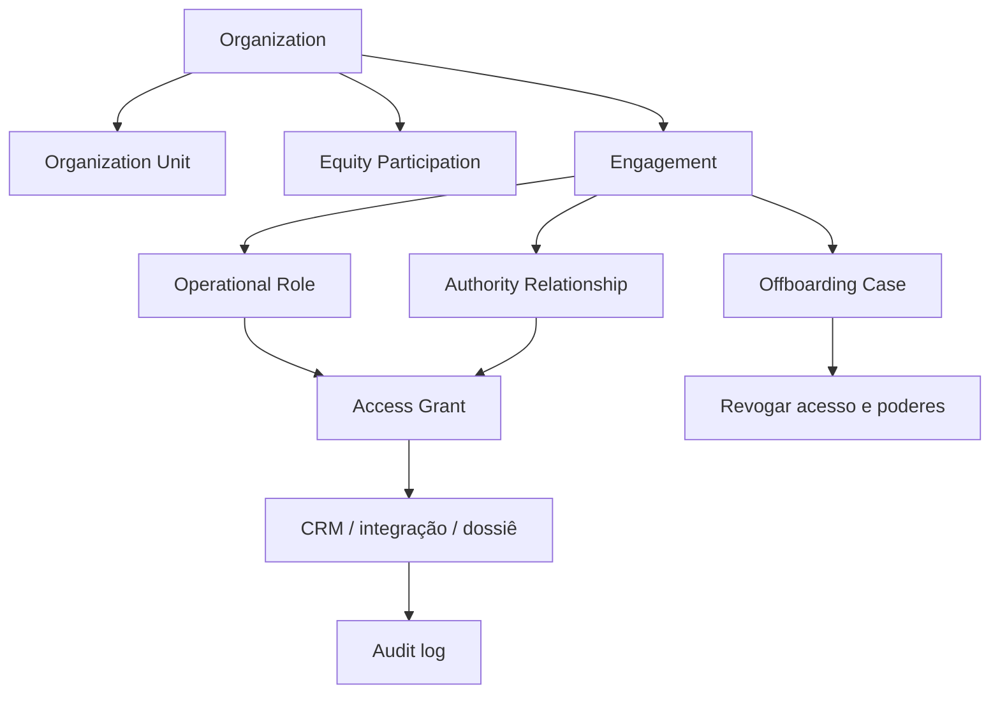

# Domínio organizacional do CRM imobiliário

## Pessoas internas, parceiros, empresas, poderes e acesso

O futuro CRM deve organizar a operação imobiliária sem absorver sistemas de RH, saúde ocupacional, folha, societário ou jurídico. A base é a mesma `Party` usada para clientes e parceiros externos, porém com contextos organizacionais independentes e acesso segregado. Cada pessoa ou empresa recebe uma ou mais relações com uma organização, empreendimento, unidade operacional ou contrato; é a relação que determina função, escopo, autoridade, elegibilidade e acesso.

## Modelo de entidades

| Entidade | Propósito | Ligações principais |
| --- | --- | --- |
| `Organization` | Empresa do grupo, SPE, imobiliária, loteadora ou fornecedor PJ | CNPJ/referência, unidade, participações, relações e políticas. |
| `OrganizationUnit` | Unidade, área ou projeto operacional | Organização, centro de responsabilidade, território/empreendimento e responsáveis. |
| `Engagement` | Relação de pessoa/empresa com a organização | Natureza declarada, instrumento, vigência, dono, revisor e estado. |
| `EquityParticipation` | Participação societária de parte em organização/SPE | Parte, organização, classe/percentual, instrumento, período e estado de governança. |
| `OperationalRoleAssignment` | Função dentro de um contexto operacional | Pessoa, unidade, responsabilidade, escopo, início/fim e supervisor operacional. |
| `AuthorityRelationship` | Poder de aprovar, assinar, representar ou movimentar | Parte, organização/ato, escopo, alçada, instrumento, vigência, evidência e revisor. |
| `ServiceProviderEngagement` | Prestação de serviço por pessoa ou empresa | Escopo, produto/entrega, SLA, contrato, acesso, contato técnico e vigência. |
| `AssociatedBrokerEngagement` | Relação do corretor associado com a imobiliária | Registro declarado, contrato, estado, território/produto, negócios e vigência. |
| `AccessGrant` | Permissão concreta no CRM ou integração | Papel, objeto/escopo, justificativa, aprovador, início, expiração e recertificação. |
| `DataProcessingRoleAssessment` | Avaliação do papel de proteção de dados de parceiro | Finalidade, instrução, dados/categorias, papel avaliado, contrato, revisor e próxima revisão. |
| `RestrictedDossierReference` | Referência a RH, saúde, folha, societário ou compliance | Sistema de verdade, estado mínimo, responsável e política de acesso; sem anexar conteúdo sensível ao CRM. |
| `OffboardingCase` | Encerramento coordenado da relação | Revogação de acesso/poderes, devolução, pendências, retenção e confirmação. |

## Classificação de relações: orientação, não diagnóstico jurídico

| Natureza declarada | Exemplos | Dados operacionais que o CRM precisa | Dados que ficam fora do CRM |
| --- | --- | --- | --- |
| Societária | Sócio de holding, imobiliária, loteadora ou SPE | Participação, papel de gestão, autoridade, referência de instrumentos, alçada e estado | Contabilidade detalhada, pró-labore, distribuição, tributos e livros societários completos. |
| Prestação de serviço | Contador, jurídico, TI, engenharia, marketing | Escopo, contrato, responsável, prazo, procuração, acesso e estado de avaliação de dados | Nota fiscal detalhada, pareceres confidenciais e dados que pertencem ao sistema profissional. |
| Trabalho/colaboração | Empregado, estagiário, temporário, aprendiz | Função operacional, unidade, responsável, estado mínimo de elegibilidade de acesso e recertificação | Folha, ASO, prontuário, dependentes, biometria, benefícios e eventos trabalhistas detalhados. |
| Associação/autonomia | Corretor associado, autônomo ou PJ de intermediação | Instrumento, registro declarado, território/produto, regras de negócio, acesso e encerramento | Controle de ponto, folha ou qualquer funcionalidade que presuma emprego. |
| Terceirização | Equipe de campo/obras, portaria, limpeza | Empresa prestadora, escopo/local, contrato, gestor e evidências acordadas | Dados individuais de trabalhadores da prestadora, salvo finalidade/obrigação específica. |

## Organograma de autoridade e acesso

O acesso não nasce de “ser sócio”, “ser corretor” ou “ser funcionário”. Ele é uma concessão que liga uma pessoa a um escopo preciso e registra por que, quem aprovou, quando termina e quando será revisada. Um sócio sem papel operacional pode não acessar carteira; um advogado pode acessar somente o dossiê de um caso; um corretor associado pode operar ativos da praça atribuída, sem receber dados de RH ou compliance.

## Matriz de responsabilidades na operação imobiliária

| Operação | Responsabilidades possíveis | Autoridade que deve ser explícita | Acesso mínimo sugerido |
| --- | --- | --- | --- |
| Captação de imóvel | Corretor, gestor de captação, jurídico externo | Publicação, alteração de preço, aprovação de captação | Ativo, proposta de captação e documentos autorizados. |
| Locação | Consultor, análise, financeiro, jurídico | Condição comercial, assinatura, acesso ao dossiê | Perfil de busca, proposta e documentos por função. |
| Venda urbana | Corretor, gestor, proprietário/representante, jurídico | Tabela, proposta, revisão de assinatura | Ativo, proposta, grupo de assinatura e pendências. |
| Loteadora | Novos negócios, engenharia, vendas, financeiro, jurídico, sócio/SPE | Gate de empreendimento, tabela, reserva, cessão, distrato | Escopo por empreendimento, lote, fase e carteira. |
| Carteira/recebíveis | Financeiro, cobrança, atendimento, gestor | Acordo, baixa, exceção, distrato e liberação de estoque | Contrato, parcela e caso sob alçada. |
| Pesquisa/estratégia | Analista, gestor, parceiro técnico | Aprovar evidência, política ou nota de mudança | Centro de evidências sem dados pessoais além do estritamente necessário. |

## Estados e gates

| Dimensão | Estados | Gate operacional seguro |
| --- | --- | --- |
| Relação | Proposta, em revisão, ativa, suspensa, encerrada | Nenhum acesso é concedido antes de instrumento/contexto e aprovador definidos. |
| Poder | Não aplicável, declarado, evidência recebida, em revisão, válido, expirado, revogado | Assinatura, alçada e representação usam somente poderes em estado revisado e vigente. |
| Acesso | Solicitado, aprovado, ativo, recertificar, suspenso, revogado | Acesso expira/requer revisão e é revogado no encerramento. |
| Dado sensível restrito | Fora de escopo, referência criada, pendente no sistema origem, confirmado pelo responsável, expirado | CRM recebe estado mínimo; conteúdo permanece no domínio de verdade. |
| Parceiro | Qualificado, contratado, acesso limitado, em revisão, encerrado | Acesso aos dados depende de escopo, avaliação de dados e responsável, não apenas de contrato genérico. |

## Fluxos fundamentais

### Entrada de sócio ou participação em SPE

Primeiro, o CRM registra a parte e a organização; depois cria participação com instrumento, data e estado de governança. Se houver poder operacional, cria-se uma relação de autoridade distinta. Fluxos de capital, pró-labore, distribuição e contabilidade permanecem em domínios financeiros/societários próprios, podendo devolver ao CRM apenas estado, referência e próximo passo.

### Contratação de parceiro estratégico

O responsável abre a relação de prestação, define escopo, dono interno, prazo, entregas e acesso mínimo. A avaliação de tratamento de dados define o contrato/termo aplicável e o acesso. Uma procuração, se houver, é modelada como poder com escopo e expiração. Ao término, a lista de desligamento revoga acessos e poderes, preservando somente o histórico e a retenção permitida.

### Habilitação operacional de colaborador ou corretor associado

O CRM recebe referência ao vínculo e aos requisitos que pertencem ao sistema de origem. Para colaborador, uma confirmação mínima e autorizada de elegibilidade libera o papel operacional; para corretor associado, contrato, registro e vigência entram como evidência para revisão. A plataforma nunca calcula a validade trabalhista da relação, mas impede que um papel expirado ou não revisado continue com permissões comerciais sensíveis.

## Recertificação obrigatória

| Objeto | Gatilho de revisão | Dono da revisão |
| --- | --- | --- |
| Participação societária e poderes | Alteração societária, prazo de instrumento ou revisão anual definida | Governança/jurídico. |
| Parceiro com acesso | Mudança de escopo, renovação, incidente ou periodicidade | Dono interno + privacidade/compliance. |
| Corretor associado | Vencimento do contrato, registro, alteração de praça ou revisão periódica | Gestão comercial autorizada. |
| Colaborador | Mudança de função/unidade, desligamento ou rotina de IAM | RH/IAM e gestor. |
| Acesso a dossiê restrito | Alteração de caso, expiração da necessidade ou política de acesso | Dono do dossiê. |

Esse modelo transforma “cadastro interno” em governança operacional verificável e mantém o CRM como a camada de coordenação do negócio, sem duplicar ou expor dados de RH, saúde, folha, tributação e jurídico especializado.
