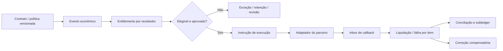

# FIN-SPLIT-01 — cobrança, liquidação e distribuição configurável

**Captura:** 25 de agosto de 2026.  
**Estado:** `em_confronto` — evidência técnica e regulatória capturada; contratos, preços, KYC, SLA, limites efetivamente contratados e sandbox do parceiro ainda precisam de homologação.

## 1. Pergunta do ciclo

Como o CRM pode suportar uma cascata econômica com até cerca de 100 recebedores, valores fixos e percentuais, entrada e parcelas, sem confundir a regra contratual com a capacidade de uma API de pagamento?

## 2. Evidência comparada

| Fonte | Afirmação verificável | Limite de produto que afeta o CRM | Consequência de arquitetura |
| --- | --- | --- | --- |
| Banco Central | Arranjos disciplinam regras e procedimentos de serviços de pagamento; instituições de pagamento e financeiras atuam na cadeia de movimentação e liquidação. | O CRM não se torna instituição de pagamento por registrar contrato, direito ou instrução. | Separar `EconomicEvent`, `Entitlement`, `PaymentInstruction` e `Settlement` da execução do parceiro. [1] [2] |
| Asaas Split | A documentação declara split automático no recebimento, entre contas Asaas, por valor fixo ou percentual sobre valor líquido; diz não impor limite de `walletId`, sujeito ao valor líquido/100%. | A regra percentual é sobre `netValue`, taxas precedem o cálculo e não existe agendamento nativo do split para data futura. | A política do CRM precisa declarar base bruta/líquida, tarifas, timing e alternativa pós-conciliação. Não presumir que “100 recebedores” será suportado por qualquer parceiro. [3] [4] |
| Asaas eventos de split | O provedor descreve estados individuais de split, divergência quando o total excede valor líquido e eventos de liquidação por `splitId`. | Uma cobrança pode gerar vários eventos de liquidação; um erro de distribuição não equivale a falha da cobrança. | Persistir item individual, chave externa, correlação, estado e exceção por recebedor. [3] [4] |
| Efí Split Pix | A documentação declara que o Split Pix ocorre apenas entre contas Efí e informa máximo de 20 contas de repasse. A configuração possui identificador e revisão. | Capacidade é menor que a ambição de até 100 recebedores; uma configuração não prova portabilidade. | Criar `ProviderCapabilityProfile`; decidir em cada plano se usa split nativo, lote de instruções pós-conciliação ou combinação homologada. [5] |
| Efí devolução | A documentação informa que a devolução do Pix com split debita a conta integradora, não as contas-filhas. | A reversão econômica e a reversão de saldo de cada recebedor podem não ter a mesma semântica. | Distinto de “apagar repasse”: abrir obrigação corretiva, exceção de recuperação e reconciliação por item. [5] |
| Efí webhook | A documentação descreve mTLS, timeout, tentativas de retorno e reenvio limitado; um callback pode carregar `txid`, `endToEndId` e referência da configuração/revisão de split. | Autenticação e reentrega são específicas do parceiro; sucesso HTTP não é sinônimo de aplicação transacional completa. | Receber rápido, validar origem, registrar inbox imutável, deduplicar, processar idempotentemente e reconciliar por consulta autorizada. [6] |
| Pagar.me | A documentação de marketplace associa split a valor/percentual, responsabilidade por MDR e chargeback; a documentação de webhook descreve reenvio e possibilidade de listar/reencaminhar falhas. | Custos e responsabilidade por disputa devem ser explícitos; mecanismo de retry é fornecedor-específico. | O modelo canônico precisa separar regra de distribuição, responsabilidade de tarifa/disputa, tentativa de entrega e efeito confirmado. [7] [8] |

## 3. Decisão de arquitetura proposta

O CRM não deve serializar o plano contratual diretamente no payload de um provedor. A regra canônica deve produzir uma ou mais **instruções de execução**, somente após os gates de contrato, elegibilidade, autorização, KYC/estado do recebedor, base de cálculo e conciliação definidos pela empresa e pelo parceiro.

> **Regra:** o `Entitlement` explica **quem tem direito a quê, por qual regra e sob qual condição**. Uma `PaymentInstruction` explica **o que foi solicitado ao parceiro**. Um `Settlement` explica **o que foi efetivamente confirmado**. Nenhum deles sobrescreve o outro.

## 4. Perfil de capacidade obrigatório por parceiro

| Campo | Por que não pode ser inferido |
| --- | --- |
| `max_receivers` e limite por cobrança/parcela | Efí declara 20 contas; Asaas declara não limitar `walletId`; contratos e produtos podem divergir. |
| `recipient_network_constraint` | Alguns provedores exigem contas/carteiras do próprio ecossistema. |
| `calculation_base` e `fee_allocation` | Percentual pode incidir sobre valor líquido, com tarifa e responsabilidade próprias. |
| `timing_model` | Split na liquidação, transferências posteriores ou ambos não são equivalentes. |
| `installment_semantics` | Valor por parcela, total distribuído e arredondamento podem gerar resultados diferentes. |
| `reversal_semantics` | Estorno, devolução, chargeback e distrato podem atingir conta integradora, recebedor ou gerar nova obrigação. |
| `event_contract` | Assinatura/mTLS, tentativa, timeout, payload, ordem e reenvio variam por parceiro. |
| `kyc_and_recipient_state` | Habilitação, bloqueio, conta destino e atualização exigem evidência do parceiro. |
| `reconciliation_surface` | Extrato, export, IDs, tarifas, data de liquidação e consulta histórica definem a prova de fechamento. |

## 5. Invariantes que entram no backlog

| ID | Invariante | Teste mínimo |
| --- | --- | --- |
| FIN-SPLIT-I01 | A soma de itens elegíveis não excede a base definida pela política e pelo parceiro. | Fixo + percentual + tarifa + arredondamento, incluindo valor líquido menor que o esperado. |
| FIN-SPLIT-I02 | Nenhuma alteração de contrato reescreve o direito que já gerou instrução ou liquidação. | Adendo posterior cria versão e evento compensatório, não `UPDATE` destrutivo. |
| FIN-SPLIT-I03 | Cada callback é processado uma vez por chave estável de parceiro/evento/item. | Reenvio, entrega concorrente e consulta posterior não duplicam subledger ou instrução. |
| FIN-SPLIT-I04 | Um recebedor bloqueado não reduz silenciosamente o direito dos demais nem confirma distribuição total. | Falha individual abre exceção, estado parcial e próxima ação. |
| FIN-SPLIT-I05 | Reembolso, devolução ou distrato não é tratado como ausência do pagamento anterior. | Fato original, confirmação, reversão e recuperação ficam ligados e explicáveis. |
| FIN-SPLIT-I06 | Capacidade do parceiro nunca substitui a política contratual da empresa/SPE/empreendimento. | Mesmo payload válido é bloqueado se política, alçada ou vigência não forem elegíveis. |

## 6. Cenários obrigatórios de homologação

O parceiro escolhido deverá homologar, no mínimo: pagamento integral; pagamento parcial; parcela em atraso; taxas que reduzem o valor líquido; 1, 20 e aproximadamente 100 recebedores; valores fixos e percentuais mistos; arredondamento; atualização antes do recebimento; bloqueio de KYC; callback duplicado; callback fora de ordem; timeout; consulta/replay; falha individual de item; estorno parcial; devolução; chargeback quando aplicável; distrato; troca de recebedor após vínculo contratual; alteração de regra após recebimento; e exportação para conciliação e contador.

## 7. Limitações e próxima prova

Os provedores citados são **referências de capacidade pública**, não recomendação, homologação, comparação comercial completa ou garantia de aderência para uma loteadora/imobiliária específica. A próxima prova é selecionar o parceiro candidato por empresa/caso de uso, obter documentação contratual e sandbox, e executar a matriz acima com jurídico, fiscal, contabilidade, segurança e parceiro de pagamento habilitado.

## Referências

[1] [Banco Central do Brasil — Instituições de pagamento](https://www.bcb.gov.br/estabilidadefinanceira/instituicaopagamento)  
[2] [Banco Central do Brasil — Arranjos de pagamento](https://www.bcb.gov.br/estabilidadefinanceira/arranjospagamento)  
[3] [Asaas — Split](https://docs.asaas.com/docs/split)  
[4] [Asaas — Introdução ao split de pagamentos](https://docs.asaas.com/docs/split-de-pagamentos)  
[5] [Efí — Split de pagamento Pix](https://dev.efipay.com.br/docs/api-pix/split-de-pagamento-pix/)  
[6] [Efí — Webhooks](https://dev.efipay.com.br/en/docs/api-pix/webhooks/)  
[7] [Pagar.me — Marketplace: criando uma transação com split](https://pagarme.helpjuice.com/p1-funcionalidades/marketplace-criando-uma-transa%C3%A7%C3%A3o-com-split)  
[8] [Pagar.me — Webhooks](https://docs.pagar.me/docs/webhooks)
