# Loteadora: estoque de contratos realizados e alertas na venda de lotes

**Status:** `requisito_estratégico_aprovado`  
**Objetivo:** dentro de **Vendas e Contratos**, manter uma lente de acompanhamento dos contratos já realizados por lote, conectada ao Estoque/Mapa de Lotes, Clientes Loteadora, dossiê, carteira e financeiro. A lente acelera a gestão comercial sem criar um segundo estoque ou tratar contrato como mera etiqueta do lote.

> **Princípio:** o lote continua sendo a unidade de estoque. O “estoque de contratos realizados” é uma **visão de carteira contratual por lote**, que explica qual contrato ocupa ou afetou cada `Qn · Ln`, com seu estado, cliente, dossiê e alertas.

## 1. Ligação entre lote, venda e contrato

| Objeto | Fonte de verdade | O que a lente de contratos realizados mostra | O que não pode alterar diretamente |
| --- | --- | --- | --- |
| **Lote (`Qn · Ln`)** | Estoque/Mapa de Lotes e estrutura de loteamento. | Identificação, fase/quadra, situação comercial, alocação, restrição e relação com contrato atual/histórico. | Estrutura da quadra/lote, disponibilidade, bloqueio ou alocação sem comando/evidência/alçada. |
| **Proposta/Reserva** | Jornada comercial. | Proposta atual, reserva, expiração, condição e transição para contrato. | Contrato confirmado, carteira ou retorno financeiro por simples clique. |
| **Venda/Contrato de lote** | Contrato versionado, partes, condições, assinaturas, aditivos e estado. | Comprador(es), data, versão, situação, documentos, lote e próxima pendência. | Texto/partes/condições da versão histórica sem aditivo autorizado. |
| **Cliente Loteadora** | Ficha única da pessoa/empresa e papéis datados. | Comprador principal, coadquirentes, representantes e cobertura documental da venda. | Dados da ficha de terceiro, documento restrito ou vínculo de outra venda. |
| **Carteira/Financeiro** | Agenda de parcelas, boletos, cobranças, retornos, cash application e conciliação. | Situação agregada: agenda criada, a vencer, adimplente, em atraso, em acordo, em análise, quitado ou distrato em análise. | Baixa, acordo, reemissão, instrução, pagamento ou conciliação. |

## 2. Visão “Contratos Realizados” em Vendas e Contratos

| Coluna/indicador da lista | Pergunta respondida | Estado/alerta relacionado |
| --- | --- | --- |
| **Lote** | Qual `Qn · Ln` foi objeto da venda? | Lote em contrato, distrato em análise, cessão, alocação ou restrição. |
| **Empreendimento/fase** | A qual recorte territorial/comercial pertence? | Filtro por empreendimento, fase, quadra e lote. |
| **Contrato e versão** | Qual é o instrumento vigente e quais versões anteriores existem? | Assinatura pendente, aditivo, cessão, distrato ou divergência. |
| **Compradores e papéis** | Quem compra, coadquire ou representa? | Representação pendente, parte incompleta ou duplicidade em análise. |
| **Cobertura de dossiê** | Quais requisitos estão elegíveis, em análise, expirados ou ausentes? | Documento pendente/expirado/restrito, checklist incompleto. |
| **Condição comercial** | Qual tabela/condição foi aplicada e está aprovada? | Tabela divergente, alçada pendente, condição expirada. |
| **Agenda e carteira** | Existe cronograma de entrada/parcelas e qual é sua saúde? | Agenda ausente, parcela vencida, comprovante em análise, conciliação pendente ou acordo. |
| **Estado de estoque** | Como o contrato afeta o lote? | Conflito entre contrato e mapa, reserva expirada, lote indevidamente disponível ou bloqueio incompatível. |
| **Próxima ação/owner** | Quem precisa agir e até quando? | Alerta priorizado, prazo e responsável explícitos. |

## 3. Máquina de estados que não pode ser reduzida

| Dimensão | Estados exemplificativos | Regra de integridade |
| --- | --- | --- |
| **Comercial do lote** | Disponível, hold, reservado, em proposta, contratado, bloqueado, devolução em análise, retornado elegível. | Um lote não é “disponível” apenas porque uma tela de contrato foi fechada; as condições de reversão precisam estar completas. |
| **Contrato** | Rascunho, em revisão, aprovado, aguardando assinatura, assinado/ativo, aditado, cedido, distrato em análise, encerrado. | Estado de contrato não é estado financeiro nem estado físico/registral do lote. |
| **Dossiê da venda** | Sem checklist, pendente, recebido em análise, cobertura parcial, cobertura elegível, restrito, expirado. | Anexo não confirma assinatura, poder, crédito ou elegibilidade total. |
| **Carteira** | Agenda pendente, cobrança ativa, parcialmente liquidada, adimplente, em atraso, em acordo, quitada, distrato financeiro em análise. | Boleto, comprovante e pagamento conciliado continuam objetos distintos. |
| **Relação de estoque** | Alocado ao contrato, aguardando migração, em conflito, liberável por decisão, liberado. | Mudança exige comando transacional, alçada e evidência; nunca edição manual do indicador. |

## 4. Alertas obrigatórios para Vendas e Contratos

| Classe de alerta | Gatilho de exemplo | Leitura no estoque de contratos | Próxima ação permitida |
| --- | --- | --- | --- |
| **Dossiê incompleto** | Checklist da venda possui evidência ausente, expirada, restrita ou em análise. | Contrato aparece com cobertura parcial, sem ser apresentado como concluído documentalmente. | Solicitar/revisar evidência pelo owner autorizado. |
| **Assinatura/versão pendente** | Instrumento aprovado não foi assinado, ou aditivo exige aceite. | Lote ainda não é tratado como contrato ativo antes do marco aplicável. | Abrir trilha de assinatura/revisão, sem modificar estoque manualmente. |
| **Agenda ausente ou divergente** | Contrato ativo não gerou agenda, ou parcela não reflete a versão/condição aprovada. | Contrato fica destacado como risco de carteira. | Investigar regra/integração e gerar caso controlado. |
| **Cobrança/carteira** | Parcela vencida, comprovante em análise, retorno sem aplicação, acordo ou divergência. | Exibe saúde de carteira por contrato/lote, com estado e `as_of`. | Direcionar ao Financeiro e Carteira; a lente não baixa nem negocia cobrança. |
| **Conflito lote × contrato** | Lote contratado aparece disponível, tem reserva concorrente ou alocação incompatível. | Alerta crítico de integridade do estoque. | Bloquear nova operação e abrir caso de correção com alçada. |
| **Distri​to/cessão em análise** | Pedido/ocorrência ainda não concluiu todas as condições. | Lote permanece com condição explícita; não retorna automaticamente ao disponível. | Tratar caso com contratos, financeiro e estoque, preservando histórico. |
| **Prazo crítico** | Reserva/assinatura/documento/parcelas com prazo próximo ou vencido. | Lista prioriza contrato/lote/owner e não apenas data solta. | Executar próxima ação autorizada ou escalonar. |

## 5. Fluxo de uma venda até o estoque de contratos realizados

```mermaid
flowchart LR
  A[Selecionar lote elegível] --> B[Selecionar Cliente Loteadora]
  B --> C[Reutilizar ficha e dossiê compatível]
  C --> D[Checklist específico da venda]
  D --> E[Proposta / Reserva]
  E --> F[Contrato versionado]
  F --> G[Agenda de parcelas e carteira]
  G --> H[Visão de contratos realizados por lote]
  H --> I[Alertas: dossiê, assinatura, carteira, lote, distrato]
  I --> J[Próxima ação por setor e alçada]
```

## 6. Critérios de aceite futuros

| Cenário | Deve permitir | Deve negar |
| --- | --- | --- |
| Contrato ativo ligado a `Q12 · L1`. | Exibir uma linha de contrato realizado com lote, partes, dossiê, agenda/carteira e alertas. | Criar uma cópia de lote ou apagar restrições/origem do estoque. |
| Contrato assinado sem agenda de parcelas. | Exibir alerta crítico de agenda ausente e owner. | Exibir situação financeira “adimplente” ou gerar recebimento automaticamente. |
| Lote contratado marcado como disponível. | Bloquear nova proposta/reserva e abrir conflito rastreável. | Vender/reservar o mesmo lote por outra sessão. |
| Dossiê atualizado na ficha do comprador. | Reavaliar cobertura da venda atual conforme estado/validade e preservar snapshots anteriores. | Alterar retroativamente o contrato ou considerar documento novo como aceito sem revisão. |
| Distrato em análise. | Manter lote/contrato/carteira em estados próprios e exibir pendências. | Retornar lote ao estoque disponível por alteração isolada de tela. |

## Referências internas

[1] [Clientes Loteadora: ficha e dossiê](crm_clientes_loteadora_ficha_dossie.md)

[2] [Arquitetura de setores](crm_arquitetura_colunas_setores_canonica.md)

[3] [Recebíveis e distribuição da Loteadora](crm_loteadora_recebiveis_distribuicao.md)

[4] [Matriz final de Loteadora](loteadora_matriz_auditoria_final_setores.md)
