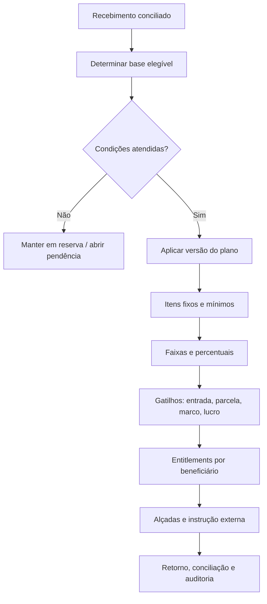

# Loteadoras: recebíveis, permutas e cascatas de distribuição

## Premissa de produto

Uma loteadora não tem apenas “vendas de lote”. Ela opera um conjunto de relações de longo prazo entre terra, SPE, obra, estoque, contrato, recebível, permutante, corretagem, parceiro, sócio e carteira. A plataforma deve modelar **o direito econômico e sua condição**, antes de tentar movimentar dinheiro.

O caso de loteamento em terreno de terceiro, parceria e repartição de receitas possui relevância fiscal e contratual específica. A Solução de Consulta SRRF06/Disit nº 6.018/2018 ilustra que a participação contratual de cada parte e a natureza da operação importam na análise; ela não substitui o exame do contrato, regime e norma vigente de cada empresa. [1]

## Domínio financeiro por empreendimento

| Entidade | O que representa | Relações essenciais |
| --- | --- | --- |
| `DevelopmentProject` | Empreendimento/loteamento ou projeto de desenvolvimento | Empresa/SPE, gleba, município, fases, políticas, orçamento e responsáveis. |
| `InventoryUnit` | Lote/unidade com estados físicos, registrais e comerciais, obrigatoriamente ligado à sua quadra matriz | Projeto, fase, quadra, número local do lote, código exibido `Qn · Ln`, matrícula/referência, estado de estoque, reserva, contrato, restrições e alocações. |
| `RegistryEvidence` | Certidão, memorial, registro, aprovação ou outra evidência registral/documental versionada | Ativo/projeto, emissor, data, escopo, arquivo/hash, resultado de revisão, validade operacional e responsável. |
| `AssetOriginInterest` | Origem da terra/unidade e participação econômica vinculada ao ativo | Natureza, parte, objeto/fração, instrumento, vigência, condição, base e entitlement relacionado. |
| `ProjectCostCommitment` | Compromisso econômico de terra, obra, legalização, venda ou parceiro | Fornecedor/parte, categoria, contrato, orçamento, gatilho e centro de responsabilidade. |
| `LotSaleContract` | Contrato de venda, cessão, permuta ou ajuste ligado a um lote | Comprador/grupo, lote, preço, plano, condições, assinatura, versões e situação. |
| `ReceivableSchedule` | Agenda de entrada econômica do contrato | Entrada, parcelas, índice, vencimento, condição, valor base e versão. |
| `ReceivableInstallment` | Parcela individual cobrável/conciliável | Devedor, vencimento, valores em camadas, cobrança, aplicação e saldo. |
| `LandownerParticipation` | Direito econômico de proprietário/permutante da terra | Base contratual, percentual/fixo, lote/receita elegível, prazo, gatilho e instrumento. |
| `DistributionPlan` | Versão aprovada de regras para partilhar um evento/recebimento | Base, ordem, recebedores, fórmulas, limites, arredondamento, aprovadores e vigência. |
| `DistributionEntitlement` | Direito calculado de uma parte a partir do plano | Beneficiário, natureza, valor, condição, estado, evidência e pagamento externo. |
| `ContractAdjustment` | Aditivo, cessão, renegociação, desconto, perdão, distrato ou quitação | Contrato, origem, aprovação, efeito em saldo/distribuição e evidência. |

## Estados paralelos do lote

Um lote precisa ter ao menos quatro dimensões em paralelo. Uma única coluna “vendido” não suporta o fluxo real.

| Dimensão | Exemplos de estados | Dono operacional |
| --- | --- | --- |
| Físico/urbanístico | Planejado, em obras, infraestrutura parcial, liberado internamente, entregue | Engenharia/empreendimento. |
| Registral/documental | Referência criada, em diligência, registro evidenciado, pendência, em revisão | Jurídico/registro. |
| Comercial | Disponível, hold, reservado, em proposta, contratado, devolvido ao estoque, bloqueado | Comercial com alçada. |
| Econômico | Sem carteira, agenda ativa, parcialmente liquidado, inadimplente, distrato em análise, quitado, cedido | Financeiro/carteira. |

Uma restrição não será armazenada apenas como rótulo de inventário. `caução/garantia`, alocação de permuta, ônus, reserva, disputa ou pendência registral devem registrar **motivo**, evidência, escopo, vigência e alçada de liberação. A disponibilidade resultante é uma projeção dessas dimensões: um lote não volta ao estoque porque alguém editou o estado comercial; volta somente quando a condição comercial, jurídica, financeira e documental compatível estiver comprovada. [2]

## Agenda de recebíveis

| Evento | Efeito no subledger | Controle de segurança |
| --- | --- | --- |
| Reserva aprovada | Cria compromisso comercial temporário e, se aplicável, recebível de reserva | Reserva vence, não bloqueia estoque indefinidamente e não cria distribuição final sem condição. |
| Contrato assinado | Cria cronograma contratual versionado | Toda parcela aponta para a versão e a condição que a originou. |
| Vencimento | Cria/ativa cobrança e fila de carteira | Índice, multa, juros e desconto usam política/versão aprovada; não campos livres. |
| Liquidação | Registra retorno externo e aplicação na parcela | Recebimento não dispara transferência automática de comissão/permuta sem plano, condição e conciliação. |
| Aditivo/cessão | Cria nova versão e regras de migração do saldo | Histórico e obrigações anteriores permanecem rastreáveis. |
| Distrato | Abre caso com cálculo/regras revisáveis, parcelas e estoque | Retorno ao estoque depende de condição comercial, jurídica e financeira explícita. |
| Quitação/escritura | Encaminha pendências finais e encerra carteira | Não marca “quitado” apenas por uma tela; exige saldo, reconciliação e responsáveis. |

## Cascata de distribuição

Uma cascata é uma política econômica aplicável a determinado universo de entradas. Ela pode ter até 100 ou mais recebedores, mas cada recebedor precisa ser uma `Party` com relação, documento e condição identificáveis. A cascata não é uma lista de percentuais soltos.

### Componentes obrigatórios de um plano

| Elemento | Exemplo | Regra de implementação |
| --- | --- | --- |
| Base | Valor contratado, líquido conciliado, receita elegível, alocação de lote/unidade ou resultado verificado | A fórmula precisa apontar para campos e eventos, não texto descritivo; tipo de base não pode ser inferido pelo percentual. |
| Sequência | Primeiro despesas aprovadas, depois corretagem, depois participação da terra | Ordem explícita e versionada; ordem muda o resultado. |
| Tipo de parcela | Fixo, percentual, faixa progressiva, mínimo/máximo, percentual residual | Categoria econômica separada de fórmula matemática. |
| Beneficiário | Corretor, imobiliária, captador, proprietário da terra, parceiro, sócio, fornecedor | Pessoa/empresa, conta externa autorizada e relação vigente. |
| Gatilho | Contrato, pagamento conciliado, marco de obra, mês, quitação, lucro definido | Nenhum direito é exigível antes do gatilho e da evidência definidos. |
| Condição/bloqueio | Documento pendente, alçada, inadimplência, lote em restrição, limite de saldo | Gera estado bloqueado/presente, nunca exclusão do direito. |
| Arredondamento | Precisão de moeda, regra de resíduos e destinatário aprovado do ajuste | A soma precisa reconciliar à base; resíduo é item de auditoria. |
| Reversão | Estorno, distrato, glosa, devolução ou ajuste | Reversão gera evento compensatório ligado ao plano/entitlement original. |

### Regras matemáticas auditáveis

1. A versão do `DistributionPlan` fica travada quando o evento de compromisso econômico é aprovado; alterações posteriores geram versão nova e nunca alteram direitos já calculados silenciosamente.
2. Valores fixos são aplicados conforme ordem e limite de base; percentuais devem informar explicitamente a base e se são cumulativos, exclusivos ou residuais.
3. O sistema valida que percentuais concorrentes e valores mínimos/máximos não produzam valor negativo ou excedam a base, exceto se existir regra de reserva/adiantamento aprovada com conta específica.
4. Recebedor com documentação, relação, poder, conta externa ou condição pendente fica em `blocked`; seu direito é preservado, mas não se cria instrução de pagamento.
5. O resultado deve gerar uma tabela imutável de `DistributionEntitlement`, com fórmula, entradas, regra, valor, arredondamento, gatilho e aprovadores reproduzíveis por auditoria.
6. O entitlement permanece distinto de instrução, tentativa do parceiro, retorno externo, settlement e conciliação. Comprovante anexado é evidência recebida, não liquidação confirmada por si só.

## Padrões de distribuição da loteadora

| Situação | Base típica a configurar | Participantes possíveis | Observação de produto |
| --- | --- | --- | --- |
| Entrada de lote | Entrada líquida conciliada ou outra base contratual | Corretor, imobiliária, captador, proprietário/permutante, SPE | Não pressupor que todos recebem na entrada; cada direito tem gatilho e prioridade. |
| Parcelas mensais | Parcela liquidada, parcela elegível ou caixa após categoria aprovada | Proprietário da terra, permutante, parceiro, sócio, comissão recorrente | Vincular a cada parcela e a período/limite contratual; não apenas ao contrato inteiro. |
| Venda por parceiro | Receita/resultado definido em contrato | Parceiro comercial, captador, imobiliária, consultor | Separar serviço, comissão, participação e reembolso para revisão fiscal/contábil. |
| Permuta física | Lotes/unidades elegíveis, não necessariamente caixa | Dono da terra, parceiro, SPE | O direito pode ser a unidade/lote ou um crédito; não forçar pagamento financeiro. |
| Lucro de projeto | Resultado definido após política de custos, provisões, impostos e aprovações | Sócios, investidores, parceiros com participação | Exige definição contábil/contratual fora de um simples “percentual de venda”. |
| Distrato | Valores devolvidos/retidos/compensados conforme instrumento e análise | Comprador, corretores, permutantes, carteira | Recalcula por caso e versão; não reverte pagamentos anteriores sem política/evidência. |

As quatro bases de direito não devem colapsar numa única “porcentagem”: participação sobre valor contratado, participação sobre caixa recebido, alocação física de lote/unidade e distribuição de resultado verificado possuem eventos, condições e efeitos próprios. Cessão, distrato, garantia e correção abrem versões/casos compensatórios; não alteram silenciosamente o direito ou a liquidação histórica. [2]

## Permuta e proprietário da terra

O CRM precisa suportar mais de uma modalidade sem reduzi-la a “comissão”.

| Relação | O que registrar | Evento econômico possível |
| --- | --- | --- |
| Proprietário vende a terra | Preço, forma de pagamento, condição, instrumento e partes | Payable, recebível de contraparte, transferência/registro conforme processo. |
| Proprietário participa das vendas | Percentual/fixo, base, lotes elegíveis, prazo, gatilho e evidência | Entitlement por entrada/parcela/resultado, com bloqueios e versão. |
| Permuta física | Critério de lotes/unidades, estado de alocação, entrega e reversão | Alocação de estoque e obrigação não monetária. |
| Permuta financeira | Crédito, base, vencimento, atualização e condição | Agenda de payable/receivable ou entitlement, conforme contrato. |
| Executor de obras participa | Escopo, custo, participação, limites e regra de serviço/parceria | Direitos separados por natureza e origem, a revisar pelo fiscal/contábil. |

## Métricas financeiras sem ambiguidade

| Métrica | Definição operacional | Não confundir com |
| --- | --- | --- |
| Vendas contratadas | Soma de contratos em estado definido, por versão e período | Caixa recebido, VGV de tabela ou receita reconhecida. |
| Entrada conciliada | Soma de settlements aplicados e conciliados à categoria “entrada” | Boleto emitido, promessa de pagamento ou valor reservado. |
| Carteira a vencer | Saldo de parcelas válidas, segregado por vencimento e condição | Fluxo de caixa garantido ou valor presente. |
| Direitos bloqueados | Entitlements calculados que aguardam condição/evidência | Despesa inexistente ou saldo disponível para uso. |
| Estoque comprometido | Lotes com hold/reserva/proposta/contrato por estado | Estoque vendido definitivamente. |
| Distribuição instruída | Entitlements aprovados enviados a provedor/financeiro | Distribuição liquidada ou contabilizada. |

Esse desenho sustenta o cenário de um boleto ou Pix que, após pagamento conciliado, origina múltiplos direitos econômicos configuráveis. O CRM controla o contrato, a regra e a evidência; a liquidação em favor de dezenas de recebedores deve ocorrer somente por rota de pagamento e governança habilitadas, com retorno externo e conciliação de cada item.

## Referência

[1] [Receita Federal — Solução de Consulta SRRF06/Disit nº 6.018/2018](http://normas.receita.fazenda.gov.br/sijut2consulta/anexoOutros.action?idArquivoBinario=64075)

[2] [Integração auditada — pagamentos, beneficiários e cadastro de ativos](crm_integracao_estudos_pagamentos_ativos_evidencias.md)
