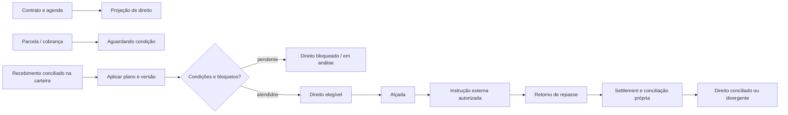

# Loteadora: setor próprio de Repasses e Distribuição

**Status:** `decisão_aprovada_para_estratégia`  
**Decisão LOT-A05:** **Repasses e Distribuição é um setor próprio** na coluna Loteadora, conectado ao Financeiro e Carteira, mas separado de cobrança, boleto, caixa e contas a pagar.

> **Princípio:** o Financeiro responde pelo fato de cobrar, receber, aplicar e conciliar a carteira. Repasses e Distribuição responde por qual direito econômico existe, por qual regra/versão, em que condição, para qual recebedor e se pode avançar à instrução, retorno e conciliação própria.

## 1. Por que o setor é próprio

Uma loteadora pode ter corretores, imobiliárias, captadores, fazendeiros/proprietários da terra, permutantes, sócios, investidores, credores, garantidores e beneficiários com regras independentes por entrada, parcela regular, intermediária, acordo, amortização, lote físico ou resultado. Colocar essa profundidade em uma aba de cobrança esconderia regras, bloqueios, alçadas e divergências materiais dentro da rotina de boleto e carteira.

| Financeiro e Carteira | Repasses e Distribuição |
| --- | --- |
| Agenda, parcela, instrução de cobrança, boleto, retorno, aplicação de caixa, acordo, atraso, pagáveis e conciliação da carteira. | Plano de distribuição, versão de regra, recebedor/grupo, entitlement, bloqueio, alçada, instrução de repasse, retorno de repasse, settlement e conciliação do direito. |
| Responde “o comprador pagou/está em atraso?” | Responde “qual parte possui direito, em qual estado, e por qual regra?” |
| Não converte pagamento em distribuição por si só. | Só usa eventos elegíveis, condições e conciliação definidos; não emite boleto nem altera a carteira. |

## 2. Áreas internas do setor

| Área | Conteúdo | Decisão que apoia | Limite obrigatório |
| --- | --- | --- | --- |
| **Visão de direitos** | Totais por projetado, aguardando condição, elegível, bloqueado, autorizado, liquidado pendente e conciliado; filtros por empreendimento, fase, lote, contrato, recebedor/grupo e período. | Priorizar pendências e acompanhar exposição econômica sem confundir com caixa. | Nunca exibe “a pagar” como se todo valor projetado estivesse disponível. |
| **Planos e versões** | `DistributionPlan`, escopo, base, evento, fórmula, ordem, percentual/fixo/híbrido, tetos, arredondamento, vigência, documento e aprovadores. | Criar/revisar política econômica reproduzível. | Alteração gera versão nova; não muda entitlement histórico silenciosamente. |
| **Recebedores e grupos** | Sócio/parceiro, proprietário da terra, permutante, corretor, imobiliária, captador, investidor e Grupo de Participação; vínculo, documento, conta autorizada quando aplicável e condições. | Conferir quem pode receber e em qual escopo. | Cadastro de parte não cria direito nem instrui pagamento. |
| **Direitos por evento** | Entitlements originados por entrada, parcela, intermediária, acordo, amortização, lote/alocação ou resultado definido. | Explicar cálculo, regra, base, condições, bloqueios e projeções. | Direito não é instrução, pagamento nem liquidação. |
| **Fila de alçadas e instruções** | Solicitações, revisão, quatro-olhos quando aplicável, instrução externa, prazo, correlação e justificativa. | Autorizar encaminhamento de um direito elegível. | Não permite que quem criou regra aprove sozinho se a política separar funções. |
| **Retorno e conciliação de repasse** | Tentativa externa, retorno, falha, settlement, tarifa, compensação, correlação e estado reconciliado. | Confirmar o que de fato ocorreu com cada direito/instrução. | Comprovante/retorno isolado não confirma conciliação nem altera carteira do comprador. |
| **Exceções e reversões** | Bloqueio, erro de base, distrato, cessão, estorno, glosa, devolução, compensação e divergência. | Preservar direito e conduzir correção sem apagar fato. | Reversão é evento compensatório rastreável, não exclusão do histórico. |
| **Auditoria e prestação de contas** | Linha de cálculo, regra, evento fonte, evidência, alçadas, instruções, correlações, exportação controlada e leitura para contador/parceiro no escopo. | Explicar cada valor a quem tem finalidade autorizada. | Portal externo continua leitura/solicitação, sem comando do setor. |

## 3. Objetos que o setor governa

| Objeto | Responsabilidade do setor | Fonte/conexão necessária |
| --- | --- | --- |
| **Plano de distribuição** | Versão da política, fórmula, ordem, escopo, vigência, alçada e evidência. | Instrumentos de Sócios e Parceiros, contrato de venda, empreendimento, lote/fase e política aprovada. |
| **Regra de direito** | Aplicação por recebedor/grupo e tipo de evento, com valor fixo, percentual ou regra híbrida. | Plano vigente, beneficiário, vínculo e evento elegível. |
| **Entitlement** | Direito individual ou de grupo calculado/projetado, suas condições, bloqueios e memória. | Parcela/evento, plano/regra, base, versão, correlação e evidência. |
| **Instrução de repasse** | Pedido aprovado de ação externa, com destinatário, valor, alçada e idempotência. | Entitlement elegível, dados autorizados e parceiro financeiro habilitado quando aplicável. |
| **Settlement de repasse** | Resultado externo e conciliação do repasse. | Retorno/correlação externa, subledger e processo de conciliação. |
| **Evento compensatório** | Reversão/ajuste de direito ou efeito já registrado. | Entitlement/instrução/settlement original, motivo, política e aprovação. |

## 4. Papéis e separação de deveres

| Papel de trabalho | Pode fazer | Não pode fazer sozinho |
| --- | --- | --- |
| **Preparador de regra** | Elaborar rascunho, anexar instrumento, simular e enviar para revisão. | Publicar regra crítica, aprovar a própria regra ou instruir repasse. |
| **Aprovador de regra/alçada** | Aprovar versão conforme escopo e política. | Alterar evento fonte, conciliar retorno externo ou apagar histórico. |
| **Operador de instrução** | Preparar/encaminhar instrução autorizada a rota habilitada. | Criar entitlement, superar bloqueio ou confirmar settlement sem retorno. |
| **Conciliação/controladoria** | Correlacionar retorno, settlement, exceção e compensação. | Mudar livremente fórmula/contrato/recebedor fora do processo. |
| **Contador/jurídico** | Consultar fatos, evidências, regras e exportação controlada no escopo. | Substituir a decisão comercial, manipular carteira ou emitir comando de pagamento sem alçada. |
| **Parceiro externo** | Ver seu direito/contrato/pool autorizado em painel de leitura. | Ver outros recebedores, alterar regra, instrução, cobrança, lote ou administração. |

## 5. Critérios de aceite futuros

| Cenário | Deve permitir | Deve impedir |
| --- | --- | --- |
| Loteadora possui muitos recebedores e regras por parcela. | Filtrar/explicar direitos por plano, versão, evento, lote, contrato, recebedor e grupo. | Reduzir todos os direitos a uma única coluna de percentual no Financeiro. |
| Parcela de cliente está conciliada e regra é válida. | Criar/atualizar entitlement conforme plano, condição e memória de cálculo. | Instruir pagamento automaticamente sem bloqueios, alçadas e rota habilitada. |
| Documento de recebedor está pendente. | Manter direito em bloqueado com motivo/owner. | Apagar direito, pagar assim mesmo ou liberar outro recebedor. |
| Distrato ou estorno afeta negócio anterior. | Criar caso e evento compensatório ligado à versão/fato original. | Alterar silenciosamente entitlement/settlement anterior. |
| Painel de parceiro consulta ganhos. | Mostrar somente direito/pool/contrato autorizado e estados explícitos. | Dar acesso à fila interna, à carteira global ou a comandos de repasse. |

## 6. Integração com Financeiro e Carteira

O setor próprio não duplica parcelas nem saldos. Ele consome fatos controlados de contrato, agenda, cobrança, retorno e conciliação para formar projeções e direitos; devolve apenas referências de entitlement, bloqueio, instrução e settlement, preservando a autoridade da Carteira sobre o recebível do comprador.

| Origem | Fato recebido por Repasses e Distribuição | Possível efeito no direito | O que não acontece automaticamente |
| --- | --- | --- | --- |
| **Contrato e versão aprovada** | Condição, lote, partes, agenda prevista e regras elegíveis. | Pode criar projeção quando a regra permite base contratual/agenda prevista. | Não cria instrução, pagamento ou direito definitivo. |
| **Parcela/cobrança emitida** | Tipo de evento, vencimento, base contratual e estado de cobrança. | Pode atualizar projeção ou `aguardando condição`. | Boleto emitido não torna direito elegível. |
| **Comprovante/retorno em análise** | Sinal de recebimento ainda sem confirmação conclusiva. | Mantém direito em análise conforme política. | Não liquida carteira, entitlement ou repasse. |
| **Cash application/recebimento conciliado** | Evento correlacionado, valor aplicado, data, natureza e estado de conciliação. | Pode satisfazer gatilho, gerar entitlement elegível ou liberar revisão de alçada. | Não envia dinheiro a recebedor sem plano, condição, aprovação e rota habilitada. |
| **Acordo, desconto, aditivo, cessão ou distrato** | Novo fato/versão que afeta saldo, evento, base, vigência ou reversão. | Reavalia projeções e abre compensação/bloqueio quando aplicável. | Não reescreve direitos, instruções ou settlements históricos silenciosamente. |
| **Settlement de repasse conciliado** | Confirmação do efeito externo do repasse, distinta da conciliação do comprador. | Marca o item próprio como conciliado/realizado. | Não altera o estado da parcela original do comprador. |

## 7. Estados paralelos e transições

| Dimensão | Estados mínimos | Owner principal |
| --- | --- | --- |
| **Recebível do comprador** | Previsto, cobrado, vencido, comprovante em análise, aplicado, conciliado, em acordo, cancelado/revertido. | Financeiro e Carteira. |
| **Direito econômico** | Projetado, aguardando condição, em análise, elegível, bloqueado, autorizado, instruído, liquidado pendente de conciliação, conciliado, revertido/compensado. | Repasses e Distribuição + alçadas. |
| **Instrução externa** | Rascunho, aguardando aprovação, autorizada, enviada, aceita pelo parceiro, falha, expirada, cancelada, resposta pendente. | Operação de repasse/integração habilitada. |
| **Settlement de repasse** | Ausente, retorno recebido, em conciliação, conciliado, divergente, estornado/compensado. | Controladoria/conciliação. |

> Um mesmo pagamento de parcela pode estar **conciliado na Carteira** e ainda ter um direito **bloqueado** por documento, alçada, limite ou regra. Da mesma forma, um entitlement autorizado pode estar `liquidado pendente de conciliação` sem que o sistema declare repasse realizado.

### 7.1 Fluxo de fatos sem atalho

## 8. Controles cruzados que bloqueiam erro material

| Controle | Como atua | Erro evitado |
| --- | --- | --- |
| **Linha de origem** | Entitlement registra contrato, lote, parcela/evento, base, plano/regra/versão, recebedor e correlação. | Valor de repasse sem explicação reproduzível. |
| **Base e residual** | Valida valores fixos, percentuais, pisos/tetos, arredondamento, saldo e regra de resíduo antes de aprovação. | Distribuir acima da base, valor negativo ou diferença sem owner. |
| **Idempotência por fato** | Chaveia entitlement/instrução/settlement por evento, regra, versão, recebedor e tentativa autorizada. | Callback, retry ou clique repetido duplicar direito/instrução. |
| **Separação de deveres** | Preparar regra, aprovar, instruir e conciliar são ações distintas conforme política. | Mesma pessoa forjar regra, pagamento e confirmação sem revisão. |
| **Bloqueio preserva direito** | Documento, KYC, conta, vínculo, alçada, lote ou condição pendente gera estado/owner, não exclusão. | Perder obrigação ou pagar sem evidência. |
| **Compensação imutável** | Distrato, glosa, estorno ou ajuste gera fato ligado ao original. | Apagar/historicamente modificar direito ou settlement. |
| **Rota habilitada** | Instrução só é possível quando parceiro/canal/capacidade, contrato e contexto estiverem homologados. | Tentar split/pagamento por canal não contratado ou não suportado. |

## 9. Critérios de integração futura

| Cenário | Deve permitir | Deve negar |
| --- | --- | --- |
| Entrada conciliada alimenta corretor, captador e grupo de proprietários com regras diferentes. | Criar direitos separados, explicáveis e condicionais pela mesma origem de evento. | Somar regras sem ordem/base, criar pagamento direto ou expor direitos de terceiros. |
| Regra usa agenda prevista, não caixa conciliado. | Mostrar projeção/aguardando condição segundo o contrato. | Apresentar valor como ganho realizado ou instruir repasse antes do gatilho. |
| Retorno externo chega duas vezes. | Reutilizar correlação/idempotência e manter um único settlement econômico. | Duplicar direito, baixar carteira ou pagar duas vezes. |
| Distrato altera a elegibilidade da base. | Abrir caso de compensação com versionamento, alçada e evidência. | Apagar entitlement original ou assumir reversão integral sem regra. |
| Parceiro financeiro está indisponível/não homologado. | Manter instrução bloqueada/pendente com owner e próxima ação. | Simular sucesso, marcar liquidado ou deslocar pagamento a rota não autorizada. |

## Referências internas

[1] [Recebíveis, permutas e cascatas de distribuição](crm_loteadora_recebiveis_distribuicao.md)

[2] [Direitos por entrada, parcela e intermediária](crm_socios_parceiros_direitos_por_parcela.md)

[3] [Dossiê de Sócios e Parceiros](crm_socios_parceiros_dossie_contratual.md)

[4] [Subledger da imobiliária](crm_subledger_imobiliaria.md)
