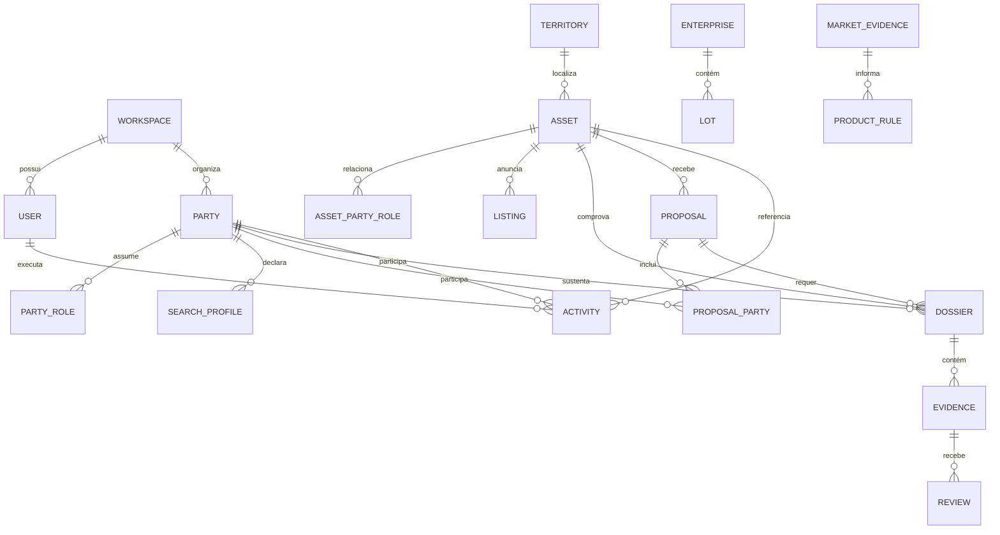

# Estratégia de produto e modelo de dados canônico do CRM imobiliário

## Visão de produto

O CRM de ponta não será um repositório de leads nem apenas um funil de corretores. Ele será um **sistema de relações imobiliárias**: conecta pessoas e empresas a ativos, necessidades, propostas, evidências e próximos passos em uma linha do tempo auditável. Isso permite operar locação, venda residencial, lote urbano e loteadora com o mesmo núcleo, sem fingir que os processos são iguais.

> **Princípio fundador:** um cadastro não é uma ficha estática. É a representação, no tempo, de uma relação entre uma parte, um ativo, uma intenção e uma evidência.

## Princípios de produto

| Princípio | Decisão de desenho | Anti-padrão evitado |
| --- | --- | --- |
| Um núcleo, várias jornadas | Manter as mesmas entidades-base para pessoa, empresa, ativo, território, documento e tarefa; criar regras por processo | Construir CRMs isolados para locação, venda e lotes. |
| Relação antes de rótulo | Pessoa/empresa pode ser proprietária, compradora, locatária, fiadora, procuradora ou contato comercial em momentos distintos | Duplicar uma pessoa em “tabela de proprietário” e “tabela de comprador”. |
| Dados progressivos | Exigir a menor informação suficiente para a decisão da etapa atual | Transformar lead em dossiê documental no primeiro formulário. |
| Evidência com estado | Registrar declarado, recebido, em revisão, divergência, confirmado e expiração | Um campo “regular: sim/não” sem fonte nem responsável. |
| Automação explicável | Priorizar tarefas, recomendar ativos e apontar pendências com regras visíveis e revisão humana | Score opaco de crédito, elegibilidade ou preço. |
| Território é dado de primeira classe | Tratar cidade, bairro, empreendimento, mapa e recorte como objetos consultáveis | Guardar localização apenas em texto livre. |
| Configuração com guarda-corpos | Campos, checklists e estados podem ser configurados, mas dados sensíveis, acesso e auditoria são padronizados | Personalização que quebra conformidade e comparabilidade. |
| Conhecimento versionado | Indicadores e regras de pesquisa possuem fonte, versão, período e validade | Atualizar painel e recomendação sem saber qual estudo os originou. |

## Arquitetura conceitual

## Entidades de negócio

| Entidade | Papel no CRM | Campos/relacionamentos essenciais | Não deve conter |
| --- | --- | --- | --- |
| Workspace | Delimita uma imobiliária, loteadora ou operação | Configurações, unidades, políticas, integração e usuários | Dados compartilhados sem permissão entre clientes. |
| Party | Pessoa física ou jurídica, inclusive contato institucional | Tipo, nome/razão social, identificadores protegidos, canais e status de deduplicação | Papel definitivo de negócio ou informações de terceiros sem vínculo. |
| Party role | Papel temporal de uma parte em uma operação | Proprietário, coproprietário, comprador, locatário, fiador, procurador, representante, contato comercial; início/fim e estado | Conclusão de poder ou titularidade sem evidência. |
| Group | Grupo familiar, grupo comprador ou grupo ocupante | Participantes, coordenador, propósito, visibilidade e versão | Informações de saúde ou atributos sensíveis não necessários. |
| Asset | Imóvel, unidade ou ativo de referência | Tipo, endereço estruturado, território, matrícula declarada, estado, atributos e situação comercial | Informação societária da parte proprietária. |
| Enterprise | Loteamento, condomínio, empreendimento ou portfólio | Nome, município, fase, regras, infraestrutura declarada e ativos vinculados | Atributos da unidade/lote misturados ao empreendimento. |
| Lot | Lote individual, ligado a empreendimento ou avulso | Quadra, lote, fase, dimensões, topografia, infraestrutura e estado urbanístico declarado | Ser tratado apenas como imóvel residencial vazio. |
| Listing | Objeto comercial publicado ou pronto para publicar | Ativo, preço/tabela, canal, versão, autorização, status e responsável | Documento de comprovação ou proposta de comprador. |
| Search profile | Intenção de locar, comprar, investir, vender ou construir | Território, tipo de ativo, faixa, prazo, critérios, forma declarada de viabilização | Prova financeira antes do estágio correto. |
| Qualification | Síntese operacional da maturidade do perfil | Completude, aderência, urgência declarada, pendências e próxima ação | Score secreto de pessoa. |
| Proposal | Oferta versionada para locação ou venda | Ativo, partes, preço, sinal, prazo, condições, vigência, aprovações e estado | Aceite jurídico automático. |
| Dossier | Conjunto de requisitos de uma proposta ou captação | Tipo, finalidade, checklist, responsáveis, estado e política de acesso | Arquivo solto e sem finalidade. |
| Evidence | Documento, declaração, consulta ou registro que sustenta uma afirmação | Origem, versão, emissão, validade, hash, visibilidade, estado e vinculações | Campo binário “regular” sem fonte. |
| Review | Avaliação humana de evidência ou pendência | Responsável, parecer operacional, data, decisão e justificativa | Substituir revisão jurídica/financeira habilitada. |
| Activity | Interação, visita, tarefa, mensagem, ligação ou evento | Participantes, canal, data, resultado, próximo passo e objeto relacionado | Contexto comercial enterrado em nota livre. |
| Market evidence | Métrica/achado de estudo | Fonte, metodologia, recorte, período, frescor, confiança e estado | Transformação direta em preço, elegibilidade ou garantia. |

## Relações que tornam o modelo escalável

### Parte ↔ ativo

O vínculo entre pessoa/empresa e ativo deve existir em tabela própria, com papel, participação declarada, período e evidência. Isso permite representar copropriedade, usufruto, espólio, cessão, empresa proprietária, procurador, corretor ou contato comercial sem duplicar o ativo ou a pessoa.

| Relação | Exemplos de papel | Atributos próprios |
| --- | --- | --- |
| Party–Asset | Proprietário declarado, coproprietário, locatário, comprador proposto, ocupante, procurador | Percentual declarado, início/fim, evidência, responsável por revisão. |
| Party–Proposal | Proponente, co-comprador, vendedor, representante, garantidor | Ordem de assinatura, condição, poder declarado, versão de aceite. |
| Asset–Listing | Ativo publicado, reservado, suspenso, retirado | Preço/tabela versionados, canal, autorização, data e responsável. |
| Asset–Enterprise | Lote em fase, unidade em empreendimento, ativo de portfólio | Quadra/lote, fase, regras, tabela e atributos herdados/locais. |
| Evidence–Claim | Evidência de identidade, representação, matrícula, renda, valor ou regra | Finalidade, origem, validade, estado, acesso e revisão. |

## Estados canônicos

Os estados devem ser consistentes entre módulos; as regras de passagem são configuráveis por processo.

| Objeto | Estados canônicos | Passagem protegida |
| --- | --- | --- |
| Lead/perfil | Novo, em contato, qualificado, aguardando, convertido, perdido, arquivado | “Qualificado” exige apenas os critérios definidos para a jornada, não dossiê completo. |
| Ativo | Identificado, em diagnóstico, em captação, publicável, anunciado, reservado, negociando, fechado, retirado | “Publicável” exige autorização comercial e qualidade mínima, não conclusão jurídica automática. |
| Proposta | Rascunho, enviada, em negociação, aceita condicionalmente, em dossiê, contratada, recusada, expirada, cancelada | Toda mudança registra usuário, data e versão. |
| Evidência | Declarada, solicitada, recebida, em revisão, divergência, aceita pelo responsável, expirada, descartada | “Aceita” identifica responsável e não substitui obrigação externa. |
| Tarefa | Aberta, em andamento, bloqueada, concluída, cancelada | Bloqueio requer motivo e próxima ação. |

## Segurança e privacidade como infraestrutura

| Camada | Regra do CRM | Implementação inicial |
| --- | --- | --- |
| Acesso | Menor privilégio por função, unidade e dossiê | Papéis iniciais: administração, gestão, corretagem, documentação, financeiro e leitura. |
| Dados pessoais | Coletar por finalidade/etapa e classificar dados de maior risco | Campos condicionais; aviso no momento de coleta; cofre para documentos. |
| Auditabilidade | Registrar alteração relevante e acesso a documento | Log imutável de upload, visualização, download, exportação e mudança de estado. |
| Retenção | Prazos por categoria e evento de descarte | Política configurável; registro de anonimização/descarte. |
| Integração | Não propagar documentos para canais sem controle | Links autenticados, permissões por objeto e expiração. |

## Limites deliberados do produto

O CRM deve organizar informação e fluxo. Ele não deve prometer aprovação de crédito, validar automaticamente poderes societários, declarar matrícula regular, calcular avaliação definitiva ou substituir parecer jurídico. Esses limites aumentam a confiabilidade comercial do produto e reduzem o risco de uma automação apresentar certeza onde existe diligência pendente.
