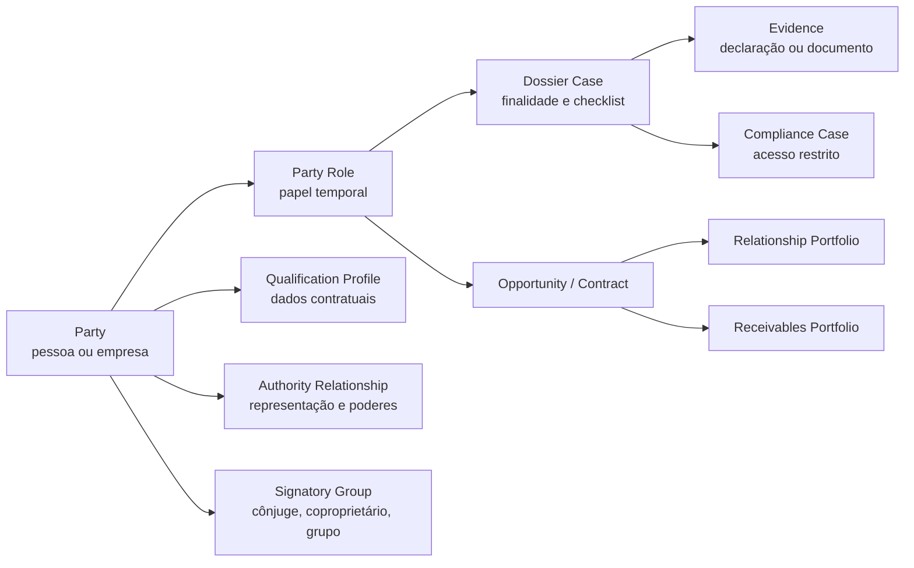

# Núcleo cadastral e carteira do CRM imobiliário

## Modelo revisado: pessoa única, relações múltiplas, dossiês por finalidade

O CRM deve abandonar formulários independentes de “locador”, “comprador”, “permutante” ou “cliente de lote”. A mesma pessoa pode ocupar vários papéis em negócios distintos e ao longo do tempo. A arquitetura recomendada é uma parte-base (`Party`) com perfis de pessoa física ou jurídica, relações temporais, grupos de assinatura, dossiês progressivos e carteira derivada dos contratos e atividades.

## Entidades e relações

| Entidade | Responsabilidade | Campos/relações críticos |
| --- | --- | --- |
| `Party` | Identidade lógica e não duplicada da parte | Tipo PF/PJ, estado de identidade, canais de contato, fonte/origem e relacionamento entre duplicatas. |
| `NaturalPersonProfile` | Qualificação de pessoa natural por finalidade | Nome, nacionalidade, profissão quando pertinente, identificação, endereço e declaração de estado civil/regime quando exigida. |
| `LegalEntityProfile` | Qualificação de empresa | CNPJ, denominação, sede, natureza jurídica, ato constitutivo, status e atividade declarada. |
| `PartyRole` | Papel contextual e temporal | Parte, papel, relacionamento/ativo/empreendimento, início/fim, estado e perfil de dossiê aplicável. |
| `ContactPoint` | Canal de comunicação verificável | Telefone/e-mail/endereço, finalidade, preferência, origem, validação e data de atualização. |
| `AuthorityRelationship` | Poder de atuar em nome de outra parte | Entidade, representante, escopo, instrumento, vigência, evidência e revisão. |
| `SignatoryGroup` | Pessoas que precisam participar de um instrumento | Negócio/instrumento, participantes, papel, condição e checklist de assinatura. |
| `QualificationSnapshot` | Foto de dados usada em uma versão de contrato/proposta | Campos, data, origem, revisor e relação com a versão do instrumento. |
| `DossierCase` | Jornada de coleta e revisão por finalidade | Perfil, estado, itens, criticidade, dono, validade e ligação com proposta/contrato. |
| `Evidence` | Documento, declaração ou resposta | Fonte, finalidade, acesso, validade, revisão, hash/versão e exclusão/retenção. |
| `FinancialCapacityDeclaration` | Dado declarado, não decisão automática | Fonte de recursos, composição, faixa, período e responsável pela coleta. |
| `AssessmentCase` | Análise humana de crédito, compliance, poderes ou outro risco | Política, evidências, decisão, justificativa, validador, validade e condição. |
| `RelationshipPortfolio` | Visão do relacionamento comercial | Estágio, preferência, território, próxima ação, recência, oportunidade e permissões de contato. |
| `ReceivablesPortfolio` | Visão operacional de obrigações futuras | Contrato, plano, parcelas, safra, estado, atrasos, acordo e vínculos de cessão. |
| `RecertificationCase` | Atualização periódica de vínculo longo | Política, campos/documentos a revisar, vencimento, contato, resultado e exceção. |

## Perfis de dossiê: o mesmo objeto, configurações diferentes

| Perfil | Usado quando | Itens que podem ser ativados | Quem revisa |
| --- | --- | --- | --- |
| Interesse inicial | Primeiro contato de qualquer linha | Contato, objetivo, território, origem e aviso de privacidade | Comercial. |
| Qualificação de busca | Interesse se torna demanda aderente | Critérios, prazo, grupo decisor, forma declarada e preferências | Comercial. |
| Proprietário/ativo | Captação para locação ou venda | Relação com ativo, matrícula/certidão, copropriedade, autorização e restrição declarada | Captação + responsável documental. |
| Comprador/proposta | Proposta, reserva ou condição de pagamento | Partes, grupo de assinatura, condição, fonte declarada e canal de decisão | Comercial + crédito/financeiro quando aplicável. |
| Locação/garantia | Análise formal de locação | Renda/documentos proporcionais, garantia, grupo ocupante e evidência de análise | Locação/risco. |
| Lote/carteira própria | Contrato de lote e relação longa | Capacidade declarada, entrada, fluxo, indexação, política de risco e recertificação | Comercial + financeiro/risco. |
| Permuta/terra | Aquisição de gleba e contrapartida | Parte, ativo-terra, cadeia/evidências, grupo de assinatura, modalidade e distribuição | Novos negócios + jurídico/técnico. |
| Sócio/investidor | SPE/SCP, aporte e governança | Parte, instrumento, participação, aporte, origem conforme política e distribuição | Governança + compliance restrito. |

## Estados paralelos do cadastro

Um cadastro não pode ser resumido a “aprovado”. A plataforma deve mostrar estados específicos e permitir que uma dimensão avance sem contaminar a outra.

| Dimensão | Estados sugeridos | Pergunta respondida |
| --- | --- | --- |
| Identidade/qualificação | Não iniciada, declarada, evidência recebida, revisada, divergência, expirada | Quem é esta parte para a finalidade atual? |
| Representação | Não aplicável, declarada, instrumento recebido, em revisão, válida, vencida/divergente | Quem pode agir em nome da parte? |
| Instrumento/assinatura | Não aplicável, grupo definido, pendência, apto para assinatura, assinado, substituído | Quem precisa participar deste ato? |
| Crédito/capacidade | Não solicitado, declaração recebida, em análise, condição aprovada, condição não atendida, expirada | Que condição comercial/financeira pode ser considerada? |
| Compliance | Fora de escopo, triagem, diligência restrita, escalonado, encerrado/revisar | Existe um caso que exige responsável e sigilo? |
| Relacionamento | Lead, qualificado, oportunidade, ativo, pós-negócio, inativo | Qual é a próxima ação de valor? |
| Dossiê | Não iniciado, em coleta, completo para revisão, pendência, pronto para gate, arquivado | A finalidade tem informação suficiente e revisada? |

## Regras de coleta progressiva

| Momento | Perguntar | Não perguntar ainda | Motivo |
| --- | --- | --- | --- |
| Interesse | Contato, objetivo, território e preferência operacional | Documento, renda, estado civil e fonte de recursos | Minimização e menor fricção. |
| Qualificação | Critérios, prazo, forma declarada, grupo comprador e necessidade de visita | Dossiê bancário/completo ou evidência societária extensa | Ainda não existe proposta/contrato que justifique a coleta. |
| Proposta | Partes, condição, vigência, alçada e requisitos suspensivos | Documentos sem vínculo com a condição ou finalidade | Proposta deve nascer clara e versionada. |
| Contrato | Qualificação que entra no instrumento, representação, grupo de assinatura e evidências exigidas | Dados sensíveis ou documentos não requeridos pelo ato | O checklist é gerado pelo tipo de instrumento e política. |
| Carteira longa | Contato de cobrança, evento contratual e campos com vencimento | Repetir documentos válidos sem gatilho | Recertificação por política e risco, não por hábito. |

## Loteadora: carteira como relacionamento e ativo operacional

| Objeto | Contexto de loteadora | Estado/indicador útil | Integração futura, não substituição |
| --- | --- | --- | --- |
| `LotContract` | Origina a relação longa e a obrigação | Safra, empreendimento, fase, lote, canal, forma de entrada e status | Assinatura e registro aplicáveis. |
| `PaymentPlanVersion` | Versiona a obrigação acordada | Entrada, prazo, indexação contratual, reforços, motivo da alteração | Financeiro/ERP e cálculo contratado. |
| `ReceivableInstallment` | Unidade operacional de cobrança | Prevista, evidência recebida, conciliada, atraso, acordo, cancelada | Banco/cobrança/conciliação. |
| `CollectionsCase` | Coordena o atendimento em atraso | Faixa de atraso, próxima ação, acordo, responsável e resultado | Canal de cobrança autorizado. |
| `RescissionCase` | Controla distrato e estoque de retorno | Base contratual, posse, itens em revisão, restituição, liberação | Jurídico/financeiro e política de estoque. |
| `CustomerSegment` | Observa comportamento sem classe opaca | Moradia/investimento declarado, faixa de ticket, safra e interação | Estratégia comercial aprovada. |

### Métricas que o CRM pode apresentar com honestidade

O CRM pode calcular e apresentar métricas operacionais usando definição e período visíveis: contratos ativos, parcelas em atraso por faixa, acordos em aberto, distratos iniciados/concluídos, contatos vencidos, pendências documentais, saldo contratual informado pela fonte de verdade, concentração por safra ou empreendimento e velocidade de reserva para contrato. Provisão contábil, elegibilidade de cessão, valuation de carteira e decisão de crédito devem permanecer indicadores fornecidos ou confirmados pelos responsáveis e sistemas adequados.

## Política de mercado como configuração, nunca como alteração silenciosa do score

O estudo recebido recomenda calibrar rigor de crédito e cobrança conforme o ciclo de mercado. O CRM deve representar isso como uma `PortfolioPolicyVersion`, contendo contexto, objetivo, regras permitidas, data de vigência, responsável e teste de efeito. A mudança não pode recalcular retrospectivamente pessoas nem decidir sozinha uma condição de venda.

| Exemplo de contexto | Configuração possível | Proteção |
| --- | --- | --- |
| Carteira própria mais exposta | Aumentar revisão humana para determinadas condições comerciais | Mostrar política, data e aplicador; nenhuma negação automática. |
| Alta de demanda | Simplificar campos iniciais e reforçar fila de qualificação | Manter gates contratuais e de compliance iguais. |
| Aumento de atrasos em uma safra | Abrir campanhas de recertificação e casos de atendimento preventivo | Não usar atributo sensível nem presumir inadimplência individual. |
| Novo empreendimento | Criar perfil de dossiê e tabela de checklists específicos | A configuração é isolada por empreendimento e versionada. |

## Ordem de implementação

1. Criar `Party`, contatos, perfis PF/PJ e deduplicação assistida, sem perder a origem de cada dado.
2. Adicionar papéis temporais, representação, grupo de assinatura e qualificação por finalidade.
3. Entregar dossiê/checklist com evidência, acesso mínimo, validade, pendência e gate de proposta/contrato.
4. Adicionar casos de avaliação de crédito e compliance como módulos humanos, explicáveis e restritos.
5. Conectar oportunidades e contratos à carteira de relacionamento e, para loteadora/construtora, à carteira de obrigações.
6. Implementar recertificação, métricas operacionais e políticas de mercado versionadas.

Esse núcleo permite que a futura plataforma evolua por módulos sem repetir pessoas, expor informações sensíveis ou reduzir relações imobiliárias de longa duração a uma lista de leads.
