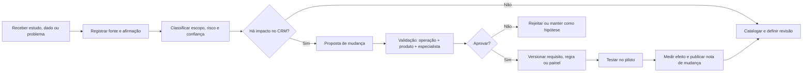

# Protocolo de revisão viva da estratégia e do CRM

## Regra de governança

Toda melhoria nasce como uma **proposta revisável**, não como verdade definitiva. O CRM deve separar três camadas: o que uma fonte afirma, o que a equipe interpreta para o produto e o que foi decidido para a versão atual. Isso permite aproveitar estudos de parceiros, pesquisa externa e fatos de operação sem confundir hipótese, dado e regra de sistema.

| Camada | Pergunta respondida | Exemplo | Pode alterar produto sozinha? |
| --- | --- | --- | --- |
| Afirmação/Evidência | O que a fonte efetivamente diz? | “Pesquisa X reporta 2.958 lotes vendidos no recorte Y.” | Não. |
| Interpretação | O que isso sugere para a operação? | “O painel deve separar unidades de VGV.” | Não, requer revisão de produto. |
| Decisão de produto | O que será feito, por quem e em qual versão? | “Adicionar dimensões de ticket e tipologia no painel de loteadora.” | Sim, após a aprovação definida. |

## Registro canônico de evidência

| Campo | Descrição | Obrigatório |
| --- | --- | --- |
| `evidence_id` e `revision` | Identificador permanente e número de versão | Sim. |
| `source_kind` | Oficial, setorial, acadêmica, parceiro, observação operacional ou hipótese | Sim. |
| `source_title`, `issuer`, `url/file` | Origem verificável ou arquivo preservado | Sim. |
| `captured_at` e `published_at` | Quando foi capturada e quando foi publicada | Sim. |
| `claim` | Afirmação objetiva, sem extrapolação | Sim. |
| `scope` | Território, período, população/amostra, processo e segmento | Sim. |
| `method_and_limit` | Método conhecido, ausência de método e limitação declarada | Sim. |
| `confidence` | Alta, média, baixa ou não avaliada, com motivo | Sim. |
| `verification_state` | Recebida, capturada, confrontada, revisada, vigente, substituída ou rejeitada | Sim. |
| `product_impact` | Nenhum, conteúdo, métrica, configuração, fluxo, regra/gate ou decisão estratégica | Sim. |
| `owner` e `reviewer` | Responsável por conduzir e por aprovar a leitura | Sim. |
| `valid_from` e `review_by` | Data de vigência e próxima revisão planejada | Sim. |

## Classificação de fontes para os estudos recebidos

| Fonte | Como entra no catálogo | Uso imediato permitido | Próxima verificação |
| --- | --- | --- | --- |
| Estudo de formação BHL | `partner_provided_domain_reference` | Vocabulário, jornadas propostas, hipóteses de dados e lista de validação | Confrontar afirmações jurídicas, financeiras e estatísticas conforme impacto. |
| Estudo superior de loteadoras BHL | `partner_provided_domain_reference` | Arquitetura de domínio, checklist de descobertas, máquinas de estado propostas | Confrontar mercado, legislação, distrato, tributação e mercado de capitais. |
| Fonte oficial (lei, regulador, tribunal) | `official_primary` | Gate, checklist, prazo ou limitação, sempre com revisão contextual | Rever quando houver mudança legislativa/jurisprudencial ou caso específico. |
| Fonte setorial (AELO, Brain, sindicatos) | `sector_research` | Contexto de mercado e dimensão de painéis | Guardar período, cobertura e método; não extrapolar além da amostra. |
| Operação piloto | `operational_observation` | Ajuste de UX, estado, SLA e prioridade | Replicar em parceiros antes de tornar padrão canônico. |

## Protocolo de conflito de evidências

| Situação | Exemplo | Tratamento |
| --- | --- | --- |
| Número divergente | Um relatório aponta alta de unidades e outro queda de VGV | Preservar ambos; comparar período, território, metodologia e unidade. Não “escolher” sem explicação. |
| Fonte parceira x fonte oficial | Apostila descreve regra com simplificação maior que a norma | Norma oficial e revisão jurídica prevalecem para o gate; material do parceiro permanece como contexto. |
| Regra antiga x fonte nova | Condição de crédito de 2026 expira ou muda | Marcar regra como expirada, abrir proposta de atualização e impedir uso automático. |
| Caso individual x padrão | Uma loteadora possui contrato com condição própria | Parametrizar por empreendimento/contrato; não elevar o caso individual a regra global. |
| Métrica sem método | Dado de mercado sem amostra/cobertura | Exibir somente como observação de baixa confiança ou manter fora de painéis decisórios. |

## Ciclo de melhoria contínua

## Matriz de revisão proporcional ao risco

| Impacto de produto | Exemplo | Revisão mínima | Evidência necessária |
| --- | --- | --- | --- |
| Conteúdo editorial | Atualizar texto de contexto de mercado | Curador + produto | Fonte identificável, recorte e limitação. |
| Painel/métrica | Incluir VGV por fase | Pesquisa + produto | Metodologia e definição de métrica. |
| Campo/formulário | Incluir modalidade de acesso do empreendimento | Operação + produto | Caso de uso e nomenclatura consistente. |
| Configuração | Alterar checklist municipal | Produto + responsável técnico/jurídico local | Fonte oficial/local, vigência e dono. |
| Gate operacional | Bloquear venda sem evidência de registro | Jurídico/compliance + produto | Fonte oficial, regra de exceção e trilha de aprovação. |
| Fórmula financeira | Correção, multa, distrato ou rateio | Financeiro + jurídico + produto | Contrato/versão, base de cálculo e teste de cenários. |
| Automação externa | Sincronizar documento, cobrança ou fonte | Segurança + produto + dono da integração | Contrato/API validado, erro, reconciliação e fallback manual. |

## Cadências recomendadas

| Ritual | Cadência | Resultado esperado |
| --- | --- | --- |
| Triagem de fontes | Semanal | Novos estudos classificados, sem acervo informal. |
| Revisão de loteadora | Quinzenal no piloto | Gates, inventário, carteira, obra e riscos atualizados. |
| Conselho de configuração | Mensal | Mudanças municipais, contratos, índices e checklists versionadas. |
| Revisão de estratégia | Trimestral | Prioridades entre locação, venda, construtora e loteadora reavaliadas por evidência. |
| Auditoria de vigência | Semestral | Fontes vencidas, regras sem dono e métricas sem cobertura identificadas. |

## Critério para novas atualizações de estudo

Toda nova atualização recebida deve responder antes de entrar no backlog: **qual afirmação é nova? qual recorte ela cobre? qual decisão anterior ela confirma, contraria ou torna incerta? em qual módulo do CRM o efeito apareceria? qual é o risco de não mudar e o risco de mudar cedo demais?**

Isso mantém a estratégia aberta à melhoria sem convertê-la em acúmulo de opiniões. O histórico de versões permite explicar por que um requisito existe, quando mudou e qual evidência sustentou a decisão.
