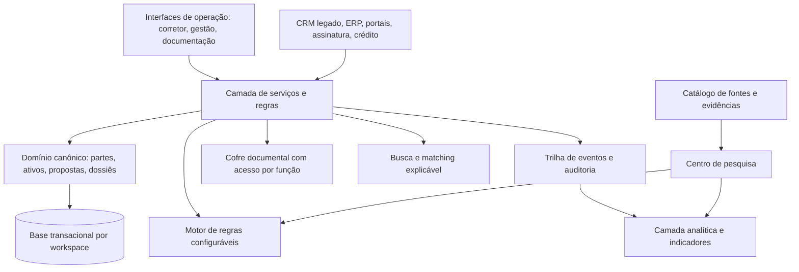

# Roteiro passo a passo para desenvolver o CRM imobiliário

## Estratégia de execução

O desenvolvimento deve seguir uma ordem de risco: primeiro constituir ambientes, segurança, vocabulário e pilotos; depois validar se equipes registram e usam contexto comercial; em seguida provar dossiê, loteadora, carteira e subledger antes de escalar integração e inteligência. Começar por um grande conjunto de integrações, por IA autônoma ou por um “ERP completo” elevaria complexidade antes de provar uso diário e integridade operacional.

> **Ordem canônica auditada:** constituição técnica e de domínio → rotina do corretor/gestor → proposta e dossiê → loteadora e carteira → subledger e integrações → inteligência controlada → escala disciplinada.

## Arquitetura de produto futuro

| Camada | Responsabilidade | Critério de qualidade |
| --- | --- | --- |
| Interfaces operacionais | Captura, agenda, funil, proposta, dossiê e painéis por papel | Menos de três cliques para registrar próximo passo frequente. |
| Domínio canônico | Partes, ativos, relações, listas, propostas e evidências | Uma parte e um ativo não são duplicados por papel ou módulo. |
| Motor de regras | Campos condicionais, checklist, estados, alçada e SLA | Configuração revisável, com versão e sem alterar integridade do núcleo. |
| Cofre documental | Arquivos, metadados, permissões, expiração e logs | Nenhum documento sensível acessível fora de finalidade e função. |
| Eventos/auditoria | Mudança de estado, versão de proposta, acesso e decisão | Histórico imutável e consultável. |
| Inteligência | Métricas da operação, indicadores de mercado e evidências | Recorte, fonte, período e limitação sempre visíveis. |
| Integrações | Troca controlada de dados com sistemas existentes | Adaptadores desacoplados e filas/reprocessamento para falhas. |

> **Materialização obrigatória:** o app web será entregue pelo Netlify; identidade, Postgres, RLS, Storage privado, migrations, comandos transacionais e eventos duráveis usarão Supabase. A arquitetura detalhada, e não esta abstração, prevalece para decisões de implementação. [1]

## Fases de produto

| Fase | Janela indicativa | Objetivo | Entrega verificável | Decisão de passagem |
| --- | ---: | --- | --- | --- |
| 0. Fundação administrativa, identidade e descoberta | 3–4 semanas | Preparar ambientes, bootstrap controlado, Auth/MFA, jornadas de ativação de comprador/owner, convite de funcionário, SSO opcional, recuperação restrita, organizações, memberships, grants, RLS, audit event, dados sintéticos e mapa de rotina de 3–5 parceiros. | Painel mínimo de plataforma, modelo de identidade v0, convite/revogação, step-up, linha de base e suíte inicial de isolamento. | Principal sem grant não atravessa organização/arquivo/função; reset não eleva privilégio; ambiente reproduz policy e schema sem ajuste manual. |
| 1. Núcleo operacional confiável | 6–8 semanas | Criar espaço de trabalho, partes, ativos, tarefas e perfis de busca sob escopo autorizado. | Fila de trabalho, timeline, captura curta, qualificação e audit event. | Usuários recuperam contexto sem planilha; usuário fora do escopo não lê ou altera dado/arquivo. |
| 2. Proposta e dossiê | 6–8 semanas | Conectar ativo, partes, condição, versão, checklist, alçada e evidência privada. | Pré-proposta, dossiê por finalidade, cofre, retenção e estados de evidência. | Dossiê reduz reabertura; proposta preserva histórico e documento tem finalidade/acesso/versionamento. |
| 3. Loteadora e carteira | 8–10 semanas | Adaptar o núcleo para lote, empreendimento, reserva, contrato, parcela e exceção. | Captação de venda, lote/empreendimento, estados paralelos, condição e carteira. | Lote não sofre venda concorrente e carteira aponta contrato, versão e responsável. |
| 4. Subledger e integrações | 8–10 semanas | Ligar direito, recebível, retorno, conciliação e exportação a parceiro homologado. | Inbox/outbox, idempotência, divergência, lote contábil e workspace controlado. | Uma competência-piloto fecha com evento, regra, evidência e retorno sem ajuste manual de saldo. |
| 5. Inteligência controlada | 4–6 semanas | Expor pesquisa, indicadores e IA assistiva sob fonte, permissão e avaliação. | Biblioteca de evidências, painel territorial, registro de IA e notas de mudança. | Gestão explica recorte; insight de IA guarda fonte, aprovação e resultado. |
| 6. Escala disciplinada | Contínua | Ampliar parceiros, regiões e integrações comprovadas sem perder controle. | SLO, alertas, recovery, supply chain, teste de carga e recertificação. | Escala preserva rastreabilidade, segurança, suporte e conciliação. |

## Primeiro MVP: o que entra e o que espera

| Entra no MVP | Espera por evidência de uso |
| --- | --- |
| Painel mínimo de Super Admin governado, multi-organização, usuários, memberships, papéis, revogação e bootstrap secreto do primeiro principal | Marketplace, rede pública de corretores ou portal próprio. |
| Ativação de comprador/owner, convite individual de funcionário, MFA por risco, recuperação restrita e preparação de SSO | Passkey como único login, SSO obrigatório para todo cliente ou reset informal de MFA. |
| Partes PF/PJ, contatos, grupos e papéis temporais | Enriquecimento automático massivo de dados pessoais. |
| Ativo residencial e lote com território estruturado | Avaliação automática de imóvel ou motor preditivo de preço. |
| Perfil de busca, fila, tarefa, atividade e visita | Campanhas multicanal avançadas. |
| Proposta versionada e checklist de dossiê | Assinatura, crédito e cartório integrados antes do fluxo se estabilizar. |
| Permissões, logs e cofre documental básico | Score de elegibilidade ou recomendação não explicável. |
| Painel simples de funil, SLA e pendências | Data lake completo ou automação contínua de toda fonte pública. |

## Critérios de aceitação do MVP

| Área | Critério |
| --- | --- |
| Captura | Um corretor cria contato, perfil de busca e tarefa em menos de dois minutos, sem documento sensível. |
| Parte e ativo | A mesma pessoa/empresa pode assumir papéis diferentes sem duplicação; ativo pode ter várias partes relacionadas. |
| Trabalho diário | Todo lead/ativo em andamento possui responsável, próxima ação e data. |
| Proposta | Versão, condições, ativo, partes, validade e estado são visíveis sem procurar em conversa externa. |
| Dossiê | Cada arquivo possui finalidade, acesso limitado, origem, data e status de revisão. |
| Gestão | Gestor visualiza tempo por etapa, pendências e motivos de perda sem exportar planilhas. |
| Segurança | Convite, login, step-up, recuperação, revogação, acesso/documento e mudança de estado críticos geram log; e-mail/domínio não concede organização, papel ou alçada. |

## Métricas de aprendizado por fase

| Hipótese | Indicador | Leitura correta |
| --- | --- | --- |
| A captura curta não perde qualidade | Taxa de conclusão + completude após primeiro contato | Analisar por origem, equipe e processo, não só média geral. |
| Fila melhora resposta | Tempo até primeiro contato e tarefas vencidas | Comparar antes/depois no mesmo parceiro. |
| Match reduz visitas desaderentes | Visitas por perfil, feedback estruturado e rejeição por critério | Não medir apenas volume de visita. |
| Dossiê reduz retrabalho | Itens reabertos, tempo até proposta apta e pendências por responsável | Separar falha de processo de regra externa. |
| Lote precisa de modelo próprio | Propostas de lote com campos específicos e motivo de perda | Comparar com operação anterior de planilha/tabela. |
| Pesquisa gera decisão | Consultas a evidências, notas de mudança e uso em revisão de carteira | Não confundir visualização com decisão efetiva. |

## Governança de desenvolvimento

| Ritual | Frequência | Resultado |
| --- | --- | --- |
| Revisão de operação | Semanal no piloto | Pendências, casos atípicos, feedback de corretores e próximos testes. |
| Conselho de regras | Quinzenal | Aprovação de novo campo, estado, checklist, alçada ou texto de orientação. |
| Revisão de evidência | Mensal | Fonte nova, indicador substituído, recorte e impacto no produto. |
| Revisão de segurança | Mensal no piloto, trimestral depois | Permissões, acesso a documentos, retenção e incidentes. |
| Revisão de produto | Mensal | Métricas, hipótese, backlog e decisão de fase. |

## Backlog orientado por riscos

| Risco | Sinal de alerta | Mitigação na próxima versão |
| --- | --- | --- |
| CRM vira planilha cara | Usuários registram somente no fim do dia ou em campos livres | Simplificar captura, criar ações rápidas e tornar fila útil. |
| Configuração excessiva | Cada cliente cria termos e estados incompatíveis | Manter núcleo canônico e limitar campos/configurações por governança. |
| Documentos se espalham | Equipe usa mensageria paralela e links públicos | Cofre simples e fácil; política e treinamento antes de automação. |
| Integração quebra contexto | Dados chegam sem origem, proprietário ou versão | Usar fila, idempotência, mapa de campos e reconciliação. |
| Indicador vira promessa | Preço de anúncio é tratado como avaliação ou garantia | Exibir fonte, método e limitação junto do dado. |
| Automação decide demais | Regra muda prioridade/crédito sem explicação | Estados, justificativa, aprovação humana e log. |

## Sequência de decisão para o fundador

1. Construir o núcleo administrativo: bootstrap, MFA, organização, membership, RLS, grant, convite/revogação e audit event com testes permitir/negar.
2. Selecionar **três parceiros-piloto**: uma imobiliária de locação, uma de vendas e uma operação de lotes/loteadora com equipe real.
3. Executar a descoberta usando casos reais, não listas genéricas de requisitos.
4. Construir o núcleo de parte, ativo, busca, tarefa e timeline antes do módulo documental complexo.
5. Medir adoção diária e redução de contexto perdido antes de vender integrações ou inteligência avançada.
6. Após o dossiê funcionar, escolher com os parceiros quais fontes de pesquisa devem alimentar o centro de evidências e qual alternativa de atualização é financeiramente justificada.

## Referência de arquitetura e auditoria

[1] [Arquitetura de referência — CRM sobre Netlify + Supabase](arquitetura_crm_netlify_supabase.md)
