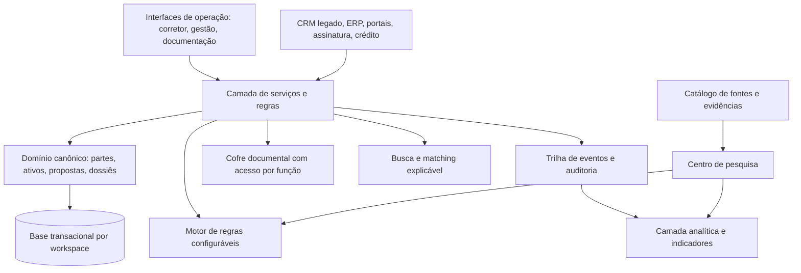

# Roteiro passo a passo para desenvolver o CRM imobiliário

## Estratégia de execução

O desenvolvimento deve seguir uma ordem de risco: primeiro validar se equipes registram e usam contexto comercial; depois validar se o dossiê reduz retrabalho; só então adicionar integrações, inteligência de mercado e automação contínua. Começar por um grande conjunto de integrações ou por um “ERP completo” elevaria complexidade antes de provar uso diário.

> **Ordem recomendada:** rotina do corretor → fluxo do gestor → dossiê da operação → inteligência territorial → integrações e atualização contínua.

## Arquitetura de produto futuro

| Camada | Responsabilidade | Critério de qualidade |
| --- | --- | --- |
| Interfaces operacionais | Captura, agenda, funil, proposta, dossiê e painéis por papel | Menos de três cliques para registrar próximo passo frequente. |
| Domínio canônico | Partes, ativos, relações, listas, propostas e evidências | Uma parte e um ativo não são duplicados por papel ou módulo. |
| Motor de regras | Campos condicionais, checklist, estados, alçada e SLA | Configuração revisável, com versão e sem alterar integridade do núcleo. |
| Cofre documental | Arquivos, metadados, permissões, expiração e logs | Nenhum documento sensível acessível fora de finalidade e função. |
| Eventos/auditoria | Mudança de estado, versão de proposta, acesso e decisão | Histórico imutável e consultável. |
| Inteligência | Métricas da operação, indicadores de mercado e evidências | Recorte, fonte, período e limitação sempre visíveis. |
| Integrações | Troca controlada de dados com sistemas existentes | Adaptadores desacoplados e filas/reprocessamento para falhas. |

## Fases de produto

| Fase | Janela indicativa | Objetivo | Entrega verificável | Decisão de passagem |
| --- | ---: | --- | --- | --- |
| 0. Descoberta e desenho | 3–4 semanas | Mapear rotina real de 3–5 parceiros e congelar vocabulário inicial | Mapa de processos, modelo de dados v0, protótipo e linha de base | Parceiros reconhecem os estados e usam a mesma linguagem. |
| 1. Núcleo operacional | 6–8 semanas | Criar espaço de trabalho, partes, ativos, atividades, tarefas e perfis de busca | Fila de trabalho, timeline, captura curta e qualificação por etapa | Usuários registram e recuperam contexto sem planilha paralela para o fluxo-piloto. |
| 2. Proposta e dossiê | 6–8 semanas | Conectar ativo, partes, condições, versões, checklist e permissões | Pré-proposta, dossiê por finalidade, cofre e estados de evidência | Dossiês reduzem reabertura e proposta preserva histórico. |
| 3. Vendas e lotes | 6–8 semanas | Adaptar núcleo para proprietário PF/PJ, comprador PF/PJ, lote e tabela | Captação de venda, lote/empreendimento, alçada e proposta de venda | Lotes são operados sem planilha paralela para tabela/condição. |
| 4. Inteligência e pesquisa | 4–6 semanas | Expor indicadores, fonte, território, lacunas de carteira e catálogo de pesquisa | Painel de demanda, biblioteca de evidências e notas de mudança | Gestores usam painel em reunião de carteira e não só como relatório. |
| 5. Integrações e escala | Contínua | Conectar sistemas prioritários e automatizar apenas fluxos comprovados | Adaptadores, sincronização monitorada e configuração por parceiro | Integração reduz duplicidade sem introduzir perda de rastreabilidade. |

## Primeiro MVP: o que entra e o que espera

| Entra no MVP | Espera por evidência de uso |
| --- | --- |
| Multi-organização, usuários e papéis básicos | Marketplace, rede pública de corretores ou portal próprio. |
| Partes PF/PJ, contatos, grupos e papéis temporais | Enriquecimento automático massivo de dados pessoais. |
| Ativo residencial e lote com território estruturado | Avaliação automática de imóvel ou motor preditivo de preço. |
| Perfil de busca, fila, tarefa, atividade e visita | Campanhas multicanal avançadas. |
| Proposta versionada e checklist de dossiê | Assinatura, crédito e cartório integrados antes do fluxo se estabilizar. |
| Permissões, logs e cofre documental básico | Score de elegibilidade ou recomendação não explicável. |
| Painel simples de funil, SLA e pendências | Data lake completo ou automação contínua de toda fonte pública. |

## Critérios de aceitação do MVP

| Área | Critério |
| --- | --- |
| Captura | Um corretor cria contato, perfil de busca e tarefa em menos de dois minutos, sem documento sensível. |
| Parte e ativo | A mesma pessoa/empresa pode assumir papéis diferentes sem duplicação; ativo pode ter várias partes relacionadas. |
| Trabalho diário | Todo lead/ativo em andamento possui responsável, próxima ação e data. |
| Proposta | Versão, condições, ativo, partes, validade e estado são visíveis sem procurar em conversa externa. |
| Dossiê | Cada arquivo possui finalidade, acesso limitado, origem, data e status de revisão. |
| Gestão | Gestor visualiza tempo por etapa, pendências e motivos de perda sem exportar planilhas. |
| Segurança | Acesso/documento e mudança de estado críticos geram log. |

## Métricas de aprendizado por fase

| Hipótese | Indicador | Leitura correta |
| --- | --- | --- |
| A captura curta não perde qualidade | Taxa de conclusão + completude após primeiro contato | Analisar por origem, equipe e processo, não só média geral. |
| Fila melhora resposta | Tempo até primeiro contato e tarefas vencidas | Comparar antes/depois no mesmo parceiro. |
| Match reduz visitas desaderentes | Visitas por perfil, feedback estruturado e rejeição por critério | Não medir apenas volume de visita. |
| Dossiê reduz retrabalho | Itens reabertos, tempo até proposta apta e pendências por responsável | Separar falha de processo de regra externa. |
| Lote precisa de modelo próprio | Propostas de lote com campos específicos e motivo de perda | Comparar com operação anterior de planilha/tabela. |
| Pesquisa gera decisão | Consultas a evidências, notas de mudança e uso em revisão de carteira | Não confundir visualização com decisão efetiva. |

## Governança de desenvolvimento

| Ritual | Frequência | Resultado |
| --- | --- | --- |
| Revisão de operação | Semanal no piloto | Pendências, casos atípicos, feedback de corretores e próximos testes. |
| Conselho de regras | Quinzenal | Aprovação de novo campo, estado, checklist, alçada ou texto de orientação. |
| Revisão de evidência | Mensal | Fonte nova, indicador substituído, recorte e impacto no produto. |
| Revisão de segurança | Mensal no piloto, trimestral depois | Permissões, acesso a documentos, retenção e incidentes. |
| Revisão de produto | Mensal | Métricas, hipótese, backlog e decisão de fase. |

## Backlog orientado por riscos

| Risco | Sinal de alerta | Mitigação na próxima versão |
| --- | --- | --- |
| CRM vira planilha cara | Usuários registram somente no fim do dia ou em campos livres | Simplificar captura, criar ações rápidas e tornar fila útil. |
| Configuração excessiva | Cada cliente cria termos e estados incompatíveis | Manter núcleo canônico e limitar campos/configurações por governança. |
| Documentos se espalham | Equipe usa mensageria paralela e links públicos | Cofre simples e fácil; política e treinamento antes de automação. |
| Integração quebra contexto | Dados chegam sem origem, proprietário ou versão | Usar fila, idempotência, mapa de campos e reconciliação. |
| Indicador vira promessa | Preço de anúncio é tratado como avaliação ou garantia | Exibir fonte, método e limitação junto do dado. |
| Automação decide demais | Regra muda prioridade/crédito sem explicação | Estados, justificativa, aprovação humana e log. |

## Sequência de decisão para o fundador

1. Selecionar **três parceiros-piloto**: uma imobiliária de locação, uma de vendas e uma operação de lotes/loteadora com equipe real.
2. Executar a fase de descoberta usando casos reais, não listas genéricas de requisitos.
3. Construir o núcleo de parte, ativo, busca, tarefa e timeline antes do módulo documental complexo.
4. Medir adoção diária e redução de contexto perdido antes de vender integrações ou inteligência avançada.
5. Após o dossiê funcionar, escolher com os parceiros quais fontes de pesquisa devem alimentar o centro de evidências e qual alternativa de atualização é financeiramente justificada.
