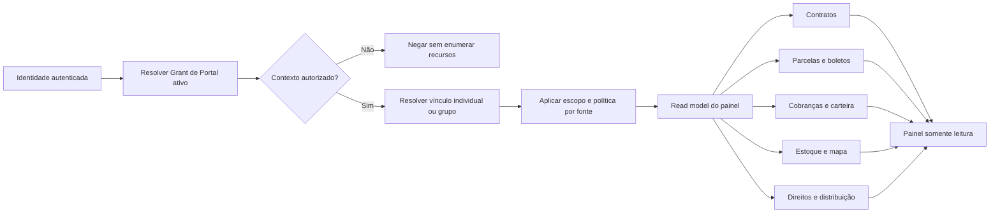

# Painel integrado de Sócios e Parceiros: contratos, boletos, cobranças e estoque

**Status:** `requisito_estratégico_avançado`  
**Decisão do usuário:** ao efetuar login, cada Sócio ou Parceiro deve chegar diretamente à sua visão individual — ou à visão do Grupo de Participação do qual faça parte — com informações autorizadas provenientes de Contratos, Parcelas/Boletos, Cobranças/Carteira e Estoque/Mapa de Lotes. A visualização de outro parceiro, grupo, cliente, contrato ou lote não pode ser acessada por navegação, URL, filtro ou falha de integração.

> **Princípio:** o painel não é uma cópia dos setores internos. Ele é uma **leitura derivada, datada e autorizada** dos fatos de cada setor, limitada ao vínculo ou grupo contratado.

## 1. Contrato de leitura entre painel e setores internos

| Setor interno da Loteadora | Fonte de verdade | O que pode alimentar o painel | Filtro obrigatório de escopo | O que o painel não recebe |
| --- | --- | --- | --- | --- |
| **Propostas, Reservas e Contratos** | Contrato de venda e instrumentos de participação, versões, partes, condição e estados. | Referência do contrato, status, lote vinculado, vigência, documento liberado, condição que afeta o direito e vínculo com o parceiro/grupo. | Contrato explicitamente incluído no vínculo de participação ou no Grupo de Participação. | Aditivos não liberados, dados de outros participantes, condições comerciais sem relação com o direito e ferramentas de edição. |
| **Financeiro — Parcelas e Boletos** | Agenda contratual, parcela, instrução de cobrança, retorno e aplicação de caixa. | Entrada, parcela regular, intermediária ou outro evento elegível; vencimento, situação, valor que afeta o direito, estado do retorno e `as_of`. | Parcela pertence a contrato/lote elegível e existe Regra de Direito vigente para o parceiro/grupo. | Dados bancários, linha digitável completa, conta de recebimento, emissão/cancelamento de boleto e parcelas sem vínculo com o direito. |
| **Cobranças e Carteira** | Estado da carteira, atraso, acordo, promessa, cobrança, exceção e conciliação. | Adimplente/inadimplente, faixa de atraso, próxima parcela vinculada, estado de acordo e impacto no direito projetado/realizado. | Cliente/contrato pertence ao escopo autorizado do vínculo/grupo e o campo atende à finalidade de transparência contratual. | Régua interna, notas de cobrança, dados de contato desnecessários, negociação operacional, comandos de baixa ou acordo. |
| **Estoque/Mapa de Lotes** | Estrutura do lote, estado comercial, restrição, alocação, reserva e contrato. | `Qn · Ln`, fase/quadra, situação comercial, lotes vendidos, lotes reservados/bloqueados e lotes disponíveis dentro do pool contratado. | Lote faz parte do objeto individual ou do pool de glebas/lotes expresso no contrato/grupo. | Estoque total da loteadora, lotes de outros grupos, alteração de mapa, reserva, liberação, tabela ou bloqueio. |
| **Repasses e Distribuição** | Plano de direitos, regra datada, entitlement, bloqueio, instrução, retorno e conciliação. | Ganhos projetados, aguardando condição, recebidos em análise, elegíveis, autorizados, conciliados, bloqueados ou revertidos; memória autorizada da regra. | Recebedor é o parceiro, ou o grupo no qual ele possui grant de visualização válido. | Direitos de outros recebedores, comando financeiro, inclusão/edição de regra e autorização de instrução. |

## 2. Contexto do painel: vínculo individual ou Grupo de Participação

| Contexto resolvido após login | Escopo exibido | Exemplo de navegação |
| --- | --- | --- |
| **Vínculo individual** | Somente contratos, lotes, parcelas, direitos e clientes ligados ao instrumento daquele parceiro. | `Meu Painel → Meu vínculo com Empreendimento A`. |
| **Grupo de Participação** | Pool de glebas, lotes, contratos, parcelas, clientes e direitos expressamente unificados pelo instrumento do grupo. | `Meu Painel → Grupo Glebas Norte`, acessível aos membros vigentes do grupo. |
| **Vínculo individual + grupo** | Duas lentes separadas, sem soma implícita: `Individual` e `Grupo`. | O usuário escolhe a lente; cada total declara seu recorte. |
| **Mais de um vínculo/grupo autorizado** | Landing segura lista contextos autorizados e abre um único contexto por vez. | Nunca mistura pools, contratos ou valores em um total sem regra de consolidação aprovada. |

> Um parceiro não enxerga “todos os lotes do loteamento” apenas por ser dono de uma parcela econômica. Para acompanhar os **lotes que faltam vender**, o contrato individual ou de grupo precisa incluir expressamente a gleba, fase, quadra, lotes ou pool comercial correspondente.

## 3. Objeto de concessão de painel

O acesso externo exige um objeto próprio, independente do cadastro da pessoa, do direito econômico e do contrato de venda.

| Objeto proposto | Campos de controle | Função |
| --- | --- | --- |
| **Identidade autenticada** | ID imutável da identidade, método de autenticação, MFA quando exigido, estado de sessão. | Prova quem iniciou a sessão; nome/e-mail isolados não liberam dados. |
| **Grant de Portal** | Identidade, organização, parceiro/grupo, finalidade, contexto, escopos, campos permitidos, vigência, status, aprovador, justificativa e audit event. | Autoriza o painel de leitura; é revogável, datado e não deriva automaticamente de `Party`. |
| **Seletor de escopo** | Vínculo, Grupo de Participação, empreendimento, fase, quadra, lote, contrato e direito elegíveis. | Resolve quais linhas cada setor pode projetar ao painel. |
| **Contrato de dados do painel** | Origem, campo, definição, estado, atualização, mascaramento, propósito e regra de falha. | Evita que uma nova coluna interna seja exposta automaticamente. |
| **Read model autorizado** | Referência ao fato fonte, `as_of`, versão, estado e correlação; nunca saldo solto sem origem. | Permite leitura rápida sem dar ao parceiro consulta direta irrestrita às tabelas operacionais. |

## 4. Caminho seguro de dados

O painel sempre exibe a data/hora de atualização aplicável e o estado do dado. Uma parcela pode estar prevista, em cobrança, com comprovante recebido ou conciliada; um direito pode estar projetado, elegível, bloqueado ou conciliado. Nenhum desses estados é reduzido a “ganho confirmado” por conveniência visual.

## 5. Regras de atualização e falha segura

| Situação | Resultado no painel | Regra de proteção |
| --- | --- | --- |
| Contrato ou parcela sai do escopo do grupo por aditivo eficaz. | Painel passa a mostrar histórico permitido e novo escopo a partir da eficácia. | Não mantém acesso ao objeto removido nem reescreve a leitura histórica. |
| Grant expira, é suspenso ou revogado. | Acesso ao contexto termina; landing não exibe o pool. | Sessão não conserva dados em cache para uso posterior; tentativa recebe resposta segura. |
| Fonte interna está em processamento/conciliação. | Painel mostra `em atualização`/`em análise` e o `as_of`, sem inventar zero ou valor definitivo. | Erro técnico não troca estado financeiro nem expõe payload interno. |
| Usuário altera URL, filtro, ID de contrato ou lote. | O recurso fora do escopo não é carregado. | Aplicar política no banco/serviço; a interface não é a única barreira e a resposta não confirma a existência de recurso de terceiro. |
| Regra de direito mudou. | Painel mostra a versão/fato aplicável por período e a diferença entre projeção e realizado. | Atualização não recalcula o passado nem amplia escopo de dados. |

## 6. Invariantes de integração

| Invariante | Evidência necessária antes da implementação operacional |
| --- | --- |
| Cada valor do painel remonta ao setor fonte, ao contrato, à regra e ao estado correspondente. | Linhagem `painel → read model → fato fonte → versão/regra → evidência`, com `as_of` e correlação. |
| O painel consulta somente o contexto que o Grant de Portal resolveu. | Políticas/testes de permitir e negar por organização, parceiro, grupo, contrato, cliente, lote e direito. |
| Um grupo mostra apenas seu pool contratual. | Instrumento, membros, objetos, vigência e regra de visualização versionados. |
| Adimplência de cliente é exibida apenas quando necessário para explicar direito autorizado. | Finalidade registrada, campos mínimos e política de mascaramento. |
| Login não determina escopo pelo e-mail, nome, cargo ou URL. | Identidade autenticada + grant ativo + vigência + contexto resolvido no servidor/banco. |
| O painel não altera a operação. | Negação comprovada para baixa, cobrança, boleto, estoque, reserva, contrato, direito, instrução, grant e administração. |

## 7. Login, Grant de Portal e direcionamento pós-autenticação

O login prova a identidade técnica; ele não escolhe o parceiro, o grupo, o empreendimento ou a carteira por nome, e-mail, papel exibido, parâmetro de URL ou memória do navegador. O direcionamento é decidido somente após a sessão autenticada consultar, em superfície confiável, os **Grants de Portal ativos** e seus escopos.

| Etapa | Regra obrigatória | Resultado seguro |
| --- | --- | --- |
| **1. Ativação** | Parceiro recebe convite controlado, de uso único, associado à identidade e ao Grant de Portal ainda pendente. Autocadastro não cria acesso. | Conta confirmada sem contexto ativo permanece sem dados até o grant ser ativado. |
| **2. Autenticação** | A identidade conclui o provedor aprovado e as provas de sessão exigidas pela política. O fluxo preserva `state`/nonce, redirects permitidos e sessão válida. | Credencial válida não cria acesso apenas por ter o mesmo e-mail de uma parte cadastrada. |
| **3. Resolução de portal** | O servidor/banco resolve `identidade autenticada → Grant de Portal ativo → contexto individual ou de grupo → escopo vigente`. | Nenhum identificador enviado pelo navegador é aceito como autorização. |
| **4. Landing direta** | Se existir um único contexto ativo, a aplicação abre a rota interna fixa de resolução e entrega o painel daquele contexto. | O usuário chega diretamente à sua visão sem precisar procurar o setor interno da Loteadora. |
| **5. Seleção controlada** | Se houver mais de um vínculo/grupo autorizado, a landing apresenta apenas os contextos liberados, um por vez. | Não há total consolidado ou troca de contexto sem nova verificação de policy. |
| **6. Ausência/revogação** | Grant inexistente, expirado, suspenso ou sessão revogada produz estado neutro de acesso pendente/indisponível. | A resposta não confirma se outro parceiro, contrato, lote ou grupo existe. |

> **Destino pós-login:** o callback de identidade deve retornar a uma rota interna fixa de resolução — por exemplo, `/portal/resolve` — e não a uma URL que contenha ID de parceiro, grupo, contrato ou lote escolhido pelo navegador. A resolução autorizada abre a primeira visão válida ou o seletor de contextos permitidos.

### 7.1 Estado do Grant de Portal

| Estado | Pode autenticar? | Pode abrir painel? | Tratamento de rota |
| --- | --- | --- | --- |
| **Rascunho** | Não se aplica. | Não. | Sem rota exposta. |
| **Convidado** | Pode concluir ativação segundo o convite válido. | Não até aceitar/ativar. | Redireciona à ativação, sem carregar dados do painel. |
| **Ativo** | Sim. | Sim, somente no escopo, vigência e finalidade aprovados. | Resolve landing individual/grupo. |
| **Step-up requerido** | Sim, em sessão limitada. | Somente após a prova adicional exigida. | Abre confirmação de fator, sem conteúdo sensível no plano de fundo. |
| **Suspenso/em revisão** | Pode haver autenticação conforme política. | Não. | Mostra estado seguro e caminho de suporte, sem detalhe de terceiros. |
| **Expirado/revogado** | Pode existir sessão, mas sem portal válido. | Não. | Limpa o contexto de painel e reavalia no servidor/banco. |

### 7.2 Regras de rota e sessão

| Regra | Implementação futura exigida | Falha que evita |
| --- | --- | --- |
| Resolver contexto após login em rota fixa. | Callback preservado do provedor; landing interna chama função/RPC confiável para resolver grants. | Open redirect, enumeração de IDs e decisão de escopo no cliente. |
| Vincular contexto à sessão, não à URL. | Cada consulta/read model revalida identidade, grant, vigência, grupo e objeto no banco/policy. | Troca manual de `partner_id`, `group_id`, `contract_id` ou `lot_id`. |
| Limpar estado ao revogar/expirar. | Renovação/reentrada busca estado canônico e invalida cache, selector e dados de painel. | Uso de dados antigos após desligamento ou alteração de grupo. |
| Reautenticar quando política pedir. | Ação de alto risco segue AAL/MFA; o painel permanece leitura e não possui atalho para operação interna. | Elevação de privilégio pela navegação do portal. |
| Usar origem real do frontend e allowlist de redirect. | Fluxo de identidade recebe a origem pelo frontend de forma controlada; backend não deduz domínio do header. | Redirecionar credenciais/códigos a domínio incorreto ou controlado por terceiro. |

### 7.3 Cenários de landing

| Situação após autenticação | Tela de destino | Dados carregados |
| --- | --- | --- |
| Um único vínculo individual ativo. | Painel individual daquele vínculo. | Somente contratos, parcelas, cobranças, lotes e direitos elegíveis ao vínculo. |
| Um único grupo ativo. | Painel do Grupo de Participação. | Somente pool de objetos e clientes unificados pelo instrumento do grupo. |
| Vínculo individual e grupo ativos. | Seletor de contextos ou última escolha ainda válida, sempre identificada. | Um contexto por vez; cada total informa o recorte. |
| Vários grupos/vínculos ativos. | Seletor seguro de contextos autorizados. | Nenhuma consulta de contexto começa antes de escolha/verificação. |
| Convite pendente, grant expirado ou revogado. | Estado de ativação/indisponibilidade com suporte. | Nenhum contrato, valor, lote, cliente ou dado de outro parceiro. |
| Token/sessão inválido ou estado de login falho. | Retorno ao login com mensagem genérica e correlação interna. | Nenhum contexto parcial, cache privilegiado ou diagnóstico sensível. |

## 8. Limite de escopo desta decisão

Esta etapa define o desenho, o contrato de dados e os critérios de segurança. Ela **não** cria contas reais, convites, rota de callback adicional, login de parceiro, tabela de grants, RLS, RPC, portal funcional, dados de cliente, boleto, cobrança, split ou pagamento. Esses comandos exigem desenho técnico detalhado, migrations, testes de policy e aprovação operacional explícita.

## 9. Isolamento por camadas e falhas seguras

Nenhuma camada isolada é suficiente. A interface pode esconder uma aba, mas o isolamento deve continuar no roteamento, na consulta, na policy de banco, no arquivo e no comando de domínio. O modelo aplica **negação por padrão**: sem Grant de Portal ativo, escopo resolvido, vigência e política permitida, a leitura não acontece.

| Camada | Controle obrigatório | Tentativa que deve falhar |
| --- | --- | --- |
| **Identidade e sessão** | UUID autenticado, sessão válida, AAL quando exigido, revogação e rotação de sessão. | Usar e-mail, nome, cargo ou sessão antiga para assumir o painel de outra pessoa. |
| **Landing e rota** | Rota interna fixa de resolução; contexto é obtido pelo grant, não pelo parâmetro do navegador. | Alterar `/portal/...`, query string, ID opaco ou histórico para abrir outro grupo/contrato. |
| **Serviço/RPC** | Resolve identidade → grant → contexto → selector de escopo em cada consulta; valida schema e contexto esperado. | Enviar `partner_id`, `group_id`, `contract_id` ou `lot_id` de terceiro no payload. |
| **Postgres/RLS** | Policies por organização, parceiro/grupo, vínculo, objeto, vigência e finalidade; views/read models sem `SECURITY DEFINER` inseguro. | Consultar diretamente contrato, parcela, cliente, lote, direito ou documento fora do pool autorizado. |
| **Storage** | Documento privado, metadado de escopo, URL curta emitida após nova autorização e registro de acesso. | Reutilizar URL, enumerar caminho, trocar chave de arquivo ou baixar documento de terceiro. |
| **Cache, filtro e exportação** | Cache segmentado por identidade/contexto e invalidado em troca/revogação; filtros são restritos; exportação não existe no MVP de painel. | Retomar dados de contexto anterior, baixar lista ampla ou expandir escopo por filtro. |
| **Comando operacional** | Painel expõe somente leitura/solicitação; comandos internos exigem papel, AAL e alçada em superfície separada. | Baixar parcela, emitir/cancelar boleto, cobrar cliente, reservar/liberar lote, alterar contrato/regra ou administrar grants. |

### 9.1 Resposta segura ao erro

| Classe de situação | Texto público sugerido | Registro protegido | Regra de não vazamento |
| --- | --- | --- | --- |
| Contexto inexistente ou fora do escopo. | “Não foi possível abrir esta visualização.” | Correlação, identidade, rota, grant avaliado e resultado de policy. | Não informar se parceiro, grupo, contrato, lote ou cliente existe. |
| Grant pendente, suspenso, expirado ou revogado. | “Seu acesso a esta visualização não está ativo. Solicite apoio à loteadora.” | Estado interno do grant, vigência, aprovador e motivo redigido. | Não listar contextos antigos, objetos removidos ou dados de terceiros. |
| Fonte em atraso ou conciliação pendente. | “Alguns dados estão em atualização. Consulte a data de referência.” | Estado da origem, correlação, job/integração e owner. | Não trocar ausência por zero, não afirmar pagamento/ganho e não exibir payload da falha. |
| Erro de autenticação, callback ou sessão. | “Não foi possível concluir o acesso. Entre novamente ou use o suporte.” | Motivo normalizado, correlação e telemetria minimizada. | Não enumerar e-mail, organização, método de login ou contexto válido. |
| Requisição inválida/manipulada. | Mesma resposta segura de visualização indisponível. | Schema/regras que falharam, identidade e correlação. | Não devolver ID interno, SQL, regra, policy, stack trace ou detalhes de outra entidade. |

### 9.2 Matriz de permitir/negar para implementação futura

| Caso | Resultado obrigatório | Prova mínima |
| --- | --- | --- |
| Parceiro A com vínculo individual ativo abre seu contrato/lote/parcela/direito. | **Permitir** somente o conjunto incluído no vínculo. | Teste de RLS/RPC e E2E verificam campos, escopo, `as_of` e ausência de botões operacionais. |
| Parceiro A tenta abrir URL, API ou arquivo do Parceiro B. | **Negar** em todas as camadas, sem enumerar existência. | Teste direto de rota, payload, RLS e Storage; alvo permanece inalterado. |
| Dois membros de um grupo unificado abrem o pool comum. | **Permitir** a mesma visão contratada do grupo. | Teste de dois UUIDs do grupo contra contratos, lotes, carteira e direitos compartilhados. |
| Membro do grupo tenta abrir direito individual de outro membro não incluído no pool. | **Negar**. | Teste por vínculo individual, ID alterado e consulta direta. |
| Parceiro individual tenta abrir estoque geral do empreendimento. | **Negar**, salvo lotes/pool explicitamente previstos no instrumento. | Teste de selector de lote/fase/empreendimento e contagem de resultados. |
| Parceiro vê cliente em atraso ligado ao seu direito. | **Permitir** apenas campos mínimos de finalidade autorizada. | Teste de mascaramento, campos allowlist e ausência de dados bancários/notas internas. |
| Grant expira/revoga durante sessão. | **Negar** leitura seguinte e limpar contexto/cache local. | Teste de mudança de vigência + nova consulta + refresh + tentativa de URL anterior. |
| Parceiro tenta emitir boleto, negociar cobrança, baixar parcela ou alterar lote. | **Negar** no frontend, RPC e banco. | Teste de UI, endpoint, RLS e audit de negação; nenhum fato econômico ou de estoque é criado. |
| Retorno de cobrança chega duplicado, tardio ou em análise. | **Preservar** estado correto, sem duplicar direito nem exibir realizado indevido. | Teste de idempotência, correlação e transição de estado em read model. |

### 9.3 Gates antes do portal funcional

| Gate | Deve estar provado | Bloqueia |
| --- | --- | --- |
| **G-PORT-01: domínio** | Contratos, lotes, parcelas, cobranças, direitos e grupos têm escopo/versão/finalidade definidos. | Painel que mistura carteira, estoque ou direito sem lineage. |
| **G-PORT-02: identidade** | Convite, ativação, sessão, MFA/AAL proporcional, recovery, revogação e audit event seguem o modelo canônico. | Login criado apenas com e-mail ou rota externa improvisada. |
| **G-PORT-03: policy** | RLS, RPC, Storage e exportação provam permitir/negar por parceiro, grupo, contrato, cliente, lote, vigência e organização. | Qualquer convite, dado real ou tela que dependa apenas de esconder navegação. |
| **G-PORT-04: consistência** | Read model mostra fonte, versão, `as_of`, parcialidade e estados financeiros sem confusão. | Valor de boleto, comprovante, projeção ou caixa apresentado como ganho conciliado. |
| **G-PORT-05: operação** | Observabilidade, correlação, erros seguros, cache/revogação, suporte e testes de regressão estão prontos. | Go-live com acesso que não possa ser revogado, explicado ou investigado. |

## Referências internas

[1] [Grupos de participação e painéis transparentes](crm_socios_parceiros_grupos_paineis.md)

[2] [Direitos por entrada, parcela e intermediária](crm_socios_parceiros_direitos_por_parcela.md)

[3] [Aportes parcelados, cronogramas e eventos de capital](crm_socios_parceiros_aportes_eventos_capital.md)

[4] [Arquitetura canônica de colunas e setores](crm_arquitetura_colunas_setores_canonica.md)

[5] [Modelo de identidade, login e bootstrap governado](crm_login_identidade_modelo.md)
