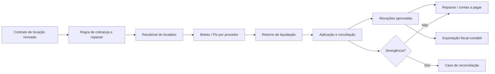

# Subledger financeiro — imobiliárias

## Propósito

O módulo financeiro da imobiliária deve ser um **subledger operacional orientado por eventos**, não um conjunto de campos de saldo e nem uma cópia do razão contábil. Ele cria obrigações e direitos econômicos a partir de contrato, proposta, locação, reserva, comissão, reembolso, cobrança ou distrato. Cada evento preserva sua origem e pode ser exportado, conciliado ou revertido com trilha completa.

> **Regra-base:** contrato, regra de remuneração e política aprovada geram a obrigação; cobrança e pagamento mudam o estado; conciliação confirma a liquidação; contabilidade reconhece e escriturar conforme configuração revisada.

## Entidades do subledger

| Entidade | Responsabilidade | Campos mínimos que não podem faltar |
| --- | --- | --- |
| `LegalEntity` | Empresa, filial, imobiliária ou SPE titular da operação | CNPJ/referência, regime/configuração fiscal, moeda, período e dono contábil. |
| `FinancialContract` | Instrumento que origina direitos e obrigações | Tipo, versão, ativo, partes, empresa, competência, vigência e estado de revisão. |
| `FinancialEvent` | Fato econômico imutável oriundo da operação | Tipo, data do evento, competência, origem, política/regra, usuário/sistema e evidência. |
| `Receivable` | Direito de receber de uma parte | Devedor, valor bruto, vencimento, contrato, estado, referência de cobrança e regra de atualização. |
| `Payable` | Obrigação a pagar ou repassar | Beneficiário, valor, vencimento/gatilho, natureza, documento e aprovadores. |
| `Allocation` | Divisão de um evento entre categorias econômicas | Base, fórmula, valor, categoria, recebedor e versão da regra. |
| `BillingInstruction` | Instrução de cobrança por boleto, Pix ou outro meio | Cobrança, provedor, referência externa, vencimento, estado e retorno. |
| `Settlement` | Informação de liquidação oriunda de banco/provedor | Identificador externo, valor, data/hora, meio, estado e evidência. |
| `CashApplication` | Aplicação de liquidação a uma ou mais obrigações | Valor aplicado, regra de prioridade, diferença, ajuste e reconciliador. |
| `AccountingExportBatch` | Lote para ERP fiscal/contábil | Empresa, competência, esquema, itens, status, retorno e divergências. |
| `ReconciliationCase` | Caso de divergência entre operação, banco e contabilidade | Objeto, diferença, causa, responsável, ação corretiva e conclusão. |

## Eventos de imobiliária e seus efeitos

| Evento operacional | Gera no subledger | Não deve fazer automaticamente |
| --- | --- | --- |
| Assinatura de locação | Agenda de cobrança, regras de administração e repasse condicionais | Lançar receita contábil final ou emitir documento fiscal sem política. |
| Vencimento mensal | Recebível, instrução de cobrança e prioridade de aplicação | Alterar silenciosamente valor contratual ou atualização aprovada. |
| Pagamento de inquilino | Settlement pendente e aplicação proposta | Considerar repasse definitivo antes de conciliação/regras de retenção. |
| Conciliação bancária | Baixa parcial/total, diferença, saldo e evento de carteira | Apagar divergência ou arredondamento sem caso de ajuste. |
| Fechamento de repasse | Payable ao proprietário/beneficiário e itens de composição | Confundir valor de terceiro com faturamento próprio. |
| Comissão de venda/locação | Recebível ou payable conforme papel econômico e contrato | Classificar como comissão/serviço sem documento e política fiscal. |
| Estorno/distrato | Evento compensatório, regra de devolução e ajuste de saldo | Editar a liquidação original ou apagar versão anterior. |

## Fluxo de locação administrada

## Hierarquia de valores

Cada cobrança deve ter valores em camadas. Isso evita que um único `valor_pago` seja usado para preço, comissão, repasse e receita ao mesmo tempo.

| Camada | Exemplos | Uso |
| --- | --- | --- |
| Bruto contratual | Aluguel, comissão combinada, sinal, parcela | Origem da obrigação e comparação com o instrumento. |
| Encargos configurados | Multa, juros, atualização, desconto autorizado, reembolso | Componentes de cálculo com política/versão. |
| Retenções e ajustes | Retenção identificada, contestação, compensação, tarifa contratada | Requer natureza, evidência e revisor. |
| Líquido aplicado | Valor efetivamente aplicado após conciliação | Situação de caixa e saldo aberto. |
| Distribuição | Administração, proprietário, corretor, parceiro, fornecedor | Gera items de payable/receivable por regra aprovada. |
| Mapeamento contábil | Conta/centro/competência sugeridos | Exportação a validar; não é livro contábil no CRM. |

## Estados de obrigação e liquidação

| Objeto | Estados sugeridos | Controle essencial |
| --- | --- | --- |
| Recebível | Rascunho, aprovado, emitido, vencido, parcialmente liquidado, liquidado, contestado, cancelado, transferido | Cancelamento depende de evento/evidência e preserva saldo/histórico. |
| Cobrança | Planejada, enviada, visualizada, paga informada, liquidada pelo retorno, expirada, falha, cancelada | O provedor é a fonte do estado externo; CRM conserva retorno e correlação. |
| Settlement | Recebido, em análise, conciliado, parcialmente aplicado, divergente, estornado | Não há exclusão; correção ocorre por reversão ou caso de reconciliação. |
| Payable/repasse | Planejado, aguardando gatilho, aprovado, instruído ao provedor, liquidado, bloqueado, revertido | Nenhum repasse sem base, recebedor, alçada e condição de liquidez aplicável. |
| Exportação | A preparar, em revisão, exportado, aceito, rejeitado, conciliado, corrigido | Esquema, competência e retorno de integração são obrigatórios. |

## Regras de caixa e conciliação

1. O sistema deve distinguir **data de competência**, **data de vencimento**, **data de instrução**, **data do evento bancário** e **data de conciliação**.
2. Um pagamento pode cobrir várias obrigações, e uma obrigação pode receber vários pagamentos; portanto, `CashApplication` é entidade própria, jamais um campo em parcela.
3. Diferença de tarifa, desconto, ajuste, devolução ou pagamento parcial abre um caso de reconciliação com motivo, evidência e responsável.
4. O saldo de carteira é sempre derivado das obrigações e aplicações em estado válido; não pode ser digitado sem evento de ajuste autorizado.
5. Repasses a proprietários e corretagem precisam mostrar tanto a base econômica quanto o estado de caixa e aprovação que sustenta o pagamento.

## Controles por função

| Papel | Pode fazer | Não pode fazer sozinho |
| --- | --- | --- |
| Comercial | Consultar condições permitidas, originar proposta e solicitar exceção | Baixar, alterar regra de repasse, liberar pagamento ou reclassificar fiscalmente. |
| Cobrança | Criar régua, acompanhar retorno, abrir negociação/caso | Mudar contrato ou escrever lançamento contábil final. |
| Financeiro | Conciliar, aprovar instrução dentro de alçada, tratar diferença | Alterar documento base ou liberar exceção sem política/alçada. |
| Contador | Consultar detalhe por empresa/competência, revisar mapeamento e devolver divergência | Modificar instrumento comercial ou movimento bancário original. |
| Gestor | Aprovar exceções dentro da política | Conceder a si mesmo acesso ilimitado ou remover trilhas. |

O subledger cria a base para a contabilidade enxergar tudo o que faturou, cobrou, recebeu, repartiu e exportou — por empresa, período, ativo e contrato — sem forçar o contador a trabalhar a partir de planilhas dispersas ou conceder a qualquer usuário o poder de reescrever a história financeira.
