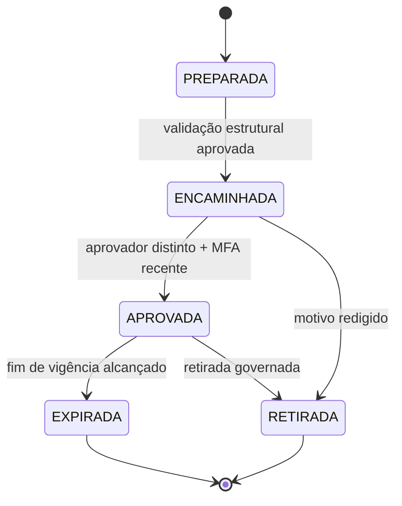

# Blueprint A223 — preço-base por m² e importação controlada

> **Decisão arquitetural.** A planilha real não será tratada como contrato, receita, recebível, estoque comercial, nota fiscal ou declaração fiscal. O preço-base será uma informação comercial versionada, com fonte e governança próprias. A classificação tributária, contábil e jurídica do empreendimento continua dependente de validação profissional e dos fatos documentados.

## 1. Fronteira de domínios

| Domínio | Pode receber nesta etapa futura | Não pode receber nesta etapa |
|---|---|---|
| Matriz física | Quadra, Lote e área, exclusivamente para conferência contra a matriz já autorizada | Criação de Quadra/Lote, correção automática de área, inferência do 165º Lote, aprovação urbanística, matrícula ou situação registral |
| Fonte de preço | Preço-base por m², referência de competência, referência de vigência, escopo físico e metadados de proveniência | Cliente, corretor, disponibilidade, desconto, comissão, proposta, reserva, venda, contrato, condição de pagamento, cobrança ou repasse |
| Política de preço | Regra preparada, encaminhada, aprovada, expirada ou retirada; início/fim de vigência e escopo por empreendimento ou Quadra | Receita, imposto, lançamento contábil, recebível, boleto, pagamento, comunicação externa ou qualquer modificação comercial individual sem módulo próprio |
| Auditoria | Hash da fonte, estrutura de cabeçalhos, contagens agregadas, autor, aprovador, data, correlação e idempotência | Conteúdo integral da planilha, dados pessoais, tokens, QR, TOTP, credenciais, URLs de infraestrutura ou motivo não redigido |

## 2. Modelo lógico proposto

| Entidade | Campos essenciais | Invariantes de segurança |
|---|---|---|
| `pricing_source_import` | `id`, `organization_id`, `subdivision_id`, `source_fingerprint`, `source_schema_version`, `competence_date`, `received_at`, `prepared_by_subject`, `status` | Não armazena bytes do arquivo no banco. Uma mesma impressão de fonte não gera novo registro de forma não idempotente. |
| `pricing_source_import_line` | `import_id`, `block_id`, `lot_id`, `area_sqm_source`, `base_price_per_sqm_brl`, `row_fingerprint`, `validation_status` | Somente faz referência a Quadra/Lote existentes. Divergência vai para reconciliação; não altera a matriz física nem cria Lote. |
| `price_base_policy` | `id`, `organization_id`, `subdivision_id`, `scope_type`, `scope_block_id`, `effective_from`, `effective_until`, `state`, `created_by_subject`, `approved_by_subject`, `approved_at` | Criador não aprova. Só estado aprovado e vigente pode alimentar leitura comercial futura. Não há exclusão física. |
| `price_base_policy_version` | `policy_id`, `version_no`, `source_import_id`, `reason_redacted`, `submitted_at`, `withdrawn_at` | Versões são imutáveis; retirada cria evento lógico e não reescreve a fonte. |
| `price_base_audit_event` | `organization_id`, `subject`, `action`, `correlation_id`, `idempotency_key`, `payload_redacted`, `occurred_at` | Escrita exclusiva do servidor e leitura restrita por organização, alçada e finalidade. |

## 3. Máquina de estados

As transições devem ser decididas no servidor. A interface pode exibir uma situação, mas não concede alçada, não comprova MFA, não escolhe aprovador e não pode avançar a política sozinha.

## 4. Prévia obrigatória antes de persistir

| Etapa | Verificações server-side | Resultado possível |
|---|---|---|
| Receber arquivo | Tipo permitido, limite de tamanho, parser determinístico e rejeição de fórmulas/links externos | Arquivo rejeitado ou processamento efêmero iniciado |
| Validar colunas | Aceitar somente Quadra, Lote, área e preço-base/m². Rejeitar a fonte se houver cabeçalho pessoal; sinalizar cabeçalhos auxiliares comerciais como não importados e descartá-los antes da leitura de linhas. | Lista de cabeçalhos aceitos, não importados e bloqueadores, sem gravar linhas |
| Validar linhas | Normalizar decimais BRL, área positiva, preço não negativo, Qn/Ln único e compatível com matriz | Linhas válidas, divergentes, duplicadas e rejeitadas |
| Conferir matriz | Comparar somente com Quadras e Lotes ativos e autorizados | Exigir reconciliação para qualquer Lote inexistente, área divergente ou total incompatível |
| Exibir impacto | Contagens agregadas, cobertura por Quadra, preço mínimo/máximo somente na prévia protegida | Aguardando pessoa preparadora ou descartado |
| Persistir preparo | Organização, subject, grant, contexto, finalidade, MFA recente, correlação e idempotência | Política em `PREPARADA`, sem efeito comercial |
| Aprovar | Separação de funções, vigência sem sobreposição e MFA recente do aprovador | Política em `APROVADA`, sem criar venda ou financeiro |

## 5. Controles que não são negociáveis

1. O valor-base deve usar decimal exato em BRL e jamais `float` binário; área permanece decimal em m².
2. A importação deverá bloquear macros, hyperlinks externos, conexões externas e fórmulas nos campos permitidos. Fórmulas exclusivamente em coluna auxiliar declarada como não importada não serão executadas nem copiadas; a coluna será descartada antes da prévia.
3. O hash/fingerprint da fonte e de cada linha devem ser calculados no servidor; o navegador não é autoridade de auditabilidade.
4. Não haverá atualização direta no valor de um Lote. A fonte gera uma versão de política; a regra aprovada e vigente é a única referência de leitura futura.
5. Toda chamada protegida continuará exigindo subject atual, organização ativa, membership, grant, escopo, finalidade, contexto, MFA recente, correlação e idempotência. RLS continuará fail-closed e as RPCs terão execução exclusiva do servidor.
6. Não há autoaprovação, retroatividade silenciosa, exclusão física, sobreposição de vigência aprovada ou promoção de uma prévia a preço efetivo sem transição auditada.
7. O módulo não transmitirá informações à Receita Federal, Prefeitura, cartório, banco, adquirente, corretor ou terceiro.

## 6. Pontos que devem ser confirmados antes de código e dados reais

| Pergunta de negócio | Decisão necessária | Motivo |
|---|---|---|
| O preço da planilha é único por empreendimento, por Quadra ou por Lote? | Definir o nível de escopo que será aceito | Impede aplicar uma regra ampla a uma exceção local. |
| Qual data representa a competência da fonte? | Informar uma data sem depender do nome do arquivo | Permite rastreabilidade de versão e reconciliação posterior. |
| A planilha contém somente os quatro campos delimitados? | Confirmar cabeçalhos e remover/mascarar o restante antes do envio | Evita receber dados pessoais, comerciais adicionais ou conteúdo fora de escopo. |
| Quem prepara e quem aprova? | Indicar funções distintas, sem expor senhas, tokens ou códigos MFA | Viabiliza segregação de funções e auditoria. |
| Há regra fiscal ou contábil específica já adotada para o empreendimento? | Responsável habilitado valida fora do CRM | Impede que o produto deduza RET, receita, imposto ou lançamento por uma planilha operacional. |

## 7. Fundamentação de controle

O desenho mantém as camadas separadas porque a Lei nº 6.766/1979 distingue requisitos de loteamento, projeto, aprovação e registro [1]. A DOI tem finalidade e sujeitos obrigados próprios; não deve ser confundida com uma tabela interna de preço [2]. A classificação e os requisitos de RET dependem do empreendimento e dos fatos aplicáveis, não de um preço por m² [3] [4]. A NBC TG 47/CPC 47 trata receita de contrato com cliente e seus critérios de reconhecimento; uma tabela-base isolada não pode ser encaminhada ao domínio de receita [5] [6]. Mesmo com a exclusão deliberada de pessoas desta importação, a LGPD orienta finalidade, necessidade, qualidade, segurança, prevenção e prestação de contas [7] [8].

## Referências

[1] [Lei nº 6.766/1979 — Planalto](https://www.planalto.gov.br/ccivil_03/leis/l6766compilado.htm)

[2] [Receita Federal — Declarar operações imobiliárias (DOI)](https://www.gov.br/pt-br/servicos/declarar-operacoes-imobiliarias)

[3] [Receita Federal — RET para incorporações imobiliárias](https://www.gov.br/pt-br/servicos/optar-pelo-regime-especial-de-incorporacoes-imobiliarias)

[4] [Receita Federal — Solução de Consulta COSIT nº 24/2023](http://normas.receita.fazenda.gov.br/sijut2consulta/anexoOutros.action?idArquivoBinario=68550)

[5] [CFC — NBC TG 47](https://www2.cfc.org.br/sisweb/sre/detalhes_sre.aspx?Codigo=2016/NBCTG47&arquivo=NBCTG47.doc)

[6] [CPC 47 — Receita de Contrato com Cliente](https://conteudo.cvm.gov.br/export/sites/cvm/menu/regulados/normascontabeis/cpc/CPC_47_Rev_13.pdf)

[7] [Lei nº 13.709/2018 — LGPD](https://www.planalto.gov.br/ccivil_03/_ato2015-2018/2018/lei/l13709.htm)

[8] [ANPD — Guia de segurança da informação](https://www.gov.br/anpd/pt-br/centrais-de-conteudo/materiais-educativos-e-publicacoes/guia-orientativo-sobre-seguranca-da-informacao-para-agentes-de-tratamento-de-pequeno-porte)

## 8. Implementação controlada e estado da fonte

A fundação A223–A225 foi implementada com parser server-side efêmero, contratos tipados, RPCs `SECURITY DEFINER` com `search_path` vazio, autoridade ativa, MFA TOTP recente nos comandos de prévia/preparação/encaminhamento/aprovação, correlação, idempotência e auditoria com payload redigido. As tabelas novas possuem RLS habilitado, privilégios diretos revogados para `public`, `anon` e `authenticated`, e políticas explícitas restritivas de negação; a execução das funções permanece exclusiva ao papel de serviço.

O histórico também foi corrigido para ser consultado por **cadastro selecionado** no servidor. A função de listagem recebe `development_id`, valida o cadastro ativo e filtra no banco antes de retornar qualquer resumo. Assim, nenhuma interface depende de carregar políticas de outros loteamentos e filtrá-las localmente.

| Verificação da fonte autorizada | Resultado saneado | Consequência aplicada |
|---|---:|---|
| Linhas de fonte | 164 | Compatível com a matriz física autorizada. |
| Linhas completas e reconciliadas | 163 | Podem ser lidas na prévia, mas não foram persistidas. |
| Exceções obrigatórias | 1 | A preparação permanece bloqueada; não há estimativa ou preenchimento automático. |
| Colunas auxiliares descartadas | 2 | Não entram em política, auditoria ou fluxo comercial. |
| Fórmulas auxiliares descartadas | 164 | Não são executadas, persistidas ou usadas em decisão. |
| Políticas e linhas persistidas | 0 | Nenhuma política, valor real ou efeito comercial foi criado durante a implementação. |

> A próxima utilização operacional exige que a fonte seja corrigida na origem para eliminar a única exceção e que o operador revalide MFA no próprio autenticador antes de executar a prévia protegida. Preparar uma política não cria venda; encaminhar exige fonte sem exceções; aprovar exige pessoa distinta da preparadora.

### Orientação saneada de correção A227

Quando a prévia encontra campo obrigatório ausente, a interface passa a mostrar somente a **linha de origem** e a **categoria de pendência**, limitada a dez referências. Ela não mostra valor, Quadra, Lote, status, cliente ou qualquer outro conteúdo da planilha. Na verificação efêmera da fonte autorizada, a única pendência foi classificada como `AREA_OR_PRICE_REQUIRED` na linha de origem 29; por isso a preparação continua bloqueada até que a planilha seja corrigida e reenviada para uma nova prévia.
