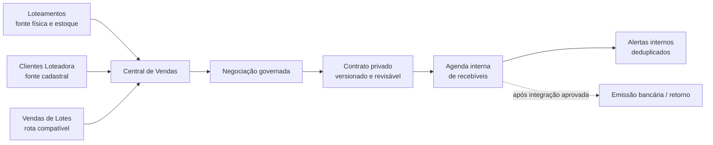

# Central de Vendas — arquitetura-alvo e migração preservativa

**Data de referência:** 7 de setembro de 2026. Este documento é um plano de engenharia para evolução do CRM. Não cria contrato, título, boleto, liquidação, cobrança ou efeito registral. A definição jurídica, contábil, tributária e bancária deverá ser revisada pelos responsáveis habilitados antes de ativar essas camadas em produção.

## Decisão central

A **Central de Vendas** será uma superfície operacional única e uma camada de orquestração; ela **não fundirá tabelas nem apagará rotas existentes**. O estoque físico continua sendo a fonte de verdade em Loteamentos, o cadastro de pessoas continua sendo a fonte de verdade em Clientes Loteadora e o atual rascunho de venda continua preservado como etapa inicial compatível. A Central passa a compor essas leituras e comandar transições novas, auditadas e transacionais.

| Área atual | Fonte de verdade preservada | Papel na Central de Vendas | Regra de transição |
| --- | --- | --- | --- |
| Loteamentos | Empreendimentos, quadras, lotes, características físicas, política e condição de preço | Catálogo e estoque consultado ao iniciar uma negociação | A Central somente lê o contexto do lote até a operação comercial autorizada. |
| Clientes Loteadora | Perfil cadastral, CPF/CNPJ declarado, contatos, pendências, preferências e anexos privados | Identificação, busca e inclusão contextual do participante | Um CPF/CNPJ localiza o cadastro existente; inexistência abre o cadastro sem sair da Central. |
| Vendas de Lotes | `subdivision_sale_drafts`, estados de trabalho e co-compradores internos | Etapa compatível de preparo do caso comercial | A rota antiga redirecionará de modo explícito à aba **Vendas** da Central após os testes, sem eliminar o vínculo nem seu histórico. |
| Financeiro | Ainda não possui recebíveis, boleto, baixa ou conexão bancária no domínio Loteadora | Agenda de recebíveis e alertas, introduzida somente em camadas novas | Títulos internos não são boletos bancários, e baixa não é inferida sem retorno ou lançamento auditado. |
| Documentos | Intenções e anexos privados/opacos | Dossiê privado por cliente e por caso de venda | Sem URL, chave, visualização pública, conteúdo em histórico ou duplicação de bytes. |

## Estrutura de navegação preservativa

Na primeira entrega visual, o rótulo **Clientes Loteadora** muda para **Central de Vendas** e passa a oferecer as abas **Clientes**, **Estoque**, **Vendas em preparação**, **Contratos**, **Recebíveis** e **Alertas**. As abas ainda indisponíveis informarão com clareza seu estágio e manterão a rota legada acessível. O item individual **Vendas de Lotes** deixa de figurar como setor independente apenas depois que seu destino compatível e a navegação por link direto forem validados.

## Modelo de domínio proposto

| Entidade nova | Finalidade | Integridade obrigatória | Não representa |
| --- | --- | --- | --- |
| Caso de venda | Agrega a jornada comercial de um ou mais lotes e participantes | Organização, contexto, autor, correlação, versão e estado; sem duplicidade de caso ativo por lote | Reserva automática, contrato ou venda concluída por si só |
| Participante do caso | Distingue comprador principal, co-comprador, interveniente ou representante | Um perfil cadastral existente por participante, papel explícito e revisão humana de dados incompletos | Titularidade imobiliária automática |
| Termos de negociação | Guarda uma versão da negociação: preço negociado, sinal, descontos, encargos, índices e observações | Valores monetários em centavos, moeda explícita, datas e total verificável; versões imutáveis após aprovação | Preço tabelado, cálculo fiscal ou decisão de crédito |
| Plano de recebíveis | Converte uma versão aprovada em itens internos de agenda | Itens numerados, tipo (entrada, regular, intermediária, balão), valor, vencimento e total conciliável | Boleto bancário ou confirmação de pagamento |
| Título interno | Item individual do plano com estado operacional | Chave idempotente, vencimento, valor, histórico imutável e vínculo com o caso | Linha digitável, QR Code, banco ou baixa automática |
| Dossiê contratual | Encaminha modelo, revisão, aprovação e anexo privado do contrato | Template versionado, aprovação jurídica configurável, trilha de auditoria e arquivo opaco | Escritura, registro de imóvel ou validade jurídica presumida |
| Alerta financeiro | Lembrete interno por vencimento/atraso | Chave única por título, regra e data; estado resolvido/suprimido/auditado | Cobrança enviada ao cliente, protesto ou negativação |

### Estados separados

Os estados abaixo não podem ser colapsados no mesmo campo, pois têm efeitos e responsáveis distintos.

| Eixo | Estados iniciais propostos | Gatilho permitido |
| --- | --- | --- |
| Situação física do lote | Em estruturação, referência confirmada, revisão necessária e reserva física técnica/proprietário | Funções existentes de Loteamentos, preservadas |
| Situação comercial do lote | Disponível para análise, em negociação, reservado comercialmente, comprometido por contrato, vendido, cancelado/liberado | Transição transacional do caso de venda com bloqueio do lote |
| Caso de venda | Preparação, dados pendentes, termos em revisão, aguardando aprovação, aprovado, contrato em preparação, ativado, desfeito/arquivado | Ação explícita, autoridade e pré-condições por etapa |
| Título interno | Programado, em aberto, vencido, em conferência, liquidado, renegociado, cancelado | Calendário, retorno bancário futuro ou lançamento humano com evidência e auditoria |
| Documento | Intenção registrada, arquivo privado registrado, em revisão, aprovado, substituído/arquivado | Fluxo documental privado, nunca inferência por nome de arquivo |

Uma reserva física de poço, caixa d’água ou proprietário continuará sendo um **impedimento de estoque** independente da situação comercial. A Central não poderá vender nem reservar comercialmente um lote que tenha impedimento físico ativo.

## Fluxo transacional de ponta a ponta

1. O operador seleciona um empreendimento, quadra e lote autorizados. A Central carrega área, dimensões, restrições físicas, situação e contexto de preço já aprovado, sem duplicar essas informações.
2. O servidor confirma a possibilidade de análise comercial e cria ou reaproveita um **caso de venda** idempotente. A abertura da tela não muda a situação do lote.
3. O operador informa CPF/CNPJ declarado. A Central executa busca protegida; se houver perfil, vincula-o; se não houver, abre o cadastro contextual e só continua após a resposta confirmada pelo servidor.
4. O operador compõe os termos livremente, com itens de entrada, parcelas regulares, intermediárias, balões, carência, descontos, juros, multa, correção e observações. O sistema calcula totais e diferenças, mas não inventa uma política comercial.
5. A submissão cria uma versão imutável dos termos e envia o caso às aprovações configuradas. Uma alteração posterior cria nova versão e nunca sobrescreve a versão anteriormente aprovada.
6. A ativação exige os pré-requisitos parametrizados por empreendimento: cliente, lote elegível, participantes, termos consistentes, dossiê mínimo e aprovação. Em uma única transação, bloqueia o lote, cria o plano de recebíveis e registra o evento de inventário/auditoria. Se qualquer parte falhar, a operação inteira é desfeita.
7. O contrato permanece como dossiê privado em revisão até o fluxo jurídico aprovado. Nenhuma tela chama essa etapa de escritura, registro ou título definitivo.
8. Uma rotina diária calcula vencimentos e cria alertas internos deduplicados. Ela não envia mensagens, não baixa títulos e não muda o estado comercial do lote.
9. A emissão de boleto e a conciliação de pagamento entram somente depois que a empresa escolher um banco/provedor, disponibilizar contrato e credenciais por canal seguro e validar as regras de retorno. O estado bancário será sempre originado do integrador ou de conferência humana auditada.

> **Regra de atomicidade:** “concluir venda” não será um conjunto de telas independentes. Será uma única transação de banco que trava o lote, valida as versões, cria a agenda interna, muda o estado comercial e grava auditoria. Erro ou concorrência libera a transação sem estado parcial.

## Regras técnicas de segurança e consistência

| Risco | Controle de projeto |
| --- | --- |
| Duas pessoas iniciarem a venda do mesmo lote | Índice único parcial para vínculo comercial ativo mais bloqueio transacional da linha do lote; a segunda transação recebe conflito seguro e auditável. |
| Repetição por duplo clique ou reenvio | `correlation_id` idempotente em toda mutação material; a repetição retorna o resultado original, sem criar novo caso, plano ou título. |
| Alteração após aprovação | Versionamento: termos aprovados e planos ativados são imutáveis; ajuste usa fluxo de renegociação/versão e preserva o histórico. |
| Baixa sem comprovação | Retorno bancário autenticado ou lançamento humano com justificativa, data efetiva, evidência privada e auditoria. Nenhum agendador marca “pago”. |
| Dados pessoais expostos | RLS fail-closed, `service_role` somente no servidor, sessões AAL2 válidas, finalidade e organização em cada operação; listas projetam o mínimo necessário. |
| Documento exposto | Armazenamento privado opaco e autorização contextual; sem bytes no banco, URL/chave no navegador ou conteúdo no histórico. |
| Reversão indevida | Arquivamento/reversão controlada e eventos imutáveis; nenhum `hard delete`. Liberação de lote exige a trilha de desfazimento adequada. |

## Alternativas para os alertas de vencimento

| Abordagem | Funcionamento e trade-offs | Custo operacional | Complexidade inicial |
| --- | --- | --- | --- |
| **Rotina interna diária** | Calcula alertas no CRM em horário configurável, com base nos títulos internos. Não depende de banco, nem envia cobrança. É a base recomendada para começar. | Baixo e previsível | Baixa |
| **Retorno do banco/provedor + rotina diária** | Recebe confirmações oficiais de emissão/baixa e complementa os alertas internos. Exige provedor definido, contrato, credenciais seguras, validação de webhook/retorno e homologação. | Depende do contrato bancário | Média/alta |

## Sequência de migração e marcos de aceite

| Marco | Entrega preservativa | Critérios para avançar |
| --- | --- | --- |
| M1 — Superfície | Rótulos, abas e rotas compatíveis da Central de Vendas; Vendas de Lotes passa a destino interno compatível | Links diretos, rotas de retorno, Clientes e Loteamentos existentes preservados em desktop e mobile |
| M2 — Caso comercial | Modelo de caso, busca por CPF/CNPJ, vínculo a lote, co-compradores e termos versionados | Isolamento por organização, idempotência, concorrência de lote, campos vazios, permissão e regressões testadas |
| M3 — Aprovação e contrato | Estados de aprovação, dossiê privado e contrato como documento revisável | Não há escritura/registro presumido; anexos continuam opacos; ajustes geram nova versão |
| M4 — Recebíveis internos | Plano flexível, parcelas e painel de acompanhamento interno | Totais conciliam; não existe boleto, banco ou baixa simulada; fluxo de desfazimento comprovado |
| M5 — Alertas internos | Regra diária deduplicada e painel de tarefas do operador | Reexecução é idempotente, não envia cobrança e não depende de processo em memória |
| M6 — Integração bancária | Emissão, retorno e conciliação por parceiro escolhido | Homologação, segredos no servidor, verificação de assinatura, reconciliação e plano de falha aprovados antes de ativar |

## Critérios de aceite transversais

A mudança somente será considerada pronta quando mantiver acessíveis as jornadas existentes, apresentar claramente a separação entre estoque físico, situação comercial e financeiro, impedir venda concorrente do mesmo lote, preservar o CPF/CNPJ como busca prioritária, aceitar campos de negociação sem valor fixo, tratar anexos como privados, passar testes de autorização/idempotência/concorrência e ter validação manual em desktop e celular. ZIP e HTML de entrega permanecerão saneados, sem dados pessoais, credenciais, documentos ou artefatos bancários.

## Referências

[1]: https://www.bcb.gov.br/detalhenoticia/20520/noticia "Banco Central — BC moderniza normas para boletos e autoriza pagamento por Pix"
[2]: https://portal.febraban.org.br/pagina/3150/1094/pt-br/servicos-novo-plataforma-boletos "FEBRABAN — Nova Plataforma de Boletos de Pagamento-Cobrança Registrada"
[3]: https://www.planalto.gov.br/ccivil_03/_ato2015-2018/2018/lei/l13709.htm "Lei nº 13.709/2018 — LGPD"
[4]: https://www.planalto.gov.br/ccivil_03/leis/l6766.htm "Lei nº 6.766/1979 — Parcelamento do Solo Urbano"
[5]: https://www.planalto.gov.br/ccivil_03/decreto-lei/1937-1946/Del058.htm "Decreto-Lei nº 58/1937 — Loteamento e venda de terrenos a prestações"
