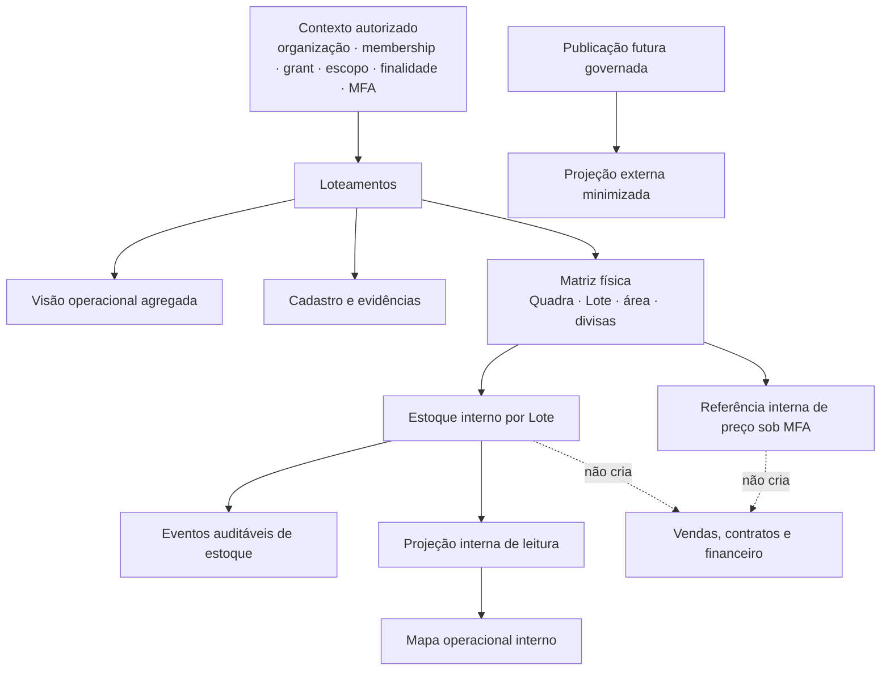

# Estratégia de unificação do setor Loteamentos — A266

## Objetivo e regra de transição

Esta estratégia trata a convergência entre o atual **Cadastro de Loteamentos** e o atual **Estoque/Mapa de Lotes** sob o novo nome **Loteamentos**. A unificação deve ampliar a operação sem apagar, ocultar, renomear internamente ou substituir os dados, jornadas, contratos e controles já entregues. A matriz física continua como fonte operacional da identidade de Quadras e Lotes; o estoque passa a ser uma camada governada sobre essa matriz, e não uma segunda matriz concorrente.

> Uma nova leitura de estoque não cria disponibilidade comercial, reserva, venda, proposta, contrato, cobrança, repasse ou financeiro. Esses domínios continuarão separados e somente poderão ser integrados por política e autorização específicas.

## Inventário factual do que deve ser preservado

| Frente atual | Capacidades existentes a preservar | Limite já estabelecido |
|---|---|---|
| Cadastro de Loteamentos | Identificação do empreendimento, matriz física de Quadras e Lotes, áreas e divisas, fichas operacionais, documentos privados, pendências, ciclo, reservas físicas, preço-base interno, condições governadas e referência por Lote | Estrutura física, preço interno e informação comercial permanecem separados |
| Visão operacional | Indicadores agregados de estrutura e cobertura física, seleção de empreendimento e entrada para jornada de cadastro | Não substitui conteúdo posterior nem concede alçada |
| Estoque/Mapa de Lotes | Contexto autorizado independente, seleção de empreendimento/Quadra/Lote, matriz visual por Quadra, estados internos e trilha de eventos | O mapa atual é somente leitura estrutural e não representa planta, disponibilidade, reserva, venda ou contrato |
| Contratos de inventário | Estado por Lote e eventos controlados com transições internas limitadas | Contexto, identidade, membership, grant, finalidade, vigência, MFA, correlação e auditoria continuam obrigatórios no servidor |
| Setor Loteadora adjacente | Clientes, parceiros, vendas internas e financeiro bloqueado mantêm rotas e domínios próprios | A unificação não absorve clientes, vendas, contratos ou financeiro |

## Diagnóstico inicial de arquitetura

O Cadastro já contém a matriz física autorizada e a leitura de preço interno por Lote. O Estoque/Mapa, por sua vez, mantém uma rota, um gate de contexto e uma seleção de Quadra/Lote duplicados, além de uma criação simplificada de Lote em rascunho. Essa duplicidade não deve ser transportada para o setor unificado: a criação e a edição física devem continuar centralizadas no Cadastro/Matriz, enquanto o estoque deve consumir a mesma identidade física e registrar somente fatos e estados de estoque permitidos.

O mapa estrutural existente será preservado como primeira camada visual do futuro estoque. A estratégia deverá evoluí-lo para leitura detalhada por empreendimento, Quadra e Lote, com filtros, legenda, pendências, reservas físicas, referência interna de preço quando autorizada e histórico governado. A futura visualização externa terá modelo e autorização próprios; ela não poderá reutilizar diretamente os dados internos, o contexto ou os estados protegidos.

## Premissas não negociáveis

| Premissa | Decisão A266 |
|---|---|
| Nome de interface | O destino principal será denominado **Loteamentos**; a alteração de rótulo não apaga rotas, componentes ou dados até a transição completa e validada |
| Fonte de verdade física | Quadras e Lotes físicos existentes, com área como atributo próprio e sem inferência |
| Fonte de verdade de estoque | Nova camada própria, referenciada ao Lote físico, com histórico imutável e sem recriar a unidade |
| Preço | Referência interna sob MFA e política, nunca disponibilidade ou preço comercial implícito |
| Ausências | Campos sem fonte permanecem vazios; estados não inferem situação comercial |
| Segurança | Sem acesso por URL ou tela; toda leitura e escrita dependem da autorização servidor e da finalidade autorizada |
| Visualização futura | Contrato de projeção redigida, explicitamente separado do banco e das leituras internas |

## Próxima etapa de estudo

O próximo passo é confrontar este inventário com referências atuais de modelagem de estoque imobiliário, event sourcing/auditoria, RBAC/ABAC e separação de projeções internas e externas. O resultado será uma arquitetura de banco e uma sequência de implementação que elimina duplicidade sem remover nenhuma jornada existente.

## Referências estudadas e implicações

As referências de mercado convergem em três pontos relevantes para Loteamentos: identificação unitária consistente, painel/matriz que permite leitura por empreendimento e Lote, e uma camada de colaboração seletiva. A documentação de gestão de Lotes da ECI cita rastreio individual, relatórios de status e mapas interativos; ela também separa soluções de inventário, CRM e ERP, reforçando que a unificação de interface não deve fundir domínios de negócio de forma indiscriminada.[1] [2]

> “One complete lot inventory management system.” — demonstração analisada da LotVue.[3]

O ponto útil da demonstração é o mapa como **projeção de leitura** de uma base governada, e não como origem que permite alterar qualquer atributo por clique. A própria análise identificou que promessas de ausência de trabalho manual exigem onboarding de dados espaciais e que atualizações feitas por terceiros devem ser tratadas como entradas restritas e auditáveis. Assim, a estratégia A266 manterá a matriz física atual como origem e introduzirá uma projeção de estoque por Lote antes de considerar geometrias, integrações de engenharia ou portais externos.

Para governança, a pesquisa de RBAC reforça o princípio de menor privilégio; para o CRM, o papel é necessário, mas não suficiente: o acesso continuará combinado com organização, membership, grant, escopo, finalidade, MFA e policy já exigidos pelo servidor.[4] A pesquisa de RLS reforça que a filtragem por linha deve permanecer no banco, evitando depender de filtros de tela para proteger empreendimentos e Lotes.[5]

Por fim, as referências de event sourcing e de disponibilidade de estoque mostram que eventos imutáveis podem apoiar auditoria e projeções de leitura, mas também alertam para custo, consistência eventual e complexidade. A recomendação A266 é **não** converter todo o Cadastro para event sourcing. Em vez disso, a nova camada de estoque terá uma tabela de estado atual e uma trilha append-only de transições governadas, aproveitando os eventos internos já existentes; projeções internas e externas serão derivadas desse estado, com comandos críticos sempre validados de forma consistente.[6] [7]

Uma segunda demonstração de mapa comercial confirmou a necessidade de duas superfícies distintas. Um mapa externo pode trabalhar com polígonos, filtros de faixa, mídia e macroestados publicados; porém a demonstração também evidenciou o risco de um mesmo objeto expor nomes, preço negociado, cronogramas e notas internas se a API enviar mais campos que o necessário. A estratégia A266, portanto, exigirá uma **projeção pública minimizada e versionada**, alimentada somente por um comando de publicação governado e nunca por acesso direto às tabelas internas.[8]

> “Você faz a alteração no back-end e ela é atualizada instantaneamente no seu site através do mapa.” — formulação apresentada na demonstração de mapa comercial, que será aplicada somente depois de autorização, contrato de publicação e controles específicos.[8]

| Superfície | Pode ler | Não pode receber |
|---|---|---|
| Operação interna | Estrutura física, estado interno, pendências, reservas físicas, referência interna sob MFA e histórico autorizado | Dados de outros contextos, efeitos comerciais implícitos ou acesso por URL |
| Projeção externa futura | Geometria publicada, identificação publicável, mídia aprovada e macroestado explicitamente publicado | PII, notas internas, preço negociado, política-base, condições internas, auditoria, cronograma, contratos ou dados financeiros |

O mapa externo também não poderá transformar uma interação de consulta em reserva ou venda. Caso no futuro exista captação de interesse, ela deverá criar uma intenção isolada e não alterará o estado de estoque sem processo e aprovação próprios.

## Arquitetura-alvo recomendada

A recomendação mais segura é uma **unificação por composição**, não por absorção destrutiva. O nome visível do setor passa a ser **Loteamentos**, mas o Cadastro e o Estoque tornam-se áreas de uma mesma jornada, alimentadas pelo mesmo contexto autorizado e pela mesma identidade física. A rota atual de estoque deve continuar atendida durante a transição e redirecionar para a seção equivalente, de modo que nenhum acesso existente fique inacessível.

### Navegação proposta

O setor terá uma entrada única denominada **Loteamentos**. Depois de escolher o empreendimento, o operador encontra uma sequência contínua e não excludente: Visão operacional, Cadastro e evidências, Matriz física, Estoque interno, Mapa operacional, Referência interna de preço e Histórico. Controles no topo servem como atalhos de rolagem; eles não podem desmontar as seções posteriores, repetindo a regra já consolidada no projeto.

| Área do setor unificado | Finalidade | Fonte de verdade | Ações permitidas neste escopo |
|---|---|---|---|
| Visão operacional | Comparar empreendimentos e pendências agregadas | Projeções internas autorizadas | Filtrar e navegar |
| Cadastro | Identificar o empreendimento e organizar evidências | Cadastro existente e anexos privados | Criar/editar sob governança já existente |
| Matriz física | Definir Quadras, Lotes, áreas, divisas e reservas físicas | Estrutura física existente | Edição física governada |
| Estoque interno | Registrar estado operacional por Lote e sua justificativa | Novo estado de estoque vinculado ao Lote físico | Transições internas idempotentes e auditadas |
| Mapa operacional | Ler o estoque por Quadra, Lote e filtros | Projeção interna | Consulta, drill-down e atalho para ficha |
| Referência interna de preço | Consultar preço-base e total referencial | Política existente e área confirmada | Leitura sob MFA; sem comando comercial |
| Publicação futura | Produzir uma visão externa minimizada | Projeção de publicação separada | Nenhuma nesta fase; dependerá de política específica |

### Modelo de dados preservativo

O Lote físico existente permanece como a chave canônica de estoque. Não haverá novo cadastro de Lote dentro do Estoque, pois isso criaria risco de duplicidade entre a matriz e o mapa. Em vez disso, a evolução será aditiva e terá quatro camadas de dados.

| Camada proposta | Cardinalidade | Conteúdo | Invariantes |
|---|---:|---|---|
| `subdivision_draft_lot` existente | 1 por unidade física | Identidade Quadra/Lote, medidas, tipologia, posição e reserva física | Continua sendo a única origem de identidade e área |
| Estado atual de estoque | 1:1 com Lote físico | Fase interna, motivo governado, versão e data de revisão | Chave única por Lote; escrita só por RPC protegida; nunca recria o Lote |
| Evento de estoque | 1:N com o estado | Transição, motivo, correlação, versão, instante e ator redigido | Append-only, idempotente e ordenado por Lote; correções são novos eventos |
| Projeção interna | 1:1 para leitura | Estado atual + atributos físicos + reserva física + alertas + referência de preço quando MFA permitir | Somente leitura; regenerável; nunca vira comando comercial |

Os três estados internos já existentes — confirmação de referência, revisão de estrutura e revisão necessária — serão preservados. Antes de ampliar a taxonomia, será criada uma tabela de equivalência e uma migração aditiva. Estados futuros devem refletir apenas fatos internos, por exemplo, verificação física pendente ou classificação de estoque concluída; termos como “disponível”, “vendido”, “reservado comercialmente” ou “contratado” continuam fora desse domínio até que seus módulos e políticas sejam autorizados.

### Segurança e autorização

O acesso ao setor unificado continuará fail-closed. RBAC apoia o agrupamento de permissões, mas a decisão final já adotada neste CRM continuará contextual: subject, organização ativa, membership, grant, escopo, finalidade, módulo, vigência, MFA quando aplicável, correlação, idempotência e auditoria. A RLS limitará a leitura e a escrita por organização e por escopo; a interface apenas apresenta aquilo que o servidor devolver.[4] [5]

| Operação | Alçada mínima proposta | Controles adicionais |
|---|---|---|
| Ler mapa interno | Grant de leitura de Loteamentos/Estoque | Organização, contexto e RLS |
| Alterar estado interno | Grant operacional específico | MFA recente, motivo governado, correlação, idempotência e evento append-only |
| Consultar preço interno | Grant de leitura de preço interno | MFA recente e política elegível |
| Alterar matriz física | Grant físico já existente | MFA, auditoria e validação de identidade da unidade |
| Publicar projeção externa futura | Grant de publicação específico, separado de estoque | Aprovação em dois níveis, revisão de campos e trilha de publicação |

### Futuro mapa e visualização externa

O mapa interno será implementado antes de qualquer portal público. A primeira versão usa a matriz por Quadra já existente, filtros e legenda de estado; polígonos georreferenciados só entram quando houver fonte técnica humana e vínculo inequívoco ao identificador físico. Nenhuma geometria será inferida por área, número ou imagem.

Quando a organização autorizar uma visualização de terceiros, ela usará uma projeção própria, com contrato de campos explícito. Somente identificação publicável, geometria publicada, mídia aprovada e macroestado publicado poderão sair do ambiente interno. Preço-base interno, total referencial, informações pessoais, observações, documentos, histórico, eventos, reservas físicas e qualquer informação comercial não aprovada ficarão excluídos no servidor.

## Plano de implementação faseado

A implementação não deve começar por migração de banco ou por mapa público. Primeiro, é necessário remover a duplicidade de experiência e consolidar leitura; só então o estoque recebe uma camada de estado mais rica. Cada fase termina em revisão real, testes, ZIP/HTML saneados e checkpoints funcional e de consolidação.

| Fase | Entrega incremental | O que será preservado | Critério de aceite |
|---:|---|---|---|
| 0 | Linha de base e inventário executável | Rotas, APIs, matriz, preço interno, documentos, reservas, fichas e histórico atuais | Testes existentes aprovados; mapa atual e Cadastro acessíveis sem mudança de dado |
| 1 | Renomear a entrada visível para **Loteamentos** e criar compatibilidade de rota | A rota antiga e o link atual de Estoque continuam funcionando e encaminham de forma inequívoca | Navegação por ambos os caminhos alcança o setor; nenhum conteúdo anterior fica oculto |
| 2 | Inserir **Estoque interno** e **Mapa operacional** como seções contínuas no setor | Cadastro, preparação, matriz e preço permanecem renderizados | Mesmo contexto seleciona o empreendimento uma única vez; filtros e atalhos não desmontam a jornada |
| 3 | Criar camada aditiva de estado atual e evento de estoque por Lote | Lote físico continua a ser a chave canônica; estados legados são mapeados e preservados | Migração somente aditiva; RPCs protegidas; idempotência, motivo e auditoria verificados |
| 4 | Evoluir o mapa interno com filtros, legenda, drill-down e histórico | Mapa estrutural existente é reaproveitado; sem status comercial | Cada célula leva à ficha física/estoque correto, sem comando material por clique |
| 5 | Painéis internos agregados e exportação redigida | Dados individuais e preço interno permanecem protegidos | Métricas só usam projeções autorizadas e não inferem disponibilidade ou vendas |
| 6 | Preparar contrato de publicação externa, sem ativá-lo | Banco e mapa internos continuam isolados | Revisão de campos, RLS, publicação em dois níveis e teste de vazamento aprovados antes de qualquer exposição |

### Sequência de dados e migração

Antes de cada migração, a equipe deve executar uma contagem agregada de empreendimentos, Quadras, Lotes, áreas confirmadas, reservas físicas e referências internas. Depois da migração, as mesmas contagens devem coincidir. A migração cria tabelas, índices, políticas e projeções novas sem alterar ou excluir tabelas físicas existentes; o backfill somente traduz estados de estoque que já existam, mantendo a ausência como ausência. Um Lote sem estado interno recebe **revisão necessária**, nunca um estado comercial inferido.

Qualquer comando de estoque deverá receber uma chave de correlação única, verificar a versão atual do Lote/estado e falhar de forma segura se a versão mudar antes da gravação. O evento resultante deve registrar a transição e o motivo governado, mas não reproduzir conteúdo de nota privada em auditoria. A projeção de leitura pode ser reconstituída a partir do estado e dos eventos, mas a primeira implementação utilizará a tabela atual e o histórico existente, evitando a complexidade de converter todo o domínio a event sourcing.[6] [7]

### Estratégia de validação

| Dimensão | Verificação exigida |
|---|---|
| Preservação | Testar rota legada, novo setor, Cadastro, matriz, fichas, anexos, reservas, preço interno e todos os estados posteriores |
| Banco | Validar esquema, RLS, permissões de RPC, índices, unicidade por Lote e ausência de alteração destrutiva |
| Segurança | Exercitar leitura autorizada, contexto ausente, grant ausente, MFA vencida e acesso cruzado negado |
| Estoque | Testar transição válida, tentativa duplicada, concorrência, motivo obrigatório, evento imutável e reversão por evento compensatório |
| Interface | Revisar 1920, 1280, 768 e 375 px; validar mapa, filtros, cartões, legenda, foco, teclado e estados vazios |
| Dados | Conciliar contagens antes/depois; conferir amostra humana por Quadra e não inferir campos vazios |
| Entrega | Executar testes focais e integrais, tipagem, build, integridade de diff e saneamento de ZIP/HTML |

### Reversão e contingência

Toda fase começa em checkpoint estável. Caso um novo componente falhe, a rota anterior e a matriz original permanecem disponíveis; a reversão deve restaurar apenas o código da fase, sem apagar eventos ou dados aditivos. Se uma projeção apresentar divergência, ela será desativada para leitura e reconstituída da fonte canônica; nenhuma correção deverá editar a matriz física, a referência de preço ou o histórico para “fazer o painel bater”. Se uma migração de estado falhar, ela será corrigida com uma migração complementar ou um evento compensatório, nunca por exclusão silenciosa.

## Decisão recomendada

O caminho mais seguro e completo é: **unificar primeiro a experiência e o contexto, depois adicionar estado interno e mapa de leitura, e só depois discutir uma projeção externa**. Essa ordem aproveita a estrutura já madura do Cadastro, elimina duplicidade de seleção e reduz o risco de que o Estoque crie uma segunda verdade para o mesmo Lote. Não é recomendável ativar disponibilidade, reserva comercial, preço público, venda, contratos ou financeiro nesta atualização.

## Referências

[1]: [ECI — Land Developers](https://www.ecisolutions.com/industries/residential-construction/land-developers/)

[2]: [ECI — Lot Management Software Land Developers](https://www.ecisolutions.com/blog/residential-construction/your-blueprint-for-effortless-lot-mastery-for-land-developers/)

[3]: [ECI Software Solutions — LotVue Lot Management Software for Land Developers](https://www.youtube.com/watch?v=ilaxvoyTo1o)

[4]: [IBM — What is role-based access control?](https://www.ibm.com/think/topics/rbac)

[5]: [Snowflake — What is Row-Level Security?](https://www.snowflake.com/en/data-governance/data-security/row-level-security/)

[6]: [Microsoft Learn — Event Sourcing pattern](https://learn.microsoft.com/en-us/azure/architecture/patterns/event-sourcing)

[7]: [Salesforce Engineering — Event Sourcing for an Inventory Availability Solution](https://engineering.salesforce.com/event-sourcing-for-an-inventory-availability-solution-3cc0daf5a742/)

[8]: [YouTube — The live lot map that sells for you 24/7](https://www.youtube.com/watch?v=6gIDhR3SkDM)

As análises integrais dos dois vídeos foram preservadas em `docs/research/a266-gestao-lotes-video.md` e `docs/research/a266-mapa-externo-video.md`. Esses registros são fontes de estudo; as decisões aplicáveis foram sintetizadas neste documento e continuam sujeitas às restrições de segurança e escopo do CRM.

## Validação e artefatos

A estratégia foi revisada integralmente contra o inventário preservativo, as decisões registradas e as premissas de segurança. A verificação confirmou que o documento não propõe exclusão de dados ou rotas, não antecipa disponibilidade, venda, contrato ou financeiro, e mantém a visualização externa apenas como etapa futura separada. O ZIP de código e o HTML autônomo foram gerados e passaram pela inspeção de presença, exclusões e saneamento. Nenhuma migração, comando de estoque, mudança de rótulo, alteração de rota ou mutação de dado foi executada neste marco estratégico.
